<a name="HOLTitle"></a>
# Using Microsoft Power BI to Explore and Visualize Data #

---

<a name="Overview"></a>
## Overview ##

[Microsoft Power BI](https://powerbi.microsoft.com/en-us/mobile/) was created to address the data explosion in commercial and academic organizations, the need to analyze that data, and the need for rich, interactive visuals to represent the data and reveal key insights. It contains a suite of tools that assist in the full life cycle of data analysis, from data discovery and collection to data transformation, aggregation, visualization, sharing, and collaboration. Moreover, it allows you to create rich visualizations without writing any code and present them in interactive dashboards.

Power BI can organize and unify all of your organization’s data to provide a clear, real-time view of your world. Its features include data connectors for a wide range of services and applications, support for popular file formats and databases, a full-featured expression engine, a WYSIWYG editor for creating sophisticated visualizations, support for visualizing data on the Web or on mobile devices running iOS, Android, or Windows, and support for embedding visualizations in your own Web or mobile apps.


_Interactive Power BI dashboard running on iOS and Windows_

In this lab, you will connect Microsoft Power BI to current and historical sales data for a fictitious company and create reports containing rich visualizations. Then you will present your visualizations in interactive dashboards, and publish the dashboards for public availability.

<a name="Objectives"></a>
### Objectives ###

In this hands-on lab, you will learn how to:

- Connect Power BI to business data
- Visualize business data in a dashboard
- Add visualization relationships
- Enhance visualizations and reports with formatting
- Publish and share Power BI content
- Use Power BI Desktop to perform advanced modeling techniques


<a name="Prerequisites"></a>
### Prerequisites ###

The following are required to complete this hands-on lab:

- An active Microsoft Office 365 subscription, or [sign up for a free trial](https://portal.office.com/signup/)
- An active Microsoft Power BI subscription or [sign up for a free trial](https://app.powerbi.com/signupredirect?pbi_source=web)
- [Microsoft Power BI Desktop](https://go.microsoft.com/fwlink/?LinkId=521662&clcid=0x409) (Windows only).

---

<a name="Exercises"></a>
## Exercises ##

This hands-on lab includes the following exercises:

- [Exercise 1: Connect to a database](#Exercise1)
- [Exercise 2: Create a report](#Exercise2)
- [Exercise 3: Add related data visualizations](#Exercise3)
- [Exercise 4: Enhance and format visualizations](#Exercise4)
- [Exercise 5: Publish and share content](#Exercise5)
- [Exercise 6: Create advanced visualizations with Power BI Desktop](#Exercise6)
 
Estimated time to complete this lab: **60** minutes.

<a name="Exercise1"></a>
## Exercise 1: Connect to a database ##

The first step in using Microsoft Power BI to explore and visualize data is to connect to a data source. In this exercise, you will connect to an Azure SQL Server database containing customer, product, and sales data for a fictitious company named Adventure Works.

1.	Open the Power BI Services Portal at https://powerbi.microsoft.com. If you are not signed in to Power BI, click **Sign In** and log in with your **Microsoft Office 365 Account**.

1. Click the **hamburger** icon to open the side menu, and then click **Get Data**.

    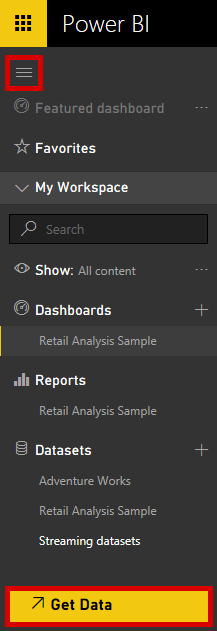

    _Accessing data sources_

1. Under "Import or Connect to Data," click **Get** in the "Databases" tile.

    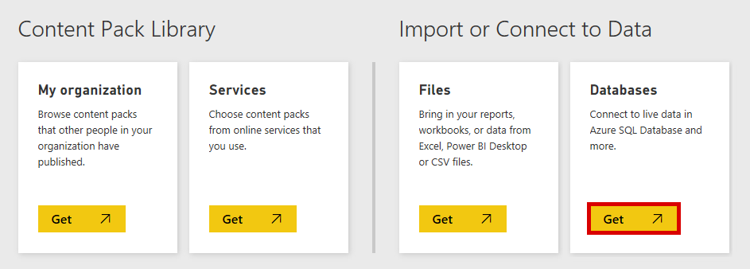

    _Accessing databases_

1. Click **Azure SQL Data Warehouse**. Then click **Connect** in the pullout that appears below the tile.

	> If you are informed that "This content pack is a Power BI Pro feature," accept the free trial of Power BI Pro. Then repeat this step to connect to Azure SQL Data Warehouse.

    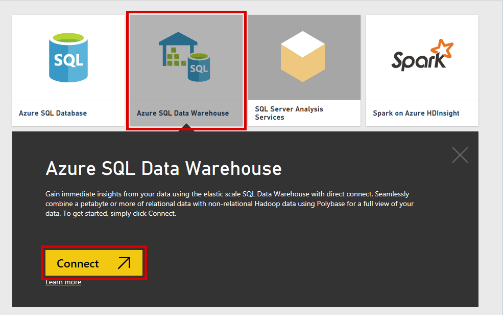

    _Accessing Azure SQL Data Warehouse_

1. Enter the values shown below in the "Connect to Azure SQL Data Warehouse" dialog. Then click the **Next** button.

    

    _Connecting to a SQL Server database_

1. Enter "PowerBILabUser" (without quotation marks) as the username and "PowerBI_1" (again without quotation marks) as the password. Then click **Sign in** to connect to Azure SQL Data Warehouse and the Adventure Works database.

    

    _Entering SQL Server credentials_

1. Click the **hamburger** icon to open the side menu and confirm that a new item named "powerbilabs" appears in the menu under "Datasets."

	
	
	_The new dataset_

You are now connected to an instance of the Adventure Works database hosted in Azure SQL Data Warehouse. Now it's time to build a report that depicts some of the data in the database.

<a name="Exercise2"></a>
## Exercise 2: Create a report ##

The heart of Power BI is the rich visualizations you can present to the user via dashboards and reports. In this exercise, you will create a report that shows data from one of the tables in the Adventure Works database.

1. Click **powerbilabs** in the side menu to open the dataset in the report designer.

	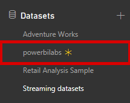
	
	_Opening the powerbilabs dataset_

1. In the report designer, click the **Table** icon in the "Visualizations" panel to add an empty table visualization to the workspace.

	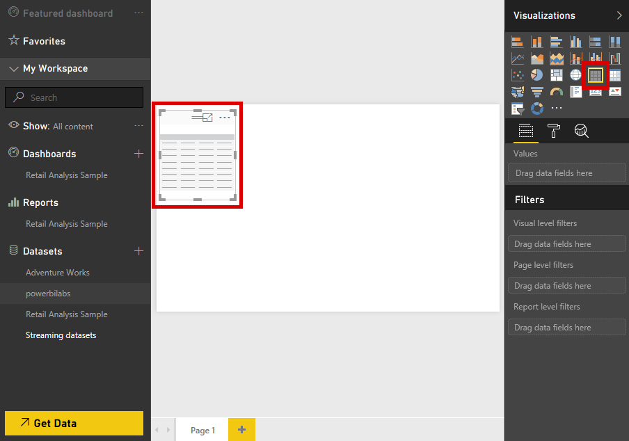
	
	_Adding a table visualization_

1. To connect the table visualization to your data, click **Customers** in the "Fields" panel to display the fields in the database's Customers table.

	
	
	_Selecting the Customers table_

1. Check **CompanyName**, **ContactName**, and **Phone** to add these fields to the table visualization.

	> You can resize the table visualization as desired by dragging the directional located at the edges of the element.

	
	
	_Selecting fields in the Customers table_
	
1. To view your report visualization in interactive mode, click **Reading view**. If prompted to save your report, click **Save** and enter the name "Adventure Works" (without quotation marks).

	> In interactive mode, you can perform actions on your visualizations, such as sorting, grouping, and drilling down into other report elements. 

	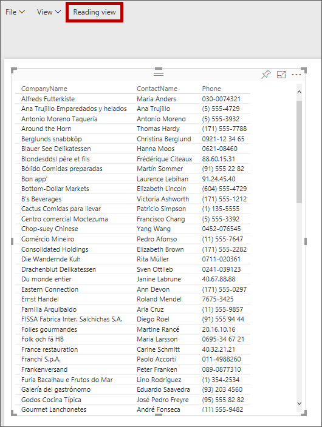
	
	_Switching to Reading View_
	 
1. Click the **sorting arrow** in the header of the CompanyName column to toggle the sort direction.

	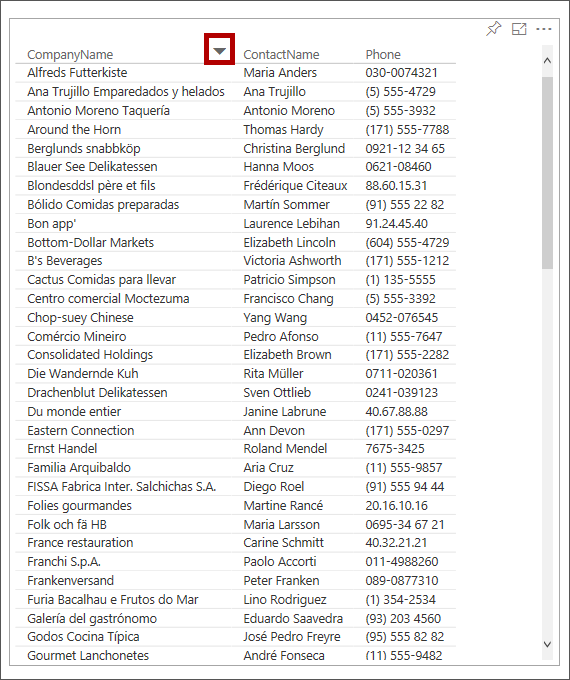
	
	_Toggling the sort direction_
	
1. Click **Edit report** in the top menu to exit interactive mode.  

	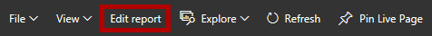
	
	_Exiting interactive mode_
	
1. To change the fields displayed in the visualization, go to the "Fields" panel and uncheck all of the fields in the Customers table. Then click **Products by Category** and check **CategoryName** and **ProductName**. Your table visualization will update with the selected values.

	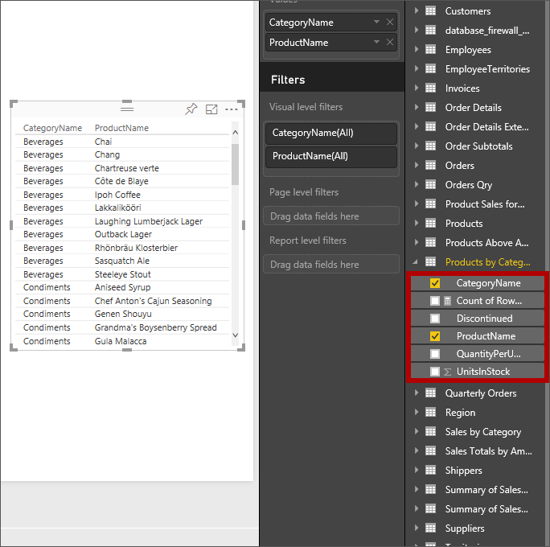
	
	_Changing the fields in the table visualization_
	
1. Click **Save** in the top menu to save the report.

	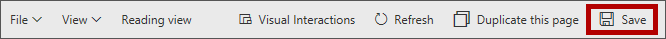
	
	_Saving your report_

Creating a report from a single table is easy: simply check the fields that you want to display in a table visualization. But there's much more that you can do to visualize the data in a database or other data source.

<a name="Exercise3"></a>
## Exercise 3: Add related data visualizations ##

Now that you know how to create a simple visualization, it's easy to add related visualizations as well as create richer visualizations with more complex configurations. In the previous exercise, you visualized product data. In this exercise, you will work with customer data.

1. Remove the existing table visualization by clicking the ellipsis (**...**) in the upper-right corner and clicking **Remove**.
	
	
	
	_Removing a visualization_
	
1. Click the **Table** icon in the "Visualizations" panel to add an empty table visualization to the workspace.
	
	
	
	_Adding a table visualization_
	
1. In the "Fields" panel, check **CompanyName** and **Count of Rows** under Customers.
	
	
	
	_Selecting fields in the Customers table_
	
1. Click an empty area on the report designer surface to prepare the report designer to accept a new visualization.	 
	
1. Check **CustomerID**, **OrderID** and **Count of Rows** under Orders. Observe that the report designer automatically creates a new table visualization for you.
	
	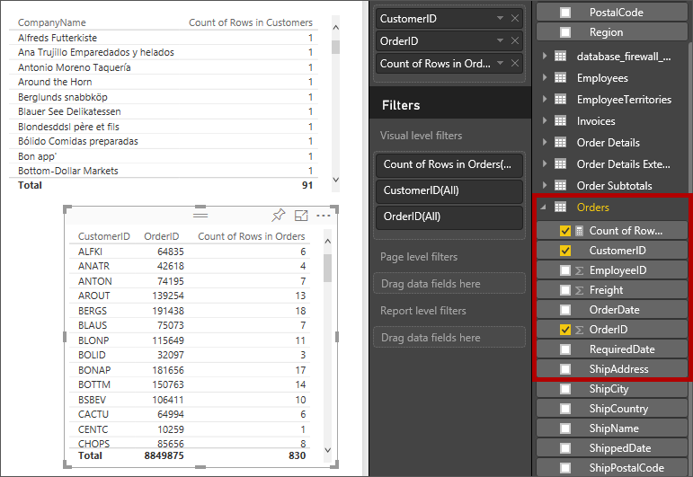
	
	_Selecting fields in the Orders table_
	
1. Click an empty area on the report designer surface to prepare the report designer to accept a new visualization.

1. In the "Visualizations" panel, click the **Slicer** icon to add a slicer visualization. Then, in the "Fields" panel, check **CompanyName** under Customers. The slicer visualization will populate with a list of customers.

	> The purpose of a slicer is to narrow the portion of the dataset shown in other visualizations. Since both of your visualizations contain related data, Power BI automatically understands the relationships and responds to actions performed in related elements.

	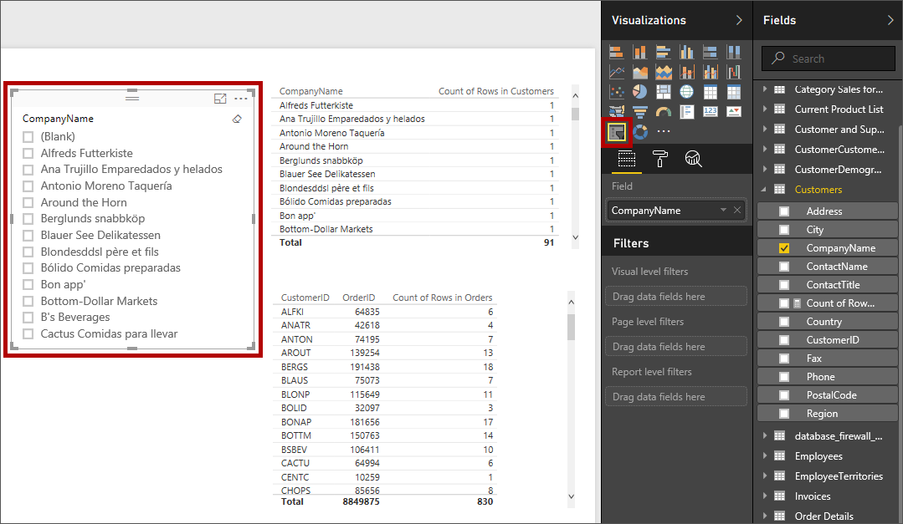
	
	_Adding a slicer visualization_

1. To demonstrate how these related elements interact, click **Around the Horn** in the slicer visualization and observe how the table visualizations update to only show order information for the selected customer.
	
	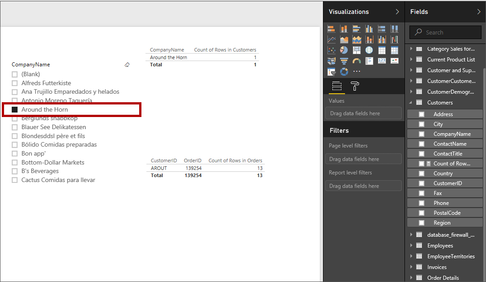
	
	_Interacting with the slicer visualization_

1. Click **Around the Horn** again to uncheck it.

1. Up to this point in the exercise, you have been working with simple lists of data. To create more compelling visualizations, you can select a different type of visualization in the "Visualizations" panel. To demonstrate, begin by selecting the table visualization that shows Customer, CompanyName, and Count of Rows.

1. In the Customers section of the "Fields" panel, uncheck **CompanyName** and check **Country**.
	
	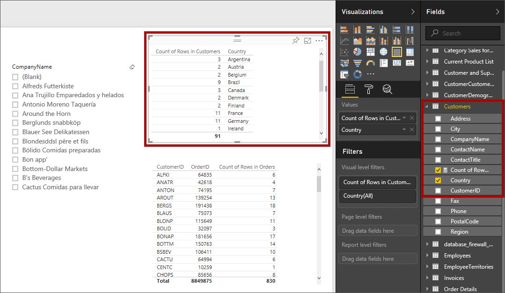
	
	_Changing the fields displayed in a visualization_

1. In the "Visualizations" panel, click the **Map** icon and observe how the table visualization changes to an interactive map that includes proportionally sized map elements (the green circles) representing the number of customers in different countries. The customer counts come from the Count of Rows field. Now hover the mouse cursor over one of the green circles in the map to display a tooltip containing information about the number of customers in that country. 
	
	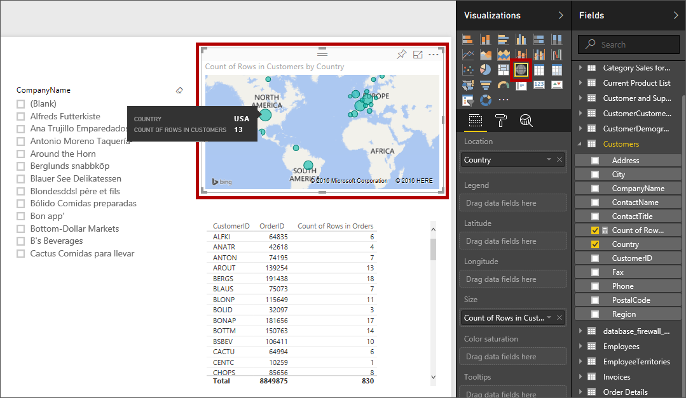
	
	_Changing a table to a map_

1. Click **Save** in the top menu to save the changes to your report.
	
	
	
	_Saving your report_

The map visualization is a step in right direction toward creating richer visualizations, but your report is still somewhat plain. In the next exercise, you will add more flair.

<a name="Exercise4"></a>
## Exercise 4: Enhance and format visualizations ##

No matter how valuable and relevant your data may be, unless it's presented in a way that's easy to understand and visually appealing, consumers of that data will find it difficult to extract meaning from it. One of the most effective ways to grab a viewer's attention and present data in a meaningful way is to apply formatting and other enhancements to your visualizations. In this exercise, you will enhance the visualizations you have created in order to dress up your report.

1. Click the header of the slicer visualization to select the slicer.

	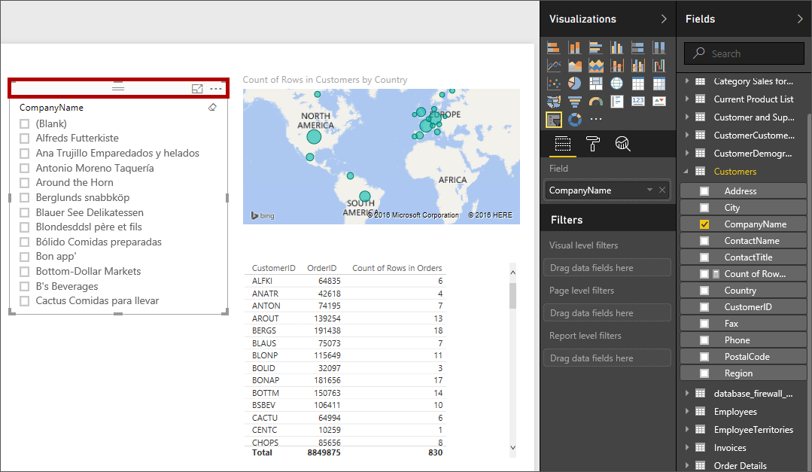
	
	_Selecting the slicer_
	
1. Click the **Format** icon in the "Visualizations" panel.

	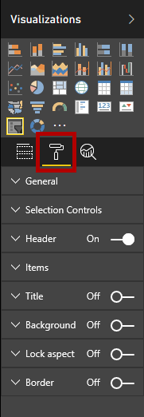
	
	_Displaying formatting options_
	
1. Click **Items** to expand the "Items" panel. Then use the color picker adjacent to "Font color" to set the font color to black.
	
	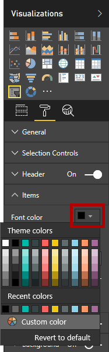
	
	_Changing the font color_
		 
1. Change the text size to 12.

	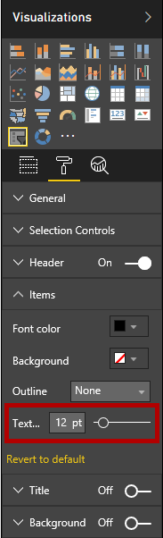
	
	_Changing the text size_
	
1. Click the header of the table visualization to select it.
	
	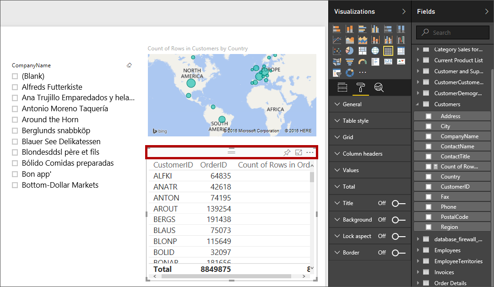
	
	_Selecting the table visualization_
	
1. Click the **Format** icon in the "Visualizations" panel. Then expand the "General" panel and set the text size to 12.
	
	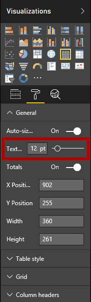
	
	_Changing the text size_
	
1. Expand the "Title" panel and click the slider to change **Off** to **On**. Then type "Customer Order Counts" (without quotation marks) into the "Title Text" box.
	
	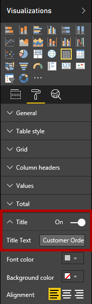
	
	_Editing a visualization title_
	
1. Click the header of the map visualization to select it.
	
	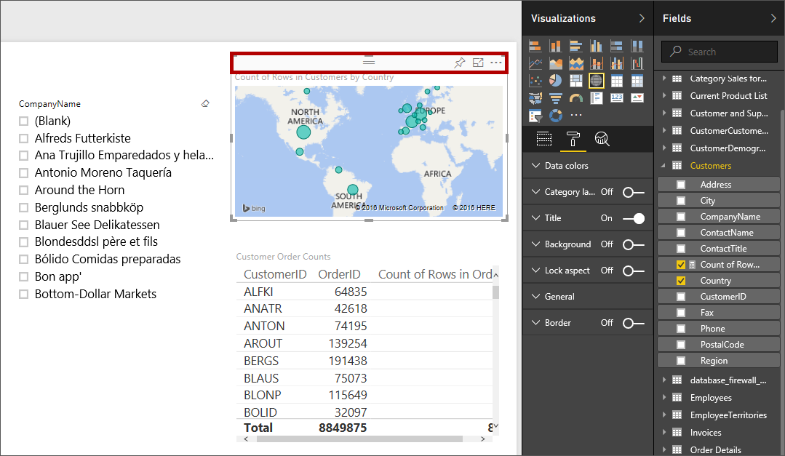
	
	_Selecting the map visualization_
	
1. Click the **Format** icon in the "Visualizations" panel. Then expand the "Data colors" panel and use the color picker adjacent to "Default color" to set the default color to purple.
	
	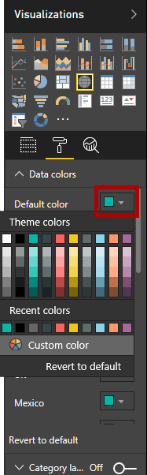
	
	_Changing the map's default color_

1. Click the slider next to "Category labels" to change **Off** to **On** and turn labels on in the map.
	
	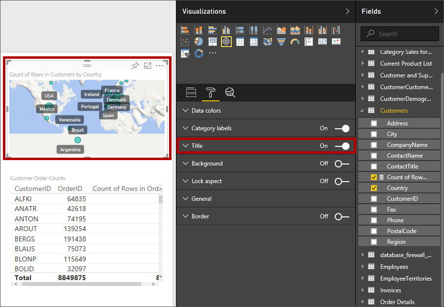
	
	_Turning on map labels_

1. Click the header of the table visualization to select it.

1. Locate the "Orders" table in the "Fields" panel and uncheck **CustomerID** and **OrderId**.

1. Locate the "Customers" table in the "Fields" panel and check **CompanyName**.
	
	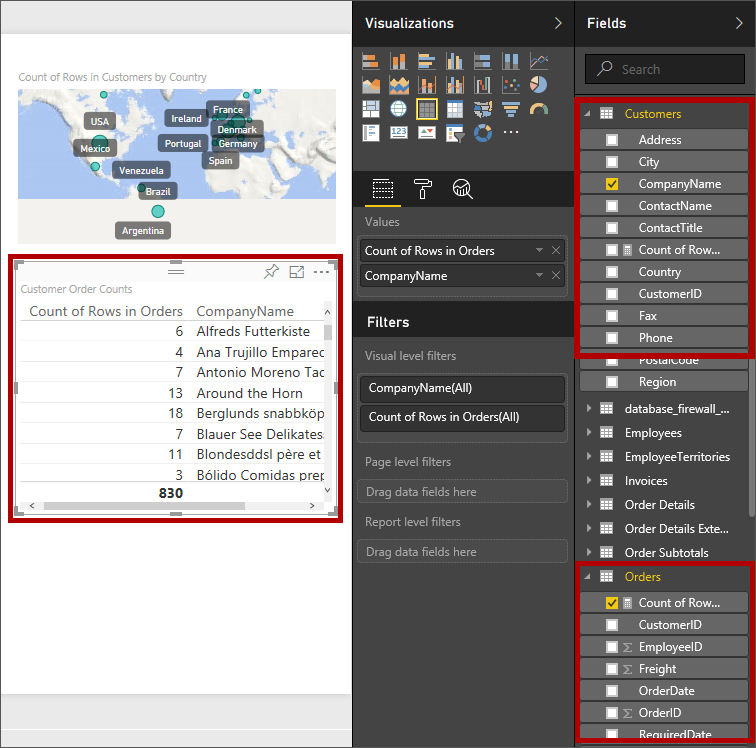
	
	_Adding CompanyName to the table visualization_
	
1. Click the **Stacked column chart** icon in the "Visualizations" panel.
	
	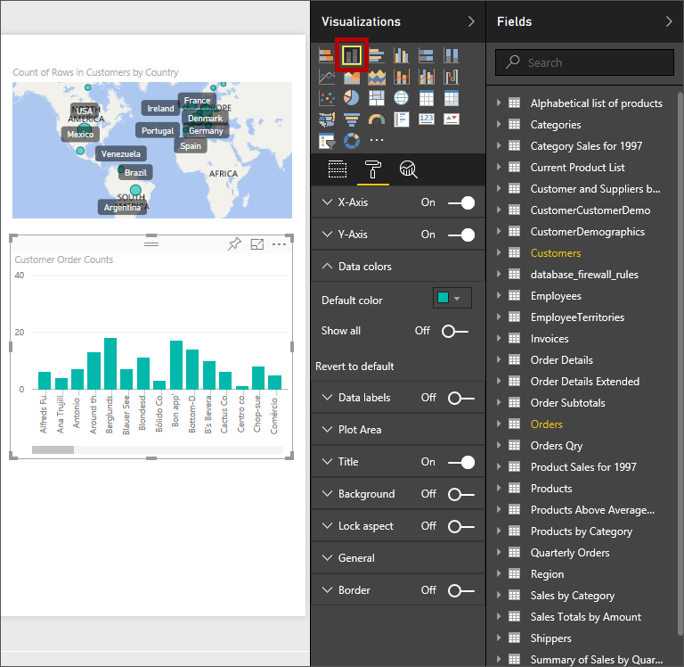
	
	_Changing a table visualization into a stacked column chart_
	
1. Click the **Format** icon in the "Visualizations" panel. Then expand the "Data colors" panel and use the color picker adjacent to "Default color" to set the default color to purple.
	
	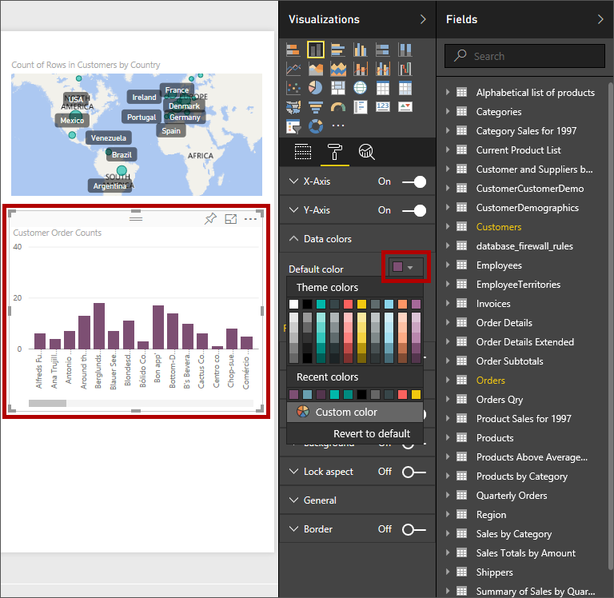
	
	_Changing the chart's default color_
	
1. Click **Save** in the top menu to save the changes to your report.
	
	
	
	_Saving your report_
	
Feel free to adjust other values as well and try different visualizations to see how the data is presented. When you are satisfied with your formatting changes, the next step is to publish and share your report.

<a name="Exercise5"></a>
## Exercise 5: Publish and share content ##

Power BI makes it easy to publish and share your content with users and groups of users, both internal and external to your organization. Although the publishing and sharing capabilities of Power BI are quite robust, only basic publishing and sharing are available when using the Power BI Service Portal. In this exercise, you will insert the report that you created in previous exercises into a dashboard and share that dashboard with other Power BI users. The you will see how Power BI's "Publish to Web" feature can be used to share content with any user.

1. Click **Pin Live Page** in the top menu of the Adventure Works dashboard.
	
	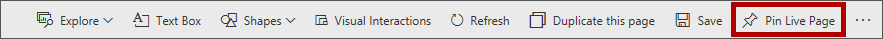
	
	_Pinning a live page_
	
1. Select **New dashboard**, enter "Adventure Works" (without quotation marks) as the dashboard title, and click **Pin live**.
	
	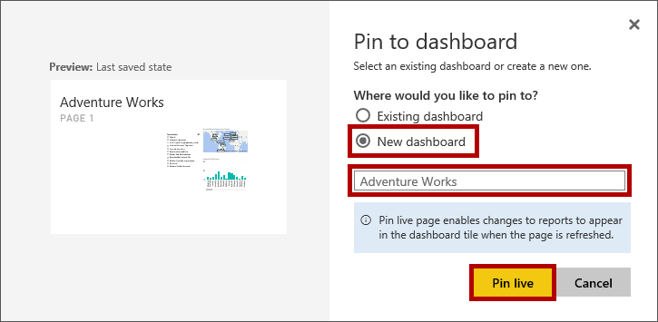
	
	_Creating a new dashboard_
	
1. Click **Adventure Works** in the "Dashboards" section of the side menu.

	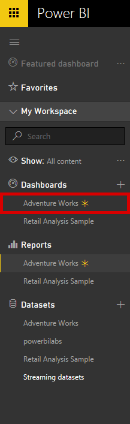
	
	_Selecting the Adventure Works dashboard_
	
1. Click **Share** in the upper-right corner of the dashboard.

	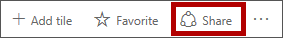
	
	_Selecting the Share icon_
	
1. Type your Office 365 e-mail address — the one you logged into Power BI with — into the e-mail address box. Then click **Share** to e-mail yourself a link to the Adventure Works dashboard.

	> You are only sharing the dashboard with yourself, but realize that you can share the dashboard with any Power BI user by including the e-mail address that they use to access Power BI in the list of e-mail addresses that you enter.

	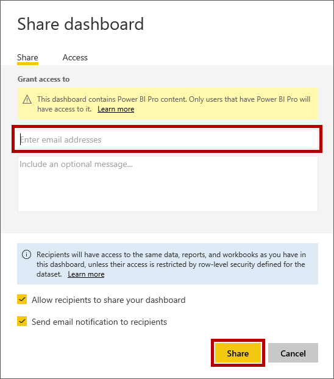
	
	_Providing a list of recipients_
	
1. Click **Share** again. Click **Access** and copy the URL under **Dashboard Link** to the clipboard. Then click the **Close** button to close the "Share dashboard" panel.

	
	
	_Copying the dashboard link_

1. Open a new browser tab or window and paste the dashboard link into the address bar to see how the dashboard will appear to users you share it with.

1. Sharing a dashboard this way limits its visibility to those you grant access to. However, Power BI also offers a "Publish to Web" feature that allows a report to be embedded in a public Web site or shared publicly through a URL. To demonstrate, return to the Power BI Services Portal and click **Adventure Works** in the "Reports" section of the side menu to open the report.

	
	
	_Opening the Adventure Works report_
	
1. Click **File** in the menu in the upper-left corner of the report, and then click **Publish to web**.
		
	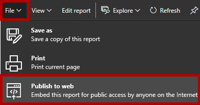
	
	_Publishing to the Web_
	
1. Click **Create embed code**.

	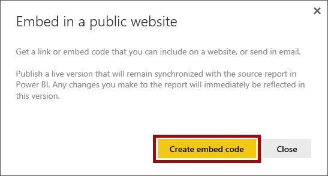
	
	_Creating an embed code_
	
1. Click **Publish**.

	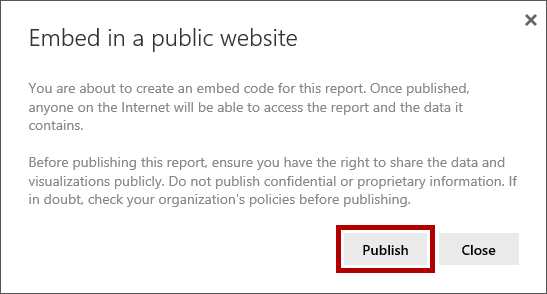
	
	_Acknowledging that the report will be public_
	
1. The dialog that ensues contains two important values: a link that you can use to share the report with anyone (whether they're a Power BI user or not), and an IFRAME that you can paste into a Web page to embed the report in the page. Inspect these values, and then click **Close** to close the dialog.

	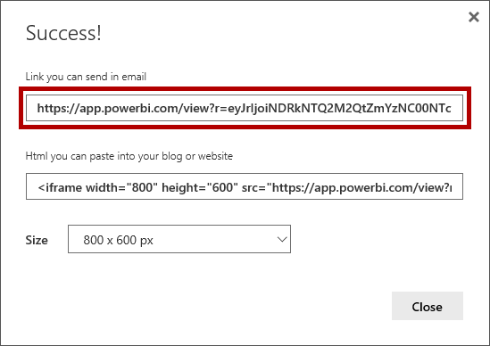
	
	_Values for sharing a report publicly_

It's that simple to publish and share your Power BI content. If you’re working with Power BI on a Windows computer, it’s time to move to more advanced scenarios in [Exercise 6: Advanced Modeling](#Exercise6").


<a name="Exercise6"></a>
## Exercise 6: Create advanced visualizations with Power BI Desktop ##

Although Power BI Services are flexible, robust, and easy to use, many of the advanced features relating to data and query management, visualizations, and modeling are only available via the Microsoft Power BI Desktop. 

To install Microsoft Power BI Desktop:  

1.	Open the Power BI Services Portal (if it’s not already open from Exercise 5) and **click** the **Download** icon in the top right portal menu, followed by **Power BI Desktop**.

	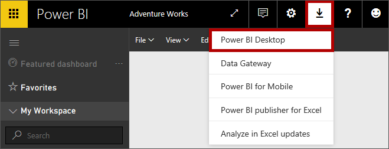
	
	_Downloading the Power BI Desktop_
	
2.	When the download is complete, **run the installation** with the **default settings**.
3.	Open Power BI Desktop and if asked to login, do so with your **Microsoft Office 365 Account**.

As an advanced modeling activity create and include a Measure in a data visualization. To setup your data connection and create a new Measure:

1.	Locate the the **Home** ribbon, and **click** the **Get Data dropdown**, followed by **SQL Server**.

	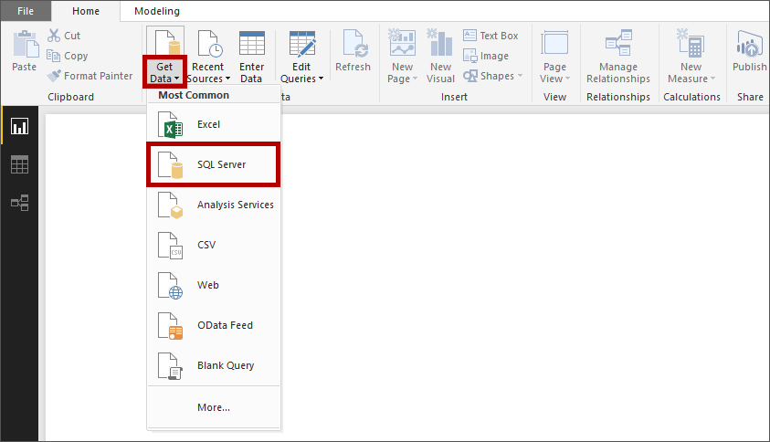
	
	_Accessing Datasourses in Power BI Desktop_
	
2.	**Enter** the following values in the **SQL Server Database** dialog:
	- Server: **powerbilabs.database.windows.net**
	- Database: **powerbilabs**

	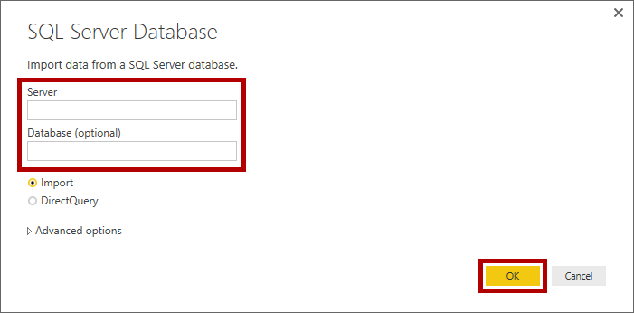
	
	_Entering Connection Credentials_
	
3.	**Click** **OK**.
4.	If prompted for credentials, enter the following values:
	- Username: **PowerBILabUser**
	- Password: **PowerBI_1**

5.	**Click** **OK**. Power BI will now authorize your credentials and connect to the Adventure Works database. When the Adventure Works data has been validated, the data Navigator dialog will be displayed.

	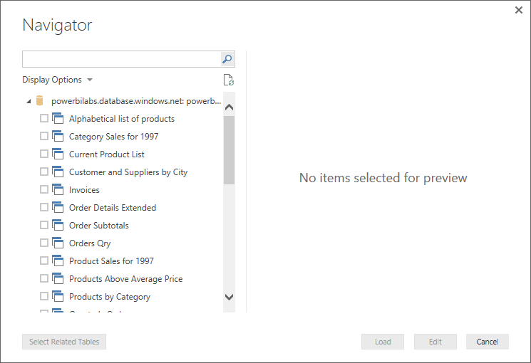
	
	_The Power BI Desktop Data Navigator_
	
7.	In the **Navigator** dialog, select the **Customers** and **Products** tables, and then **click** **Select Related Tables**. Power BI will analyze the relationships in your data and automatically select additional tables based on the relationships found in Customers and Products.

	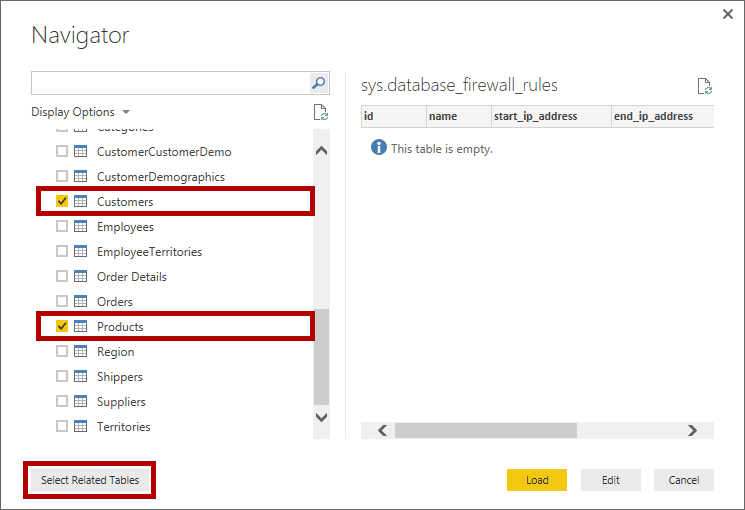
	
	_Selecting Related Tables_	

8.	**Click** **Load** to bring the selected data into the Power BI Desktop environment.

	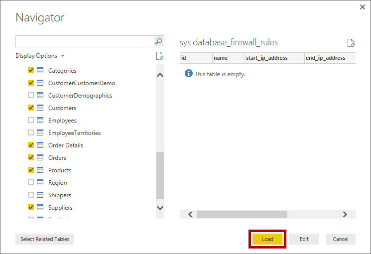
	
	_Loading a Dataset_	

9.	Locate the **Visualizations** panel and **click** the **Table Visualization** icon. An empty, disconnected Table tile will be created and displayed on the report designer workspace.

	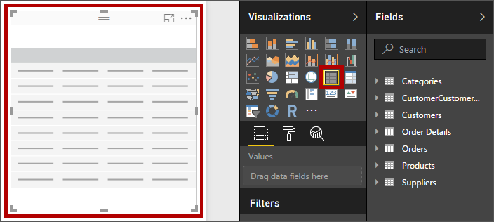
	
	_Adding a Table Visualization_	

10.	To connect the Table visualization to your data, locate the **Fields** panel and **click** the **Customers** element to expand and view the associated Fields for the Customers element.
11.	**Select** the **CompanyName** field to display the associated data in the visualization.

	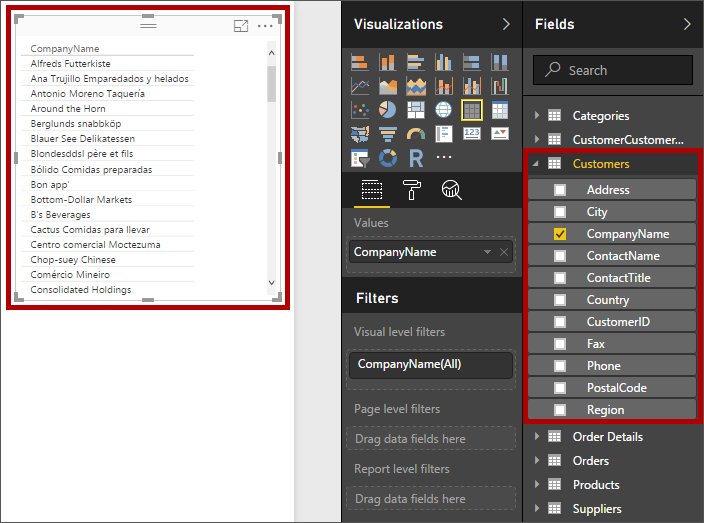
	
	_Adding Customer Fields_	
	
	> Resize the visualization as needed, by dragging one of the directional handles located at the edges of the element, to better view the content.

12.	Locate the **Order Details** entity and **select** **ProductID**.
13.	Locate the **Orders** entity and **select** **OrderID**.
14.	Locate the **Products** entity and **select** **ProductName**.	

	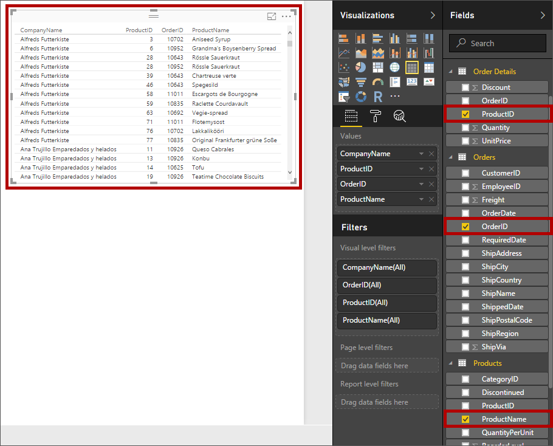
	
	_Adding Additional Fields_	

15.	**Click** the **Order Details** entity in the **Fields** panel.

	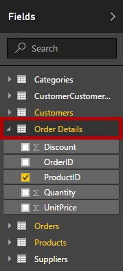
	
	_Selecting Order Details_	

16.	On the **Home** ribbon, **click** **New Measure**. A formula input box will be displayed.

	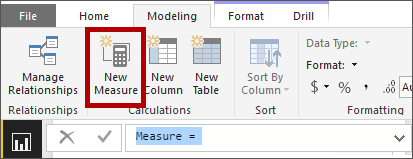
	
	_Creating a New Measure_	

17.	Enter the following DAX expression in the **input box** and **click** the **checkmark** to validate and save. A new column will become available in the Order Details entity named “Measure” calculating the average product price for a group of orders.

	```
Measure = AVERAGE('Order Details'[UnitPrice])
	```

18.	**Click** the **ellipse** (...) on the **Measure** column followed by **Rename**. Enter “AveragePrice” (without quotation marks) as the new value for your Measure.
	
	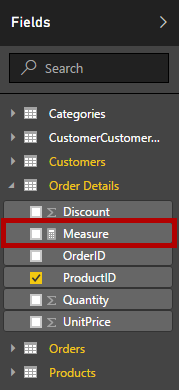
	
	_Selecting the New Measure_	

	
	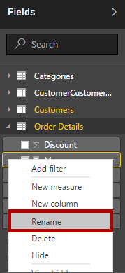
	
	_Renaming the New Measure_	

19.	**Select** the new **AveragePrice** column to display the average product price in your Table Visualization.
	
	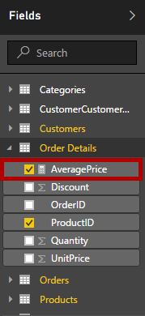
	
	_Selecting the Renamed Measure_	

 
	> Improve the display of the new column by changing the decimal formatting of your AveragePrice Measure. To format the AveragePrice column in Power BI Desktop:

1.	Locate the **Order Details** entity in the **Fields** panel and **click** the **AveragePrice** column.
2.	On the **Modeling** ribbon, adjust the **decimal place** value to the number **2**. Observe the changes to the AveragePrice column in your Table Visualization.

	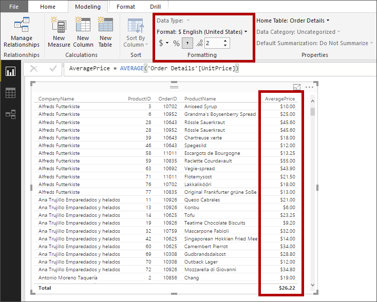
	
	_Formatting the New Measure Column_	
	
This exercise has prepared you with a solid foundation of core knowledge and experience required to continue into more advanced modeling scenarios, including extending Measures, Calculated Columns, and Calculated Tables.

<a name="Summary"></a>
## Summary ##

In this hands-on lab you learned how to:

- Connect Power BI to business data
- Visualize business data in a dashboard
- Add visualization relationships
- Enhance visualizations and reports with formatting
- Publish and share Power BI content
- Optionally, perform advanced data modeling techniques

This is just a beginning, as there’s a whole lot more you can do to leverage the power of Power BI. Start experimenting with other Power BI features, especially the Power BI Desktop, and identify other ways you can enhance your business intelligence through integrating Power BI into your processes.

----

Copyright 2016 Microsoft Corporation. All rights reserved. Except where otherwise noted, these materials are licensed under the terms of the MIT License. You may use them according to the license as is most appropriate for your project. The terms of this license can be found at https://opensource.org/licenses/MIT.