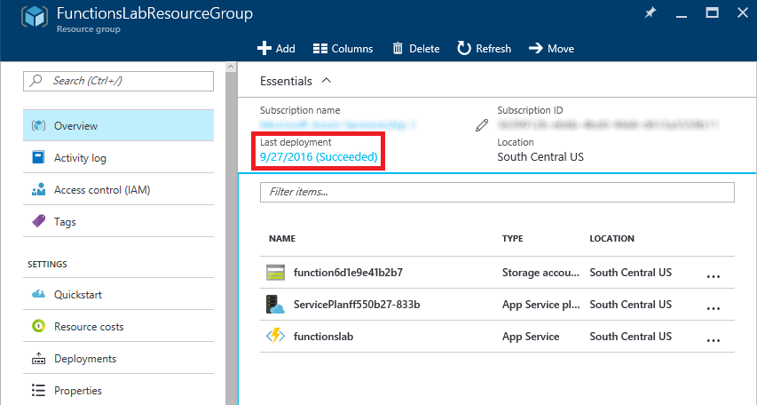
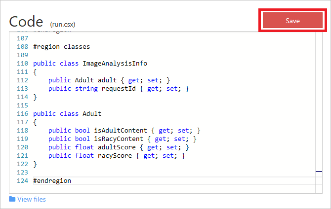
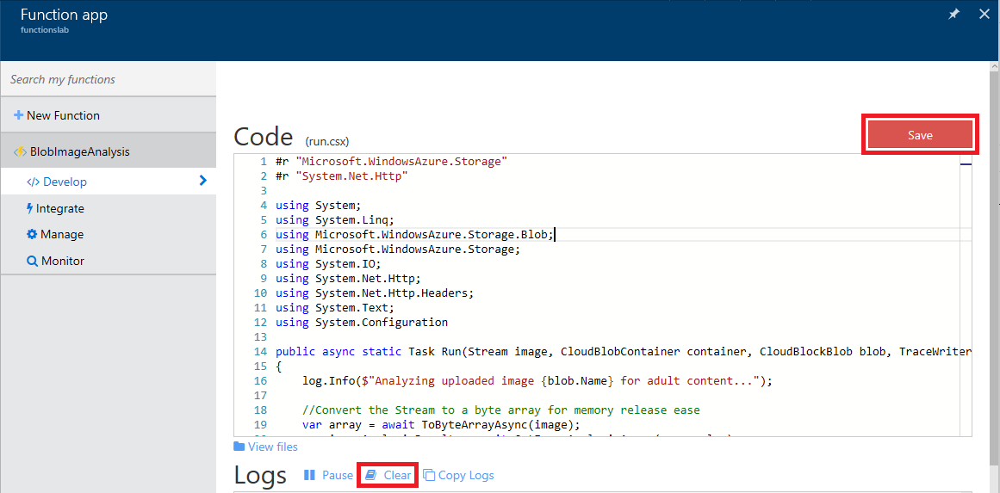
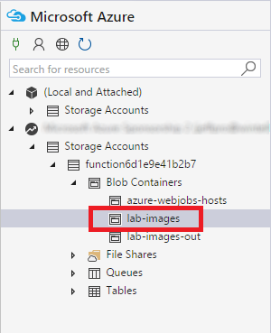
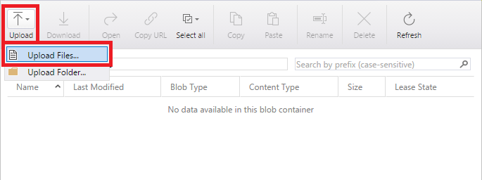
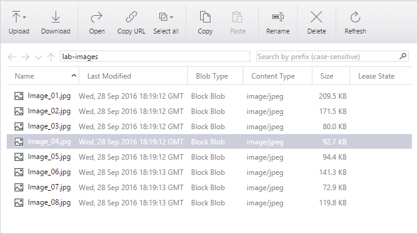
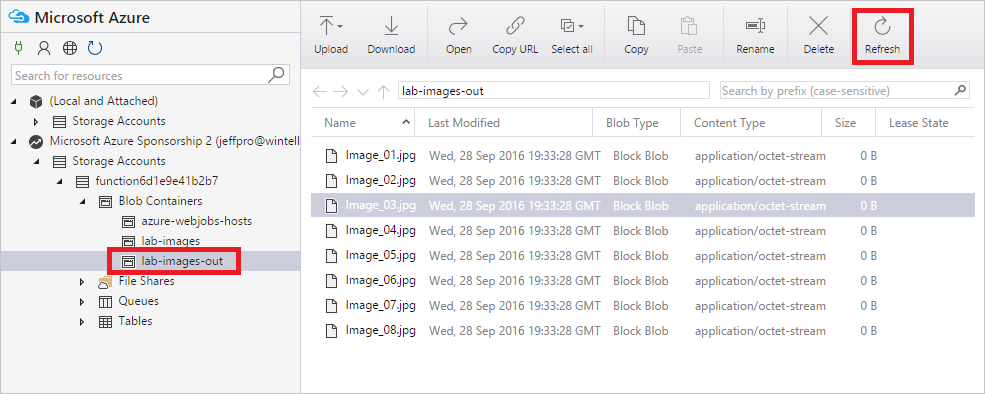

<a name="HOLTitle"></a>
# Azure Functions #

---

<a name="Overview"></a>
## Overview ##

Functions have been the basic building blocks of software since the first lines of code were written and the need for code organization and reuse became a necessity. Azure Functions expand on these concepts by allowing developers to create "serverless", event-driven functions that run in the cloud and can be shared across a wide variety of services and systems, uniformly managed, and easily scaled based on demand. Azure Functions can be written in a variety of languages, including C#, JavaScript, Python, Bash, and PowerShell, and they're perfect for building apps and nanoservices that employ a compute-on-demand model.

In this lab, you will create an Azure Function that monitors a blob container in Azure Storage for new images, and then performs automated analysis of the images using the Microsoft Cognitive Services [Computer Vision API](https://www.microsoft.com/cognitive-services/en-us/computer-vision-api). Specifically, The Azure Function will analyze each image that is uploaded to the container for adult content, create a copy of the image in another container, and store the scores returned by the Computer Vision API in blob metadata.

<a name="Objectives"></a>
### Objectives ###

In this hands-on lab, you will learn how to:

- Create an Azure Function App
- Write an Azure Function
- Configure an Azure Function with a blob trigger
- Configure app settings for an Azure Function App
- Process incoming, outgoing, and bidirectional values from a trigger
- Use Microsoft Cognitive Services to analyze images and store the results in blob metadata

<a name="Prerequisites"></a>
### Prerequisites ###

The following are required to complete this hands-on lab:

- An active Microsoft Azure subscription, or [sign up for a free trial](http://aka.ms/WATK-FreeTrial)
- [Microsoft Azure Storage Explorer](http://storageexplorer.com)

---

<a name="Exercises"></a>
## Exercises ##

This hands-on lab includes the following exercises:

- [Exercise 1: Create an Azure Function App](#Exercise1)
- [Exercise 2: Write an Azure Function](#Exercise2)
- [Exercise 3: Connect to a storage account](#Exercise3)
- [Exercise 4: Configure Azure Function App settings](#Exercise4)
- [Exercise 5: Test the Azure Function](#Exercise5)
- [Exercise 6: Analyze the results](#Exercise6)

 
Estimated time to complete this lab: **60** minutes.

<a name="Exercise1"></a>
## Exercise 1: Create an Azure Function App ##

The first step in writing an Azure Function is to create an Azure Function App. In this exercise, you will create an Azure Function App using the Azure Portal.

1. Open the [Azure Portal](https://portal.azure.com) in your browser. If asked to log in, do so using your Microsoft account.

2. Click **+ New**, followed by **Compute** and **Function App**.

    

    _Creating an Azure Function App_

3. Enter an app name that is unique within Azure. Under **Resource Group**, select **Create new** and enter "FunctionsLabResourceGroup" (without quotation marks) as the resource-group name to create a resource group for the Function App. Accept the default values for all other parameters and click **Create** to create a new Function App.

	> The app name becomes part of a DNS name and therefore must be unique within Azure. Make sure a green check mark appears to the name indicating it is unique. You probably **won't** be able to use "functionslab" as the app name.
 
    

    _Naming a Function App_

1. Click **Resource Groups** in the ribbon on the left side of the portal, and then click the resource group created for the Azure Function ("FunctionsLabResourceGroup") to open a blade for the resource group. When "Deploying" changes to "Succeeded," the Function App has been successfully deployed.

	> Azure typically requires less than 30 seconds to create a Function App. You may have to click the browser's **Refresh** button every few seconds to update the deployment status. Clicking the **Refresh** button in the resource-group blade refreshes the list of resources in the resource group, but does not reliably update the deployment status.

    

    _Successful deployment_

Wait until the Function App has been deployed, and then proceed to the next exercise. 

<a name="Exercise2"></a>
## Exercise 2: Write an Azure Function ##

Once you have created an Azure Function App, you can add Azure Functions to it. For writing, compiling, testing, and configuring Azure Functions, the Azure Portal provides the Azure Function Designer. In this exercise, you will add a function to the Function App you created in Exercise 1 and write C# code that analyzes images added to a blob container for adult or "racy" content.

1. In the blade for the "FunctionsLabResourceGroup" resource group, click the Azure Function App that you created in Exercise 1. 

    

    _Opening the Function App_

1. Click **+ New Function** and select **Empty - C# template** from the list of templates. (If the **Empty - C#** template does not appear in the list, make sure **Core** is selected in the drop-down list labeled **Scenario**.)
  
    

    _Selecting a function template_

1. Type "BlobImageAnalysis" (without quotation marks) for the function name and click **Create**. This will create an "empty" Azure Function written in C#.

    

    _Naming the function_

1. In the code editor, find the **using** statement highlighted below.

    

    _Replacing the using statement_

1. Replace the **using** statement with the following statements:
   
	```C#
	#r "Microsoft.WindowsAzure.Storage"
	#r "System.Net.Http"
	
	using System;
	using System.Linq;
	using Microsoft.WindowsAzure.Storage.Blob;
	using Microsoft.WindowsAzure.Storage;
	using System.IO;
	using System.Net.Http;
	using System.Net.Http.Headers;
	using System.Text;
	using System.Configuration;
	```

1. Find the **Run** method highlighted below.

    

    _Replacing the Run method_

1.	Replace the **Run** method with the one below:

	```C#
	// Use the blob (image) and container as parameters to refer to them in code
	public async static Task Run(Stream image, CloudBlobContainer container, CloudBlockBlob blob, TraceWriter log) 
	{       
        log.Info($"Analyzing uploaded image {blob.Name} for adult content...");
    
		// Convert the Stream to a byte array for memory release ease
        var array = await ToByteArrayAsync(image);
        var imageAnalysisResult = await GetImageAnalysisAsync(array, log);
        
        log.Info("Is Adult: " + imageAnalysisResult.adult.isAdultContent.ToString());
        log.Info("Adult Score: " + imageAnalysisResult.adult.adultScore.ToString());
        log.Info("Is Racy: " + imageAnalysisResult.adult.isRacyContent.ToString());
        log.Info("Racy Score: " + imageAnalysisResult.adult.racyScore.ToString());
        
        AddMetadata(image, container.Name, blob.Name, imageAnalysisResult, log);
	}
	```

1.	Add the following helper methods after the **Run** method, and replace **{storage_account_name}** with the name of the storage account created for the Azure Function App in Exercise 1. (Be sure "_STORAGE" is appended to the name, too.)

	```C#
	#region Helpers
	
	// Call the Cognitive Services Computer API for analysis
	private async static Task<ImageAnalysisInfo> GetImageAnalysisAsync(byte[] bytes, TraceWriter log) {
	    
	    HttpClient client = new HttpClient();
	    
		// Grab the Subscription Key from App Service Settings
	    var subscriptionKey = ConfigurationManager.AppSettings["SubscriptionKey"].ToString();
	    client.DefaultRequestHeaders.Add("Ocp-Apim-Subscription-Key", subscriptionKey);
	
		// Send the image as a byte array to the service for analysis
	    HttpContent payload = new ByteArrayContent(bytes);
	    payload.Headers.ContentType = new MediaTypeWithQualityHeaderValue("application/octet-stream");
	    
	    var results = await client.PostAsync("https://api.projectoxford.ai/vision/v1.0/analyze?visualFeatures=Adult", payload);
	    ImageAnalysisInfo imageAnalysisResult = await results.Content.ReadAsAsync<ImageAnalysisInfo>();
	    return imageAnalysisResult;
	}

	// Adds metadata to the destination blob
	private static bool AddMetadata(Stream image, string containerName, string fileName, ImageAnalysisInfo imageAnalysisResult, TraceWriter log) {
	    
	    var storageAccountConnectionString = ConfigurationManager.AppSettings["{storage_account_name}_STORAGE"].ToString();
	    
	    CloudStorageAccount storageAccount = CloudStorageAccount.Parse(storageAccountConnectionString);
	
	    log.Info($"Intializing {containerName}-out");
	
	    CloudBlobClient blobClient = storageAccount.CreateCloudBlobClient();
	    CloudBlobContainer container = blobClient.GetContainerReference($"{containerName}-out");
	    
	    try 
	    {
	        log.Info($"Creating {fileName}...");
	        
			// Create a new, empty blob
	        CloudBlockBlob blob = container.GetBlockBlobReference(fileName);
	        
			// Add the image as the blob content
	        blob.UploadFromStream(image);
	    
	        if (blob != null) 
	        {
				// Get the blob metadata
	            blob.FetchAttributes();
	            
				// Write all the blob metadata
	            blob.Metadata["isAdultContent"] = imageAnalysisResult.adult.isAdultContent.ToString(); 
	            blob.Metadata["adultScore"] = imageAnalysisResult.adult.adultScore.ToString("P0").Replace(" ",""); 
	            blob.Metadata["isRacyContent"] = imageAnalysisResult.adult.isRacyContent.ToString(); 
	            blob.Metadata["racyScore"] = imageAnalysisResult.adult.racyScore.ToString("P0").Replace(" ",""); 
	            
				// Save the blob metadata
	            blob.SetMetadata();    
	        }
	    
	    }
	    catch (Exception ex)
	    {
	        log.Info(ex.Message);
	    }
	    
	    return true;
	}

	// Converts a stream to a byte array 
	private async static Task<byte[]> ToByteArrayAsync(Stream stream)
	{
	    Int32 length = stream.Length > Int32.MaxValue ? Int32.MaxValue : Convert.ToInt32(stream.Length);
	    byte[] buffer = new Byte[length];
	    await stream.ReadAsync(buffer, 0, length);
	    return buffer;
	}
	
	#endregion
	```

1. Add the following classes after the methods you just added:

	```C#
	#region classes
	
	public class ImageAnalysisInfo
	{
	    public Adult adult { get; set; }
	    public string requestId { get; set; }
	}
	
	public class Adult
	{
	    public bool isAdultContent { get; set; }
	    public bool isRacyContent { get; set; }
	    public float adultScore { get; set; }
	    public float racyScore { get; set; }
	}
	
	#endregion
	```
 
1. Click **Save** in the upper-right corner of the code editor. If compilation or binding errors are reported, ignore them for now.

    

    _Saving the function_

1. Click **View files** below the code editor.

    

    _Viewing all files_

1. Click **function.json**. This file contains configuration information for your function's bindings.

    

    _Opening the JSON configuration file_
	
1. Replace the JSON in **function.json** with the JSON below. In three places, replace ***{storage_account_name}*** with the name of the storage account that was created for your Azure Function App in Exercise 1. Then click **Save** to save your changes.

	```JSON
	{
	  "bindings": [
	    {
	      "path": "lab-images/{name}",
	      "type": "blobTrigger",
	      "name": "image",
	      "direction": "in",
	      "connection": "{storage_account_name}_STORAGE"
	    },
	    {
	      "name": "container",
	      "type": "blob",
	      "path": "lab-images",
	      "connection": "{storage_account_name}_STORAGE",
	      "direction": "in"
	    },
	    {
	      "name": "blob",
	      "type": "blob",
	      "path": "lab-images-out/{name}",
	      "connection": "{storage_account_name}_STORAGE",
	      "direction": "inOut"
	    }
	  ],
	  "disabled": false
	}
	```

1. Add a new file to your function by clicking the **+** button. Name the file **project.json** and press the **Enter** key after typing the name.

    

    _Adding a project file_
	
1. Enter the following JSON in the code editor and click **Save**.

	```JSON
	{
	  "frameworks": {
		    "net46":{
		      "dependencies": {
		        "WindowsAzure.Storage": "7.2.0"
		      	}
		    }
	  	}
	}
	```

An Azure Function written in C# has been created, complete with JSON configuration information regarding bindings and dependencies. The next step is to add a trigger that determines when the function will execute.

<a name="Exercise3"></a>
## Exercise 3: Connect to a storage account ##

Now that the function has been written, you need to configure the services that the function will use. You will begin by using the [Microsoft Azure Storage Explorer](http://storageexplorer.com "Microsoft Azure Storage Explorer") to create a pair of storage containers for the images that the function will process. After creating the storage containers, you will connect your function to one of them using a blob trigger so the function will execute each time a blob is added to the container.

> If you haven't installed Storage Explorer, please do so now. Versions are available for Windows, macOS, and Linux.

1.	Start the Microsoft Azure Storage Explorer. If you are asked to log in, do so using the same account you used to log in to the Azure Portal.

1. Find the storage account that was created for your Azure Function App in Exercise 1 and click the small arrow to the left of it to display the items underneath.

    

    _Finding the storage account_

1.	Right-click (on a Mac, Command-click) **Blob Containers** and select **Create Blob Container** from the ensuing menu.

    

    _Creating a blob container_

1. Type "lab-images" (without quotation marks) to name the container. The press the **Enter** key.

    

    _Naming the container_

1. Repeat Steps 3 and 4 to create a container named "lab-images-out."

1. Now it's time to connect the Azure Function that you created in the previous exercise to the "lab-images" container so the function will run each time a blob appears in the container. Return to the Azure Portal and to the Function App you created in Exercise 1. If the **BlobImageAnalysis** function isn't selected, click it in the ribbon on the left side of the blade.

    

    _Opening the function_

1. Click **Integrate** to view the function's binding configuration. You may see an error message alerting you that at least one binding must be declared to compile your function. If so, close the message box and ignore the error for now.

    

    _Viewing the binding configuration_

1. Click **new** next to the **Storage account connection** box.

    

    _Configuring a blob trigger_

1. Select the storage account that was created for your Function App in Exercise 1.

    

    _Connecting to a storage account_

1. Click **Save** to save the connection that was created.

    

    _Saving the connection_

Now that the function is connected to the storage account with a blob trigger, it is time to define the application settings that the function relies on.

<a name="Exercise4"></a>
## Exercise 4: Configure Azure Function App settings ##

The Azure Function you created in Exercise 2 references settings in the Azure Function App you created in Exercise 1. In this exercise, you will add those settings so the function can retrieve them.

1. Click **Function app settings** in the lower-left corner of the Azure Function Designer.

    

    _Viewing Function App settings_

1. Scroll to the bottom of the page and click **Go to App Service Settings**.

    

    _Viewing App Service settings_

1. Click **Application settings**.

    

    _Viewing application settings_

1. Scroll down the page until you find the **App settings** section. Then add a new app setting entry named "SubscriptionKey" (without quotation marks) in the **Key** box. For the time being, leave the **Value** box blank.

    

    _Adding a subscription key_

1. The value you will fill is an subscription key for the Computer Vision API. In order to acquire a key, you need to sign up for a free account. To do that, open a new browser window or tab and go to [https://www.microsoft.com/cognitive-services/en-us/subscriptions](https://www.microsoft.com/cognitive-services/en-us/subscriptions).

	> If you already have a subscription key for the Computer Vision API, you can go straight to the [subscriptions page](https://www.microsoft.com/cognitive-services/en-us/subscriptions) and skip to Step 10 of this exercise.

1. If you are asked to sign in, do so with your Microsoft account.

1. Click **Yes** when asked if this app can access your info.

    

    _Approving access to personal info_

1. Scroll down until you find **Computer Vision**. Then check the box next to it.

    

    _Requesting access to the Computer Vision API_

1. Scroll to the bottom of the page. Check the box to agree to the terms and privacy statement, and then click the **Subscribe** button.

    

    _Subscribing to the Computer Vision API_

1. Click **Copy** under **Key 1** to copy your Computer Vision subscription key to the clipboard.

    

    _Copying the subscription key to the clipboard_

1. Return to the app settings for your Azure Function App in the Azure Portal and paste the subscription key into the **Value** box to the right of "SubscriptionKey." Then click **Save** at the top of the blade.
	
    

    _Saving the subscription key_

1. The app settings are now configured for your Azure Function. It’s a good idea to validate those settings by recompiling the function and ensuring it compiles without errors. Scroll left until you see the "Function app" blade, and then click **BlobImageAnalysis**.
	
    

    _Opening the function_

1. Make sure **Develop** is selected. Make a simple change to the code in the code editor — for example, add a space or blank line and then delete it. Now click **Clear** above the **Logs** panel, and click **Save** to recompile the function. Confirm that the message "Compilation succeeded" appears in the **Logs** panel.
	
    

    _Recompiling the function_

The work of writing and configuring the Azure Function is complete. Now comes the fun part: testing it out.

<a name="Exercise5"></a>
## Exercise 5: Test the Azure Function ##

Your function has been configured to listen for changes to the blob container named "lab-images" that you created in Exercise 3. Each time an image appears in the container, the function executes and passes the image to the Computer Vision API for analysis. To test the function, you simply upload images to the container. In this exercise, you will use the Microsoft Azure Storage Explorer to upload the images.

1. Open Storage Explorer and find the "lab-images" container that you created in Exercise 3. Then click the container. 

    

    _Opening the "lab-images" container_

1. Click **Upload**, and then select **Upload Files**.	

    

    _Uploading files to blob storage_

1. Click the **...** button and select all of the files in this lab's "Resources" folder. Then close the file-selection dialog and click **Upload** to upload the files to blob storage.

    

    _Selecting the files to upload_
	
1. Confirm that eight images were uploaded to the "lab-images" container.

	
	
	_Uploaded images_

Although you couldn't see it, your Azure Function executed once for each image uploaded to the container. In the next exercise, you will inspect the results.

<a name="Exercise6"></a>
## Exercise 6: Analyze the results ##

Each time an image appears in the "lab-images" container, your Azure Function passes it to the Microsoft Cognitive Services [Computer Vision API](https://www.microsoft.com/cognitive-services/en-us/computer-vision-api), which evaluates the image for "adult" or "racy" content. The function creates a copy of the image in the "lab-images-out" container and stores the values received from the Computer Vision API in the blob's metadata. You can use the Microsoft Azure Storage Explore to view that metadata, confirm that your Azure Function executed, and determine whether each image contains adult content or content that might be considered racy.

1. In the Microsoft Azure Storage Explorer, click the "lab-images-out" container to view its contents. Then click the **Refresh** button to make sure the contents are current.

    

    _Opening the "lab-images-out" container_

1. Right-click (on a Mac, Command-click) one of the images in the "lab-images-out" container and select **Properties** from the context menu.

    

    _Viewing blob metadata_

1.	Inspect the blob's metadata. *IsAdultContent* and *isRacyContent* are Boolean values that indicate whether the Computer Vision API detecting adult or racy content in the image. *adultScore* and *racyScore* indicate the computed probabilities. Check these values for other images in the "lab-images-out" container to see how they vary.

    

    _Metadata added by your Azure Function_

You can probably imagine how this might be used in the real world. Suppose you were building a photo-sharing site and wanted to prevent adult images from being stored. You could easily write an Azure Function that inspects each image that is uploaded and deletes it from storage if it contains adult content.

<a name="Summary"></a>
## Summary ##

In this hands-on lab you learned how to:

- Create an Azure Function App
- Write an Azure Function
- Configure an Azure Function with a blob trigger
- Configure app settings for an Azure Function App
- Process incoming, outgoing, and bidirectional values from a trigger
- Use Microsoft Cognitive Services to analyze images and store the results in blob metadata

This is just one example of how you can leverage Azure Functions to automate repetitive tasks. Experiment with other Azure Function templates to learn more about Azure Functions and to identify additional ways in which they can aid your research or business.

---

Copyright 2016 Microsoft Corporation. All rights reserved. Except where otherwise noted, these materials are licensed under the terms of the MIT License. You may use them according to the license as is most appropriate for your project. The terms of this license can be found at https://opensource.org/licenses/MIT.