
# Working with Azure Virtual Machines #

---

## Overview ##

The Azure Virtual Machine service provides access to a seemingly immeasurably large array of hardware, networking, operating system (OS), and software combinations that you can use to support your custom workloads in the cloud.  Virtual Machines (VMs) fall into the the Infrastructure-as-a-Service (IaaS) model of Cloud Computing resources, abstracting away the management of the physical hardware, while allowing access to the computing resources.  This arrangement allows you the greatest flexibility and control, while at the same time incurring the responsibility for maintenance and upkeep tasks (such as applying OS and Security patches) necessitated by the operating system.  You can learn more about IaaS and other cloud computing models [here](https://en.wikipedia.org/wiki/Cloud_computing#Infrastructure_as_a_service_.28IaaS.29).

It has been widely reported that Microsoft has gone through profound changes in the past several years.  One facet of these changes is an embrace of both Linux and Open Source technologies.  The VMs that you create and manage in Microsoft Azure are not limited to just Windows Server images, but also include a wide selection of Linux VMs, including Ubuntu, Red Hat, Debian, SUSE, Oracle, and CentOS distributions.  If those do not meet your needs, you can also follow [these instructions](https://azure.microsoft.com/en-us/documentation/articles/virtual-machines-linux-classic-create-upload-vhd) to upload your own VM image.
  
In this lab, you will learn how you can use the gallery of proconfigured VM images in the Azure Portal to provision an Ubuntu Linux VM.  You will then see how you can use a Secure Shell (SSH) terminal to log in to your VM and perform several installation and customization tasks in order to allow it act as a simple web server.  You will also see how you can work with Network Security Group rules to govern the network traffic to and from your VM.  

### Objectives ###

In this hands-on lab, you will learn how to:

- Provision a Linux virtual machine in Azure using the Azure Marketplace images
- Connect to the virtual machine using SSH
- Install a web server on the virtual machine
- Define a network security group rule to allow incoming network traffic on the HTTP port
- Stop the virtual machine to suspend any further usage charges
- Use the Azure Resource Manager to delete the virtual machine and its related resources

### Prerequisites ###

The following are required to complete this hands-on lab:

- An active Microsoft Azure subscription. Use the Azure Pass you activated earlier, or [sign up for a free trial](http://aka.ms/WATK-FreeTrial).
- [PuTTY](http://www.chiark.greenend.org.uk/~sgtatham/putty/download.html) (Windows users only)

## Exercises ##

This hands-on lab includes the following exercises:

- [Exercise 1: Provision the Virtual Machine](#Exercise1)
- [Exercise 2: Set up a Web Server on the Virtual Machine](#Exercise2)
- [Exercise 3: Configure Access to the HTTP Port](#Exercise3)
- [Exercise 4: Suspend the virtual machine](#Exercise4)
- [Exercise 5: Delete the lab resources](#Exercise5)

Estimated time to complete this lab: **60** minutes.

## Exercise 1: Provision the Virtual Machine ##

The [Azure Portal](https://portal.azure.com) allows you to perform many of the operations you will need to do in order to create and manage your virtual machines.  It also provides access to a browsable marketplace that you can use to find the virtual machine images you want to deploy.  In this exercise, you'll use the Azure Portal to find a virtual machine image in the Azure Marketplace and use it to create a new virtual machine instance.

1. Go to the [Azure Portal](https://portal.azure.com/) and sign in using your Azure credentials.
1. Click **+ New** in the ribbon on the left. Then select **Compute** followed by **See All**.

    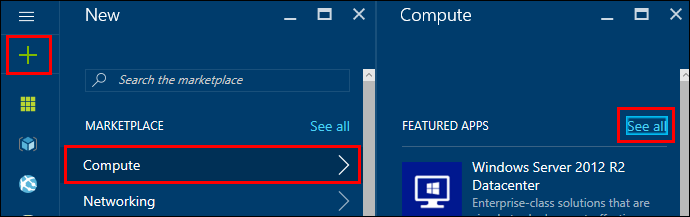

     _Adding a virtual machine_

1. In the **Compute** blade, type **Ubuntu** into the **Search virtual machines** box and press Enter.

    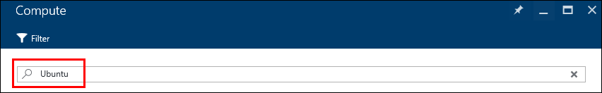

     _Searching available virtual machine images_

1. Click on **Ubuntu Server 16.04 LTS** from the results list.

    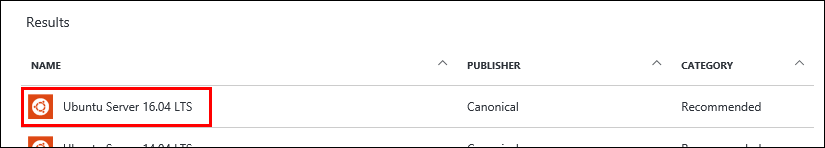

     _Selecting the Ubuntu machine image_

1. In the details blade that appears for the _Ubuntu Server 16.04 LTS_ image, make sure that **Resource Manager** is selected under **Select a deployment model** and click the **Create** button.

    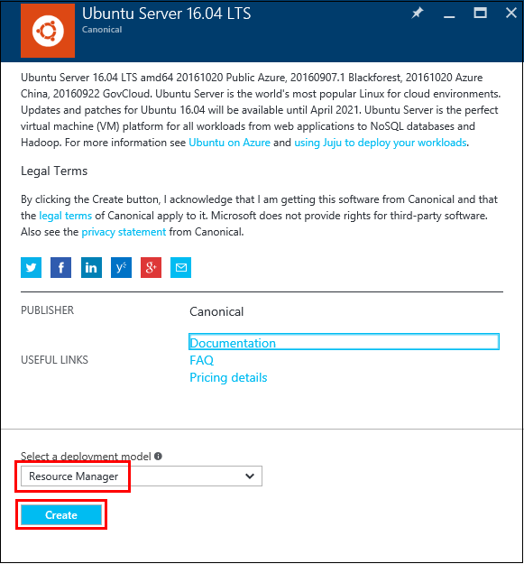

     _Opening the VM creation blade_

1. Enter the basic settings information for your virtual machine in the **Basics** settings blade:

	- Enter a name that identifies this virtual machine in the **Name** box (_VMLab_ is recommended.)
	- Select **SSD** in the **VM disk type** box 
	- Enter **azureuser** into the **User name** box.  This is the name of the administrator account on the virtual machine.
	- Select **Password** for **Authentication type**
	- Enter **Azure4Research** for the **Password** and **Confirm password** boxes.
	- Select **Create new** under **Resource group** and enter the name **VMLabResourceGroup**. Under **Location**, select the location nearest you.
	- Click the **Ok** button to confirm these settings

    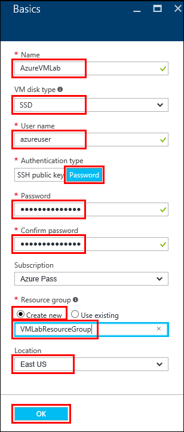

     _Basic virtual machine settings_
 
1. In the **Choose a size** blade, select **DS1_V2 Standard** and click the **Select** button to confirm this as the desired size for the VM you are provisioning.

    

     _Virtual machine size selection_

1. In the **Settings** blade, click on the **Storage account** entry.  In the **Create storage account** blade, change the **Name** value to better reflect its purpose.  Note that this is an Azure Storage Account, so it requires a unique name.  Choose a name that begins with **vmlabdisks**, and then add some characters to make it unique (for example, use your initials and birthdate, as in _vmlabdisksjg1110_)  Click the OK button to accept the name change.

    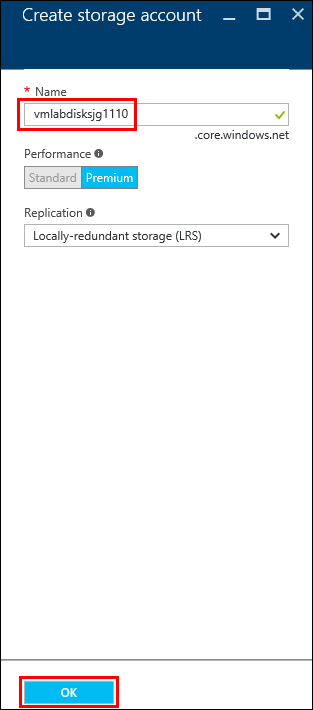

     _Virtual machine storage account name_
 
	Back in the **Settings** blade, scroll down to the bottom and click to the **Diagnostics storage account** entry.  Repeat the process above in the **Create storage account** blade, changing the **Name** value to also better reflect its purpose.  Choose a name that begins with **vmlabdiagnostics**, and then add some characters to make it unique (for example, use your initials and birthdate, as in _vmlabdiagnosticsjg1110_)  Click the OK button to accept the name change.

	Click the **Ok** button to accept the default values in the **Settings** blade.

1. Click the **OK** button in the **Summary** blade to accept the settings entered to this point and provision the virtual machine.

    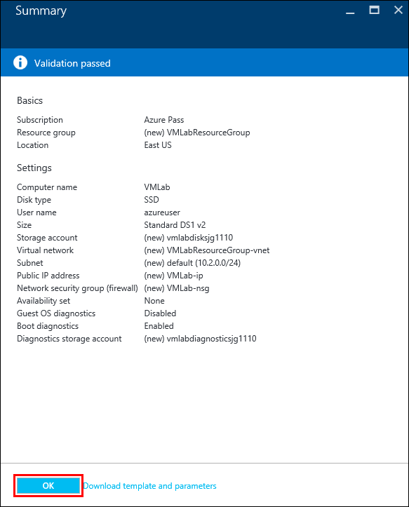

     _Virtual machine provisioning summary_

	Provisioning the virtual machine and its related resources should just take a couple of minutes.

1. When the VM provisioning process completes, the **VMLab** blade should automatically appear.  Click on the **VMLabResourceGroup** link to open the resource group that contains all of the resources related to this VM.     

    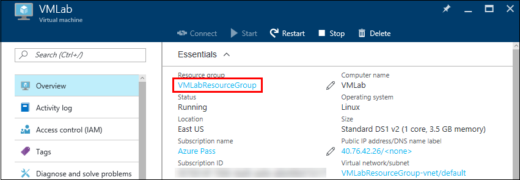

     _The VM Lab blade_

1. Examine the contents of the **VMLabResourceGroup** blade.  This blade shows all of the resources that were provisioned as part of creating the virtual machine.  *(Note - you may want to expand the TYPE column to better see the resource type name for each entry.)*  Key resources include:

- The actual _virtual machine_.
- A _network interface_ entry, indicating the NIC used by the VM for communication.
- A _network security group_ entry.  The NSG contains a list of port-access restrictions that govern communication types into and out of the network interface with which the NSG is associated.
- A _public IP address_.
- A _virtual network_.
- Two _storage account_ entries.  One will be the storage account the virtual machine uses for diagnostic information, the other will be the storage account on which the VM disk images are stored.    

    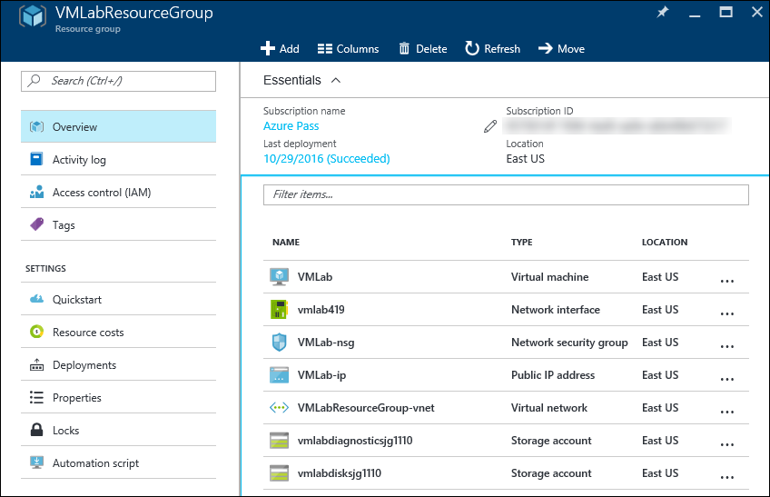

     _The VM Lab resources_

	Close this blade to return to the _VMLab_ virtual machine blade.

## Exercise 2: Set up a Web Server on the Virtual Machine##

In this exercise, you will configure your virtual machine to handle web requests using the Node.js runtime.  work on the VM remotely, you will use a Secure Shell terminal application.  On Mac and Linux systems, SSH is built into the operating system and available for you to use.  On Windows, you will use the popular Windows SSH client named PuTTY.

1. The deployment template that you used to create the virtual machine created a public IP address for the virtual machine.  Open the blade for the **VMLab** virtual machine if it is not already open and click on the IP address under the **Public IP address/DNS name label** section to open the blade for the Public IP address resource.

    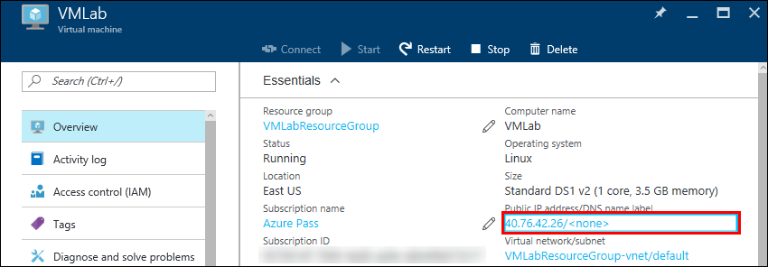

    _Opening the IP address blade_
 
2. In the **VMLab-ip** blade, hover your mouse over the **IP address** entry.  When the **Click to copy** icon appears, click it to copy the IP address to the clipboard.

    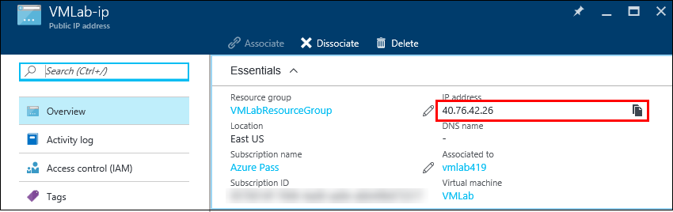

    _Copying the public IP address_

### Connecting with MacOS/Linux ###
Perform these steps to establish a connection to the virtual machine if you are using MacOS or Linux.  If you're running Windows, skip ahead to the *Connecting with Windows* section.

1. Open a terminal window to use to log into the virtual machine. Execute the following command.  If you chose a different VM administrator name than "_azureuser_" in Exercise 1, replace _azureuser_ with the name you chose.  Replace _IP-Address_ with the IP address that you copied into the clipboard in the previous step.

    <pre>
    ssh -l <i>azureuser</i> <i>IP-Address</i>
    </pre>

	> Because this is the first time you have connected to the virtual machine, you may be prompted with a warning dialog asking if you trust this host. Since the host is one you created, type "yes" (without the quotes).

	When prompted, enter the password "_Azure4Research_" (without the quotes) or the value you provided in Exercise 1 if you chose to use a differnet password.

### Connecting with Windows ###
If you already installed PuTTY, [download the installer MSI file](http://www.chiark.greenend.org.uk/~sgtatham/putty/download.html) and install it now.

1. Start PuTTY and paste the IP Address into the **Host Name (or IP address)** field. Then click the **Open** button to initiate a Secure Shell (SSH) connection.

	> Because this is the first time you have connected to the virtual machine, you may be prompted with a warning dialog asking if you trust this host. Since the host is one you created, click **Yes**.

    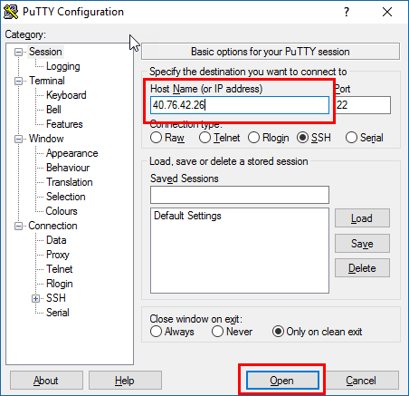

    _Connecting with PuTTY_

1. A PuTTY terminal window will appear and you will be prompted to **login as**. Log in with the the VM administrator user name ("azureuser") and password ("Azure4Research") you previously entered in [Exercise 1](#Exercise1).

### Configuring the virtual machine ###

1. In the SSH terminal, execute the commands below to update the package lists, install the Node.js runtime, install the NPM package manager, and update the internal firewall to allow port 80 communication on the virtual machine. If you are prompted to continue, type "Y" (without the quotes) to indicate "yes".
    <pre>
    sudo apt-get update
	</pre>

    <pre>
    sudo apt-get install nodejs
	</pre>

	<pre>
	sudo apt-get install npm
    </pre>

    <pre>
    sudo ufw allow 80
    </pre>

1. Edit the node content file in the SSH terminal by typing the following command:
	<pre>
    vi labvm.js
	</pre>

1. Press the "i" (without quotes) key to enter _Insert Mode_ in VI.  The bottom left corner of your screen should display the text

	> -- INSERT --

1. Paste the following text into the VI editor:
	<pre>
	var http = require('http');
	
	var server = http.createServer(function(req, res) {
	  res.writeHead(200);
	  res.end('Hello Azure VM Lab!');
	});
	server.listen(80);
	</pre>
 
1. To finish editing, press the Escape (ESC) key on your keyboard, then the following key sequence to save and exit.
	- Esc (escape key)
	- : (colon)
	- wq
	- Enter key

1. Enter the following command in your SSH terminal to run the the node program you just wrote.  This program will listen for web request on port 80 returning a fixed block of text for each request.
	<pre>
	sudo nodejs labvm.js 
	</pre>
  

## Exercise 3: Configure Access to the HTTP port ##

Even though you configured the firewall in the VM to allow network traffic on port 80, there is still one more step you have to perform in order to be able to serve web content.  That is because the _Virtual Network_ (VNET) that your machine resides in includes a _Network Security Group_ (NSG).  The NSG includes rules that define the kinds of inbound and outbound communications that are allowed, and you have yett o tell it that it should allow communication on port 80, the HTTP port.  In this exercise, you will configure a rule that will allow external traffic to reach your virtual machine's _Network Interface Card_ (NIC).

1. In the Azure Portal, open the blade for your lab VM if it is not already open.  Click on **Network Interfaces** to bring up the blade for your VM's NIC, then click on the NIC for your VM in the list that is shown.

    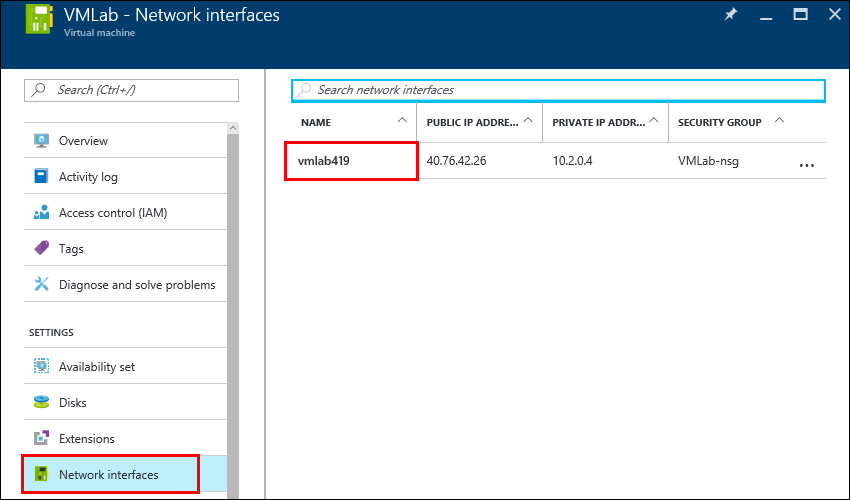

    _Open the NIC blade for the VM_

1. In the **Network Interface** blade, click on the **Network security group** entry, and then on the name of the network security group to bring up its blade.

    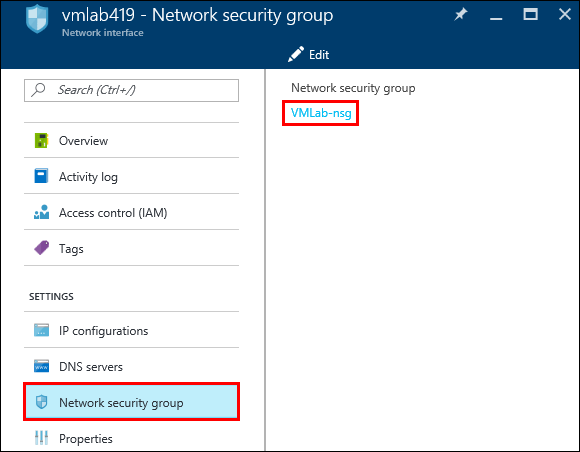

    _Open the network security group_

1. Click on **Inbound security rules** and then on **Add** to add a new rule.

    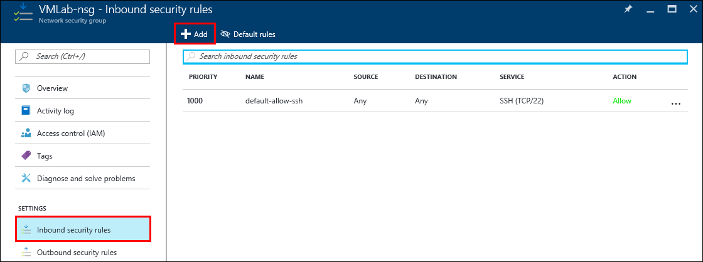

    _Add a new inbound rule_

1. Enter the following information for the new rule:
	- Enter "Lab-VM-HTTP" (without the quotes) in the **Name** box
	- Leave the **Priority** box set to **1010**
	- Leave the **Source** box set to **Any**
	- Under **Service**, select **HTTP**
	- Leave the **Action** selection set to **Allow**
	
	Press the **OK** button to create the rule.

    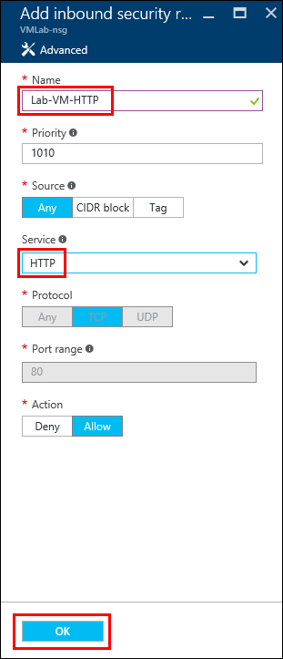

    _Define the new inbound rule_

	You may need to wait a minute or two for the new rule to be created.

1. Open a new browser window and enter the IP address of your VM into the address bar.  It should show the content you entered in the Node program in the previous exercise.

    

    _Browse the web page_

## Exercise 4: Suspend the Virtual Machine ##

When virtual machines are running, you are being charged — even if the VM is idle. Therefore, it is advisable to stop virtual machines when they are not in use. You will still be charged for storage, but that cost is typically insignificant compared to the cost of an active VM. The Azure Portal makes it easy to stop virtual machines. VMs that you stop are easily started again later so you can pick up right where you left off.

1. In the Azure Portal, open the blade for your lab VM if it is not already open.  

1. Click the **Stop** button to stop the virtual machine.

    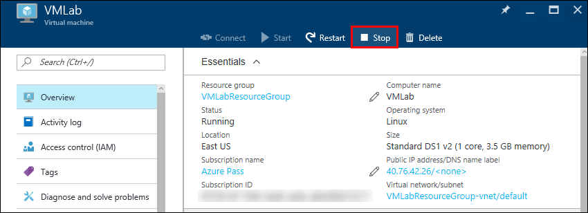

    _Stopping the virtual machine_

You can stop and start virtual machines in the Azure portal, but if you have a lot of VMs, that's not very efficient. In the real world, you might prefer to use an Azure CLI or PowerShell script to enumerate all of the VMs in a resource group and start or stop them all. For more information on scripting the Azure CLI, see the section entitled "How to script the Azure CLI for Mac, Linux, and Windows" in [Install and Configure the Azure CLI](https://azure.microsoft.com/en-us/documentation/articles/xplat-cli/). If you prefer visual tools to command-line tools, you can use [Azure Automation](https://azure.microsoft.com/en-us/services/automation/) to automate VM operations.

## Exercise 5: Delete the Lab Resources ##
Resource groups are a useful feature of Azure because they simplify the task of managing related resources. One of the most practical reasons to use resource groups is that deleting a resource group deletes all of the resources it contains. Rather than delete those resources one by one, you can delete them all at once.

In this exercise, you'll delete the resource group created in [Exercise 1](#Exercise1) when you provisioned the virtual machine. Deleting the resource group deletes everything in it and prevents any further charges from being incurred for it.

1. In the Azure Portal, open the blade for the "VMLabResourceGroup" resource group that holds the virtual machine. Then click the **Delete** button at the top of the blade.

	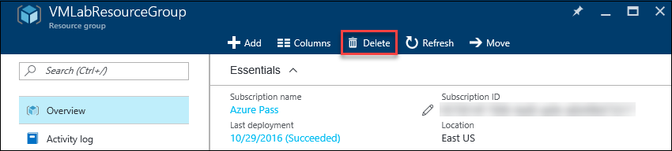

	_Deleting a resource group_

1. For safety, you are required to type in the resource group's name. (Once deleted, a resource group cannot be recovered.) Type the name of the resource group. Then click the **Delete** button to remove all traces of this lab from your account.

After a few minutes, the virtual machine and all of its resources will be deleted. Billing stops when you click the **Delete** button, so you're not charged for the time required to delete the virtual machine. Similarly, bulling doesn't start until a virtual machine has been fully and successfully deployed.

## Summary ##

In this hands-on lab, you learned how to:

- Provision a Linux virtual machine in Azure using the Azure Marketplace images
- Connect to the virtual machine using SSH
- Install a web server on the virtual machine
- Define a network security group rule to allow incoming network traffic on the HTTP port
- Stop the virtual machine to suspend any further usage charges
- Use the Azure Resource Manager to delete the virtual machine and its related resources

The Azure Virtual Machine service gives you a lot of powerful options for configuring and deploying virtual machines into the Cloud.  But remember, "with great power, comes great responsibility."  Although VM's allow you to the greatest options for custom configuration, you are also signing up for the related responsibility of managing the VM, especially including timely application of OS and security patches.

---