<a name="HOLTitle"></a>
# Azure DocumentDB #

---

<a name="Overview"></a>
## Overview ##

An app, tool, or process, whether it targets businesses, consumers, or both, is only as meaningful as the data that drives it. With consumer and organizational requirements changing constantly, as well as the need to store, index, and optimize data and structures as they change, the need for a more open, flexible, and schema "agnostic" data solution has been become essential. Azure DocumentDB addresses these challenges and makes it easy to adjust and adapt data models on the fly, as business logic and application scenarios change.

In this lab, you’ll create and configure an Azure DocumentDB account, database, and collection to accept the import of customer and product order information for the fictitious company Adventure Works, as well as automatically populating an Azure Search service index with customer and product information to facilitate an "autosuggest" customer order search.

<a name="Objectives"></a>
### Objectives ###

In this hands-on lab, you will learn how to:

- Create an Azure DocumentDB account, database and collections
- Populate Azure Document DB collections with documents
- Create and configure an Azure Search service and index
- Access Azure DocumentDB collections from your apps
- Query Azure Search services connected to DocumentDB content

<a name="Prerequisites"></a>
### Prerequisites ###

The following are required to complete this hands-on lab:

- An active Microsoft Azure subscription or [sign up for a free trial]( https://azure.microsoft.com/en-us/free/).
- [Visual Studio 2015 Community edition](https://www.visualstudio.com/en-us/products/visual-studio-community-vs.aspx) or higher.
 
---

<a name="Exercises"></a>
## Exercises ##

This hands-on lab includes the following exercises:

- [Exercise 1: Create and configure a DocumentDB application](#Exercise1)
- [Exercise 2: Create and configure a database and collections](#Exercise2)
- [Exercise 3: Populate collections with documents](#Exercise3)
- [Exercise 4: Create and configure an Azure Search service and index](#Exercise4)
- [Exercise 5: Build an Azure Web App](#Exercise5)
- [Exercise 6: Add document search to an Azure Web App](#Exercise6)

 
Estimated time to complete this lab: **60** minutes.

<a name="Exercise1"></a>
## Exercise 1: Create and configure a DocumentDB application ##

The first step in working with Azure DocumentDB content is to create an Azure DocumentDB application as the location for a one or more databases, collections, and documents. This step will create and configure your Azure DocumentDB application.

1.	Open the [Azure Portal](https://portal.azure.com "Azure Portal"), if asked to login, do so with your Microsoft Account.

1.	Click **+ New**, followed by **Database** and **DocumentDB (NoSQL)**.	

    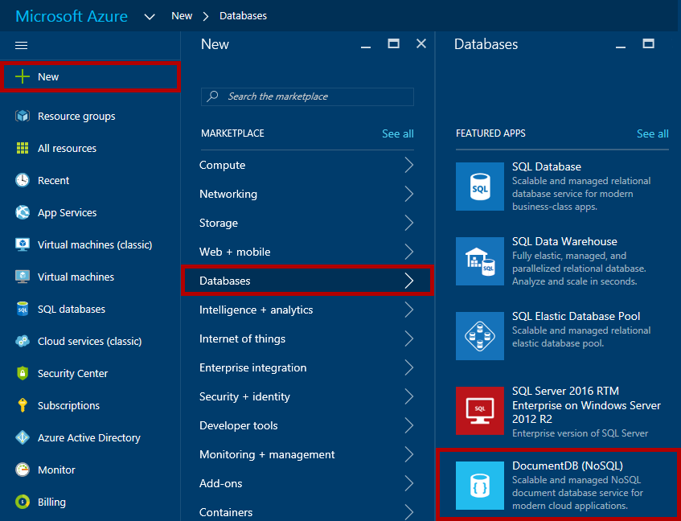

    _Creating a DocumentDB application_

1.	The Azure portal will display a form for creating a new Azure DocumentDB application. Enter an account ID such as "traininglab01" (without the quotation marks) or any unique label without spaces or special characters.

	> DocumentDB account IDs can be 3 to 24 characters in length and can only contain numbers and lowercase letters. In addition, the name you enter must be unique within Azure. If someone else has chosen the same name, you'll be notified that the name isn't available with a red exclamation mark in the **Name** field.
	 
1.	Make sure DocumentDB has been selected as the type of **NoSQL API**. If DocumentDB is not selected, click **DocumentDB**.

1.	Under "Resource Group" select **Create New**, enter a Resource Group name such as "TrainingLabResource."

1.	Select the location nearest you, and click **Create**.

    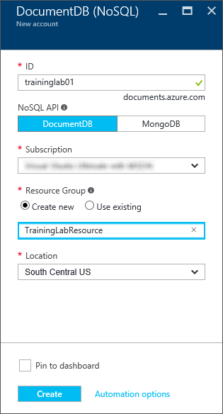

    _Specifying DocumentDB application parameters_

The Azure Portal will redirect you to the Azure Portal Dashboard while it provisions your DocumentDB application. It typically takes around three to five minutes to fully provision a new DocumentDB application. To monitor provisioning of your DocumentDB application from the Azure Portal:

1.	Click the **"hamburger"** icon in the Azure Portal to open the side drawer.

1.	Click **Resource Groups** followed by **TrainingLabResource**.

1.	Select the "Overview" tab.

1.	Review the "Last deployment" label and watch for the status to change from "Deploying" to "Succeeded", at which time your DocumentDB application has been successfully provisioned.

    

    _Resource Group deployment status_

	> NOTE: You may need to refresh the page in your browser from time to time to see the most recent deployment status changes.

Your Azure DocumentDB application is now provisioned and ready to start creating databases and collections in n [Exercise 2: Create and configure a database and collections](#Exercise2").

<a name="Exercise2"></a>
## Exercise 2: Create and configure a database and collections ##

Now that you’ve created an Azure DocumentDB application, you’re ready to create a database and collections in preparation for storing documents. In this exercise you’ll create a database and collections to store customer and product order information that can be indexed for searching in Exercise 4. To creating an Azure DocumentDB database and collections:

1. Open the [Azure Portal](https://portal.azure.com "Azure Portal") dashboard (if it’s not already open from Exercise 1) and click the **"hamburger"** icon to open the side drawer menu.

1. Click **Resource Groups** followed by **TrainingLabResource**.

1. Select the "Overview" tab.

    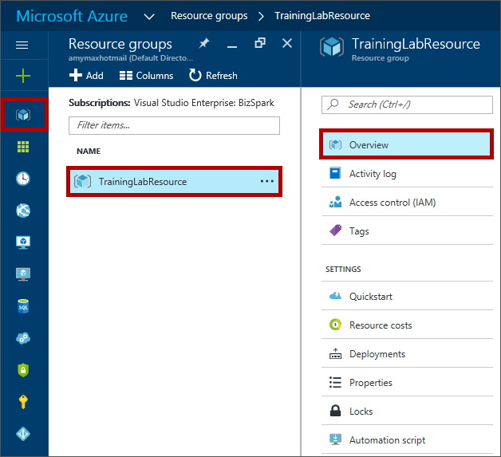

    _Selecting the Resource Group_

1. Click **traininglab01** (or the alternative name you entered in Step 3 of Exercise 1) to open your newly provisioned DocumentDB application.

    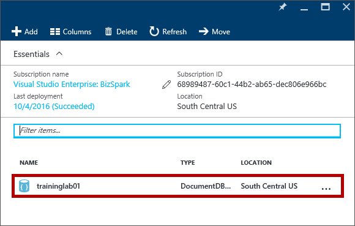

    _Selecting the DocumentDB application_

1. Click **Add Database** and when the Add Database form displays, enter "CustomerOrders" (again, without quotes) as the **ID** of your database.

    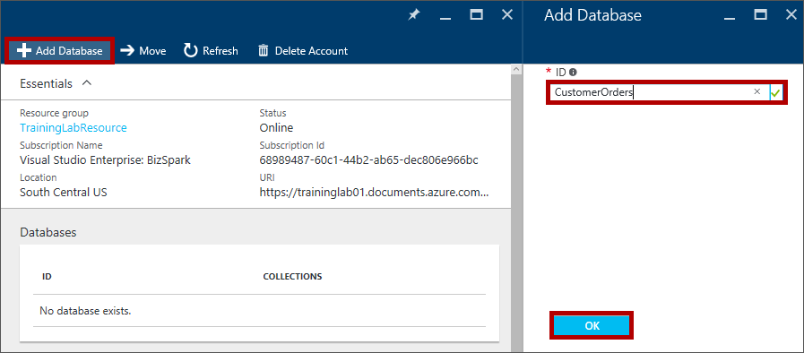

    _Selecting Add Database_

1. Click **OK** to create your database. A new entry for CustomerOrders will display in the Databases section of the DocumentDB application blade.

    

    _A newly created database_

1. Click **CustomerOrders** in the "Databases" section of the application blade. The new "CustomerOrders" database blade will now be displayed.

    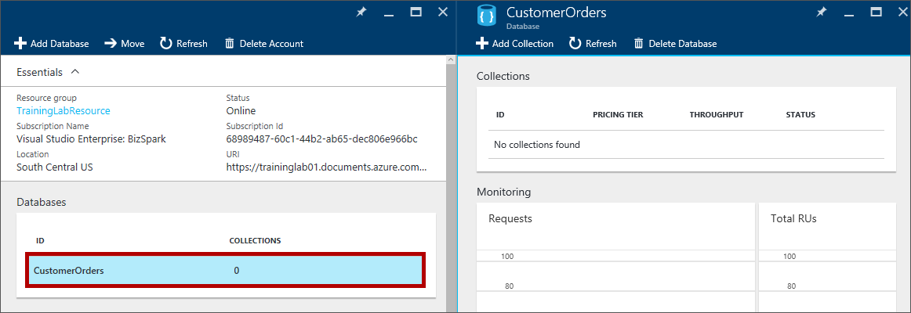

    _The DocumentDB database blade_

1. Click **Add Collection** and when the "Add Collection" form displays, enter "Customers" as the **collection ID**. Leave all other form values as the pre-selected defaults and click **OK**. Your Customers collection has now been created.

    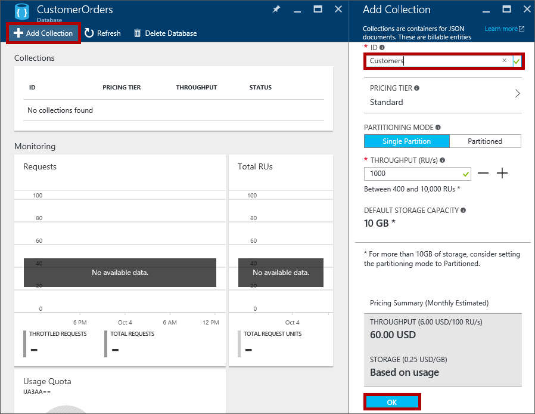

    _Adding the Customers collection_

1. Click **Add Collection** again and when the **Add Collection** form displays, enter "Products" as the **collection ID**. Again, leave all other form values as the pre-selected defaults and click **OK**. Your Products collection has now been created.

    

    _Adding the Products collection_

1. Click **Add Collection** again and when the "Add Collection" form displays, enter "Orders" as the **collection ID**. Again, leave all other form values as the pre-selected defaults and click **OK**. Your Orders collection has now been created.

    

    _Adding the Orders collection_

Your DocumentDB database and collections have now been created. Up until now, you have been creating and configuring elements of your DocumentDB environment in preparation for the storage of actual data, and you’re ready to start adding customer and product order documents. You can now proceed to Exercise 3: Populate collections with documents.

<a name="Exercise3"></a>
## Exercise 3: Populate collections with documents ##

Populating Azure DocumentDB collections with documents can be accomplished through various mechanisms, such as programmatic import via the [Azure SDK](https://www.nuget.org/packages/Microsoft.Azure.DocumentDB/ "Azure SDK"), the [Microsoft DocumentDB Data Migration Tool](https://www.microsoft.com/en-us/download/details.aspx?id=46436 "Microsoft DocumentDB Data Migration Tool"), as well as direct import via the Azure Portal itself. In this exercise you’ll be using the direct import feature of the Azure Portal to populate your collections with customer, product, and order data stored as JSON documents.

To populate your DocumentDB collections with documents:

1.	Locate the "Collections" panel in the CustomerOrders database you created in Step 6 of Exercise 2 and click **Customers**.

    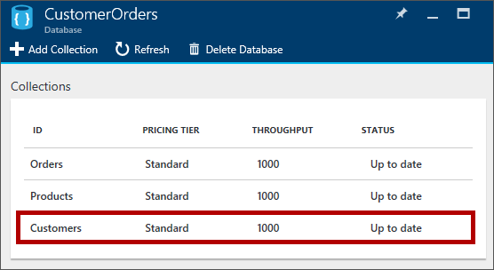

    _Select the Customers collection_

1.	The Azure Portal will display the "Customers" collection blade. Click **Document Explorer**.
1.	In the "Document Explorer" blade click **Upload**.
	
    

    _Selecting upload Customer documents_

1.	In the "Upload Document" panel click the **folder icon** and browse your local files to the **Resources** folder included in the content for the lab, and open the **Customers** folder.
	
    

    _Browsing for Customer documents_

1.	Select all files in the **Customers** folder by pressing **CTRL+A** on your keyboard. Click **Open** to add the selected files to the file input.
	
    

    _Selecting Customer documents_

1.	When the file input populates, click **Upload** to add the selected customer documents to the Customers collection. A result of "Succeeded" will display in the File Upload Status panel.
	
    

    _Customer documents uploaded_

1.	Navigate back to the **CustomerOrders** database by selecting **CustomerOrders** in the Azure Portal **breadcrumb navigation**.
1.	In the "Collections" panel of the "CustomerOrders" database click **Products**.

    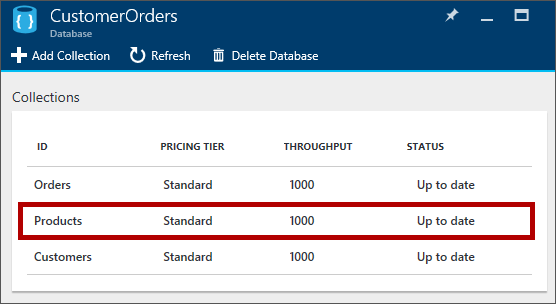

    _Select the Products collection_

1.	The Azure Portal will display the Products collection blade. Click **Document Explorer**.
1.	In the "Document Explorer" blade click **Upload**.
	
    

    _Selecting upload Product documents_

1.	In the "Upload Document" panel click the **folder icon** and browse your local files to the "Resources" folder included in the content for the lab, and open the **Products** folder.
1.	
    

    _Browsing for Product documents_

1.	Select all files in the **Products** folder by pressing **CTRL+A** on your keyboard. Click **Open** to add the selected files to the file input.
	
    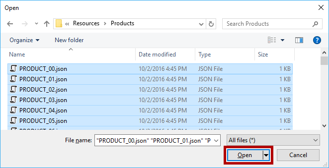

    _Selecting Product documents_

1.	When the file input populates, click **Upload** to add the selected product documents to the Products collection. A result of "Succeeded" will display in the "File Upload Status" panel.
	
    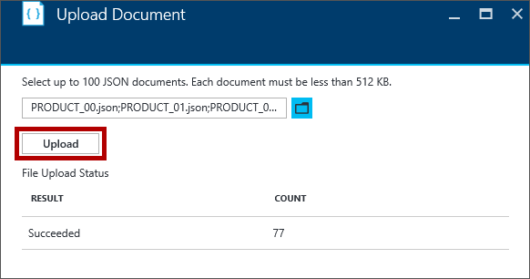

    _Product documents uploaded_

1.	Navigate back to the "CustomerOrders" database by selecting **CustomerOrders** in the Azure Portal **breadcrumb navigation**.
1.	In the "Collections" panel of the "**CustomerOrders** database click **Orders**.

    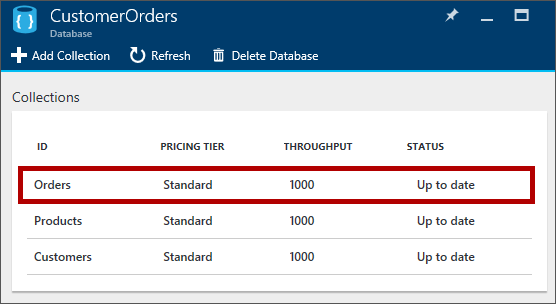

    _Select the Orders collection_

1.	The Azure Portal will display the "Orders" collection blade. Click **Document Explorer**.
1.	In the "Document Explorer" blade click **Upload**.
	
    

    _Selecting upload Order documents_

1.	In the "Upload Document" panel click the **folder icon** and browse your local files to the "Resources" folder included in the content for the lab, and open the **Orders** folder.
	
    

    _Browsing for Order documents_

1.	Select all files in the "Orders" folder by pressing **CTRL+A** on your keyboard. Click **Open** to add the selected files to the file input.
	
    

    _Selecting Order documents_

1.	When the file input populates, click **Upload** to add the selected order documents to the Orders collection. A result of "Succeeded" will display in the "File Upload Status" panel.
	
    

    _Order documents uploaded_

At this point in the exercise, it's helpful to validate document import by querying a collection for documents. To query the Orders collection for documents:

1.	Navigate back to the "Orders" collection by selecting **Orders** in the Azure Portal **breadcrumb navigation**.

1.	Click **Query Explorer** in the "Orders" collection blade.
	
    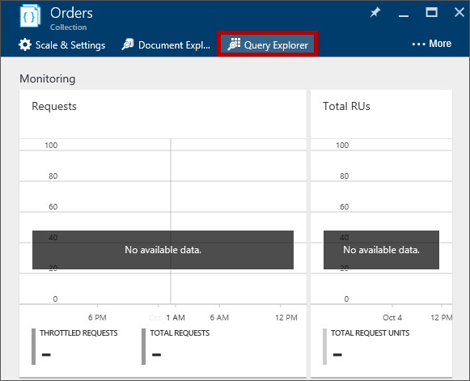

    _Selecting the Query Explorer_

1.	Click **Run Query** in the "Query Explorer" panel to execute a sample query against the imported order documents.

1.	The Azure Portal will display a Results panel containing JSON-formatted output representing orders from the Orders collection. Scroll the panel using the vertical scrollbar to review order document content and associated customer and product information.
	
    

    _Running a query in the Query Explorer_

In this exercise you’ve experienced how simple adding documents to an Azure DocumentDB collection can be, as well as mechanisms to review and validate imported documents. In order to facilitate indexed searching against customer and product documents to create search "lookups" it’s time to integrate our DocumentDB application with Azure Search in [Exercise 4: Create and configure an Azure Search service and index](#Exercise4").

<a name="Exercise4"></a>
## Exercise 4: Create and configure an Azure Search service and index ##

Since Azure DocumentDB collections are based on the concept of "open" schemas, and often contain redundant data due to their denormalized structure, it’s helpful to manage specific search-related activities by integrating search enhancement services such as Azure Search.

To create and configure an Azure Search service to index documents in your Azure DocumentDB application:

1.	Open the Azure Portal (if it’s not already open from Exercise 3) and click the **"hamburger"** icon to open the side drawer menu.

1.	Click **+ New**, followed by **Web + mobile** and then **Azure Search**.
	
    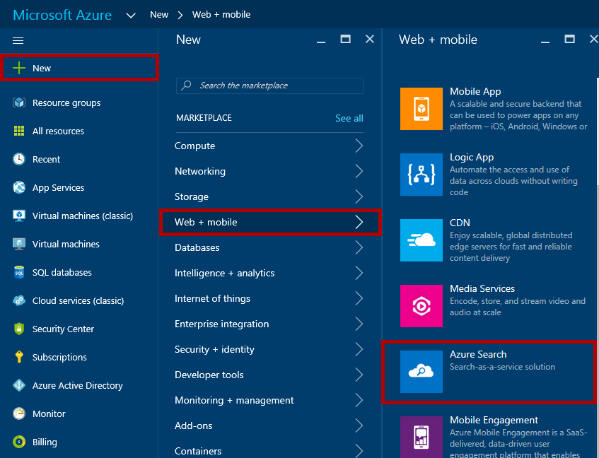

    _Creating a new Azure Search service_

1.	The Azure portal will display a form for creating a new Azure Search service. Enter a **search service name** such as "trainingsearch01" (without the quotation marks) or any unique label without spaces or special characters. 

	>NOTE: Azure Search service names can be 3 to 24 characters in length and can only contain numbers and lowercase letters. In addition, the name you enter must be unique within Azure. If someone else has chosen the same name, you'll be notified that the name isn't available with a red exclamation mark in the **Name** field.
	
1.	Under "Resource Group" select **Use Existing**, and select the **TrainingLabResource** group created in Step 6 of Exercise 1.

1.	Select the location nearest you, and click **Create**.
	
    

    _Configuring a new Azure Search service_


The Azure Portal will redirect you to the Azure Portal Dashboard while it provisions your Azure Search service. It typically takes around 30 seconds fully provision a new Azure Search service. To monitor provisioning of your service from the Azure Portal:	

1.	Click the **"hamburger"** icon in the Azure Portal to open the side drawer

1.	Click **Resource Groups** followed by **TrainingLabResource**.

1.	Select the **Overview** tab.

1.	Review the "Last deployment" label and watch for the status to change from "Deploying" to "Succeeded", at which time your Azure Search service has been successfully provisioned.
	
    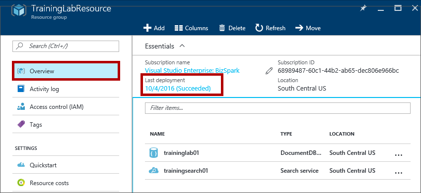

    _Resource Group deployment status_


	>NOTE: You may need to refresh the page in your browser from time to time to see the most recent deployment status changes.
	
1.	Click **trainingsearch01** (or the alternative name you entered earlier in this exercise) to open your newly provisioned Azure Search service.
	
    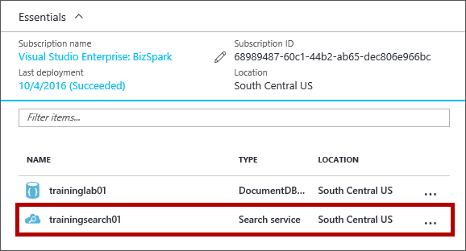

    _Selecting the new Search service_

1.	In the "trainingsearch01" search service blade, click **Import data**. The Import data panel will be displayed with options to configure a Data Source, Index and Indexer.
	
    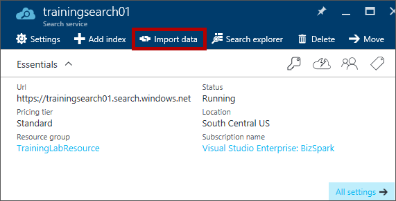

    _Selecting Import data_

1.	Click **Data Source**, followed by **DocumentDB** to open the "New data source" panel.

1.	Enter "customers" (all lowercase, not quotation marks) in the **Name** entry.
	
    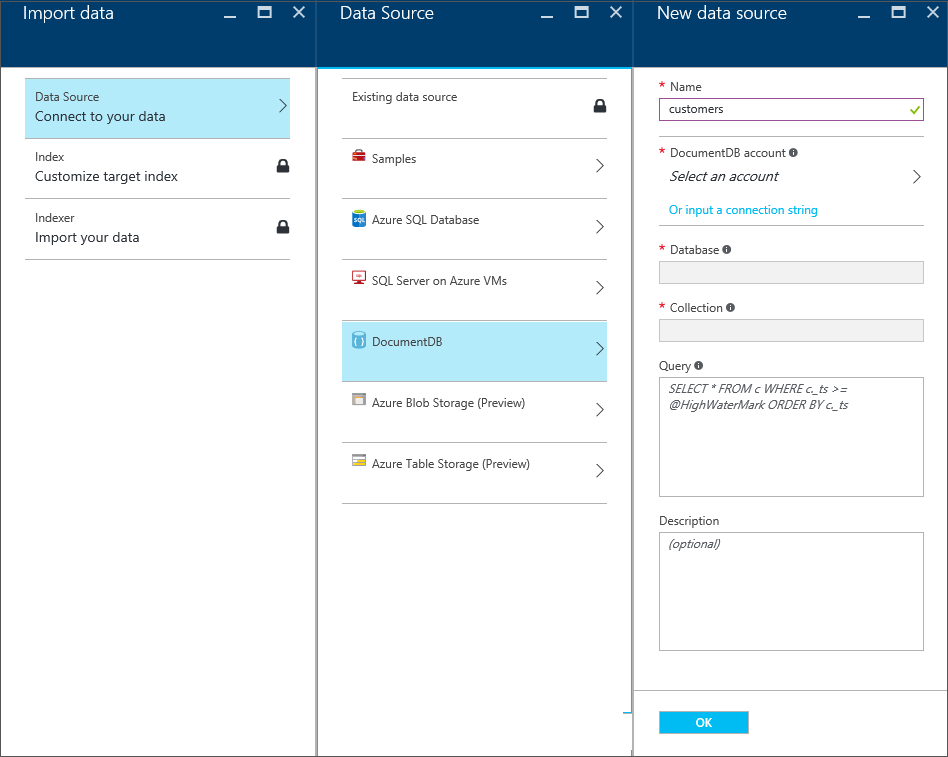

    _Connect a Search service to a datasource_

1.	Click **DocumentDB account** and then select **traininglab01** (or the alternative name you entered in Step 3 of Exercise 1.)
	
    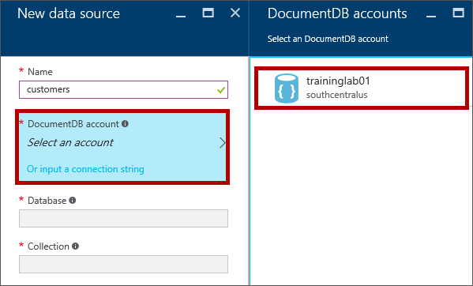

    _Connecting the Search service to a DocumentDB datasource_

1.	Select **CustomerOrders** from the "Database" list and then select **Customers** from the "Collection" list.

1.	Click **OK** to save changes to the data source and be returned to the Import data panel.
	
    

    _Configuring the Search service datasource collection_

1.	Select **Index** from the "Import data" panel.

1.	Replace the default label "temp" with "customerindex" in the **Index name** entry.

1.	Locate the "CompanyName" row in the available index grid and check **all five (5) options** in the available columns to the right. These columns will be labeled *RETRIEVABLE*, *FILTERABLE*, *SORTABLE*, *FACETABLE* and *SEARCHABLE*.
	
    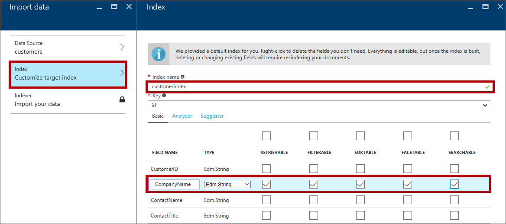

    _Configuring the Search service index_

	>Since the terms "index" and "indexer" are similar, make sure are aware of these use of these terms when configuring your Search Service. In general, an "index" maps to field values, and an "indexer" handling index schedules and updates.

1.	Click **OK** to save changes to the Search index. You will be redirected to the Search indexer panel to configure indexer options.

1.	In the "Create an indexer" panel, enter "customerindexer" in **Name** entry and click **OK**, and then click **OK** the "Import data" panel.
	
    

    _Configuring the Search service indexer_
 
    

    _Saving the Azure Search service index_
 
At this point your Azure Search service has been created and configured to connect to your Azure DocumentDB content, as well as indexed to return lookup information from documents in the Customers collection. You’ve also completed all the necessary steps for accessing highly-performant, indexed Azure DocumentDB content from an external application. Now it’s time to create an application to access customer, product, and order information in [Exercise 5: Build an Azure Web App](#Exercise5").

<a name="Exercise5"></a>
## Exercise 5: Build an Azure Web App ##

Up to this point, most of your efforts have gone into creating and configuring services related to an Azure DocumentDB database and collection, as well as an Azure Search service, but the real value comes in being able to visualize the data returned from these services in a user experience.

In this exercise you’ll be building an Azure Web App with Visual Studio 2015 and writing code to access the Azure DocumentDB application, database, collections, and documents created in earlier exercises.

To create an Azure Web App in Visual Studio 2015:

1.	Start Visual Studio 2015 and use the **File -> New -> Project** command to create a new Visual C# **ASP.NET Web Application** project named "AdventureDoc" (short for "Adventure Works Documents").
 
    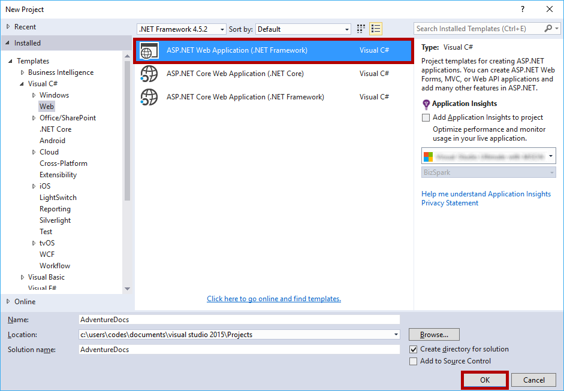

    _Creating a new Web Application project_

1.	In the "New ASP.NET Project" dialog, select the **MVC** template. Then click the **Change Authentication** button and select **No Authentication**. (This simplifies the app by omitting authentication infrastructure.) Next, make sure the **Host in the cloud** box is checked and that **App Service** is selected in the drop-down list below the check box. Finally, click **OK**.
 
    

    _Creating a new ASP.NET MVC project_

1.	In the **Create App Service** dialog that ensues, enter a name into the **Web App Name** box, or accept the default. (The default name will include a bunch of numbers. Since this name will form part of the DNS name through which the app is accessed once it's deployed to Azure, it must be unique within Azure. For this reason, you probably won't be able to use the name "AdventureDocs" pictured in the screen shot.)
	
	Type "TrainingLabResouce" (without quotation marks) into the **Resource Group** box to make the App Service that's being created part of the same resource group as the Azure DocumentDB application you created in Exercise 1.

 	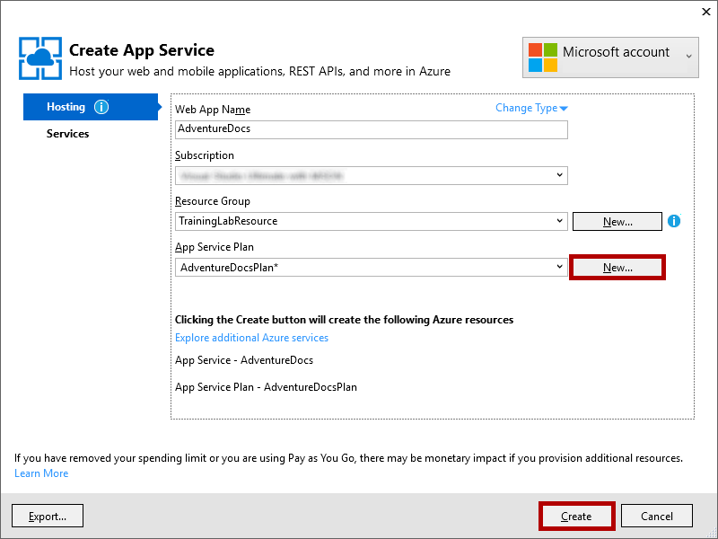

    _Creating an App Service_


	Now click the **New** button to the right of **App Service Plan** to open the "Configure App Service Plan" dialog. In that dialog, set **Location** to the same location you specified for the storage account in Exercise 1, and make sure **Free** is selected in the **Size** drop-down. Click **OK** to close the dialog.
 
    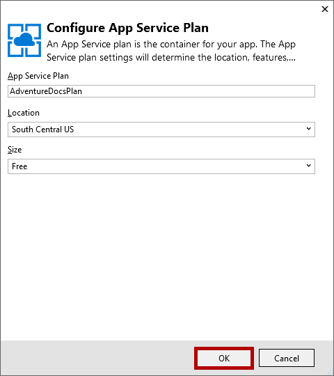

    _Creating an App Service plan_


1.	Take a moment to review the project structure in the Solution Explorer window. Among other things, there's a folder named "Controllers" that holds the project's MVC controllers, and a folder named "View" that holds the project's views. You'll be working with assets in these folders and others as you implement the application.

1.	 Now use Visual Studio's **Debug -> Start Without Debugging** command (or simply press **Ctrl+F5**) to launch the application in your browser. Here's how the application looks in its present state:
	 
    

    _The initial application_

1.	Close the browser and return to Visual Studio. In the Solution Explorer window, right-click the **AdventureDocs** project and select **Manage NuGet Packages...**.
	 
    

    _Managing NuGet packages for the project_

1.	Click **Browse**. Then type "DocumentDB" (without quotation marks) into the search box. Click **Microsoft.Azure.DocumentDB** to select the Azure DocumentDB client library from NuGet. Finally, click **Install** to install the latest stable version of the package. This package contains APIs for accessing Azure DocumentDB from .NET applications. Click **OK** if you're prompted to review changes, and **I Accept** if prompted to accept licenses for downloaded packages.
	 
    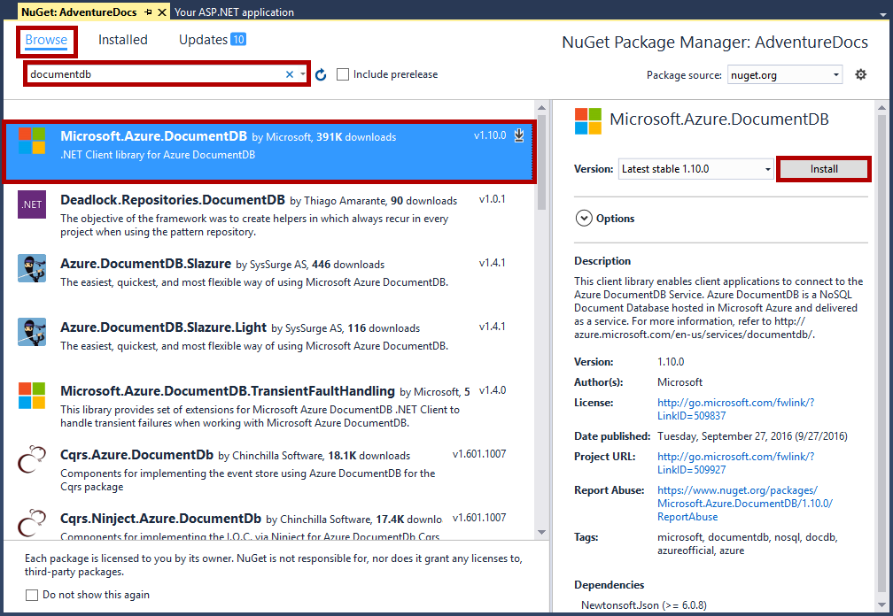

    _Installing Microsoft.Azure.DocumentDB_

1.	Repeat this process to add the NuGet package named **Microsoft.WindowsAzure.ConfigurationManager** to the project. This package contains APIs that you will use in your code to parse connection strings and access keys. Once more, OK any changes and accept any licenses presented to you.
	
    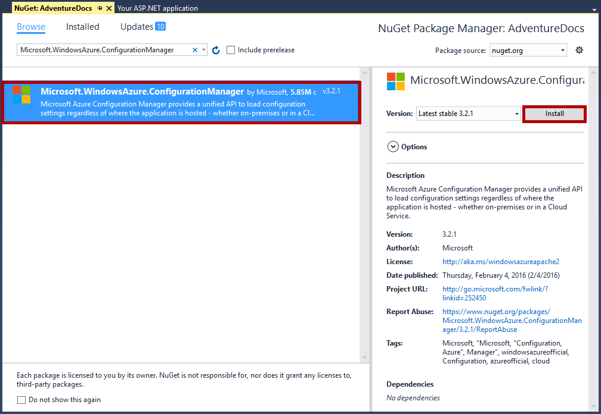

    _Installing Microsoft.WindowsAzure.ConfigurationManager_

1.	Repeat this process to add the NuGet package named **Microsoft.Azure.Search** to the project. This package contains APIs for accessing Azure Search from .NET applications. Once more, OK any changes and accept any licenses presented to you.	
	
    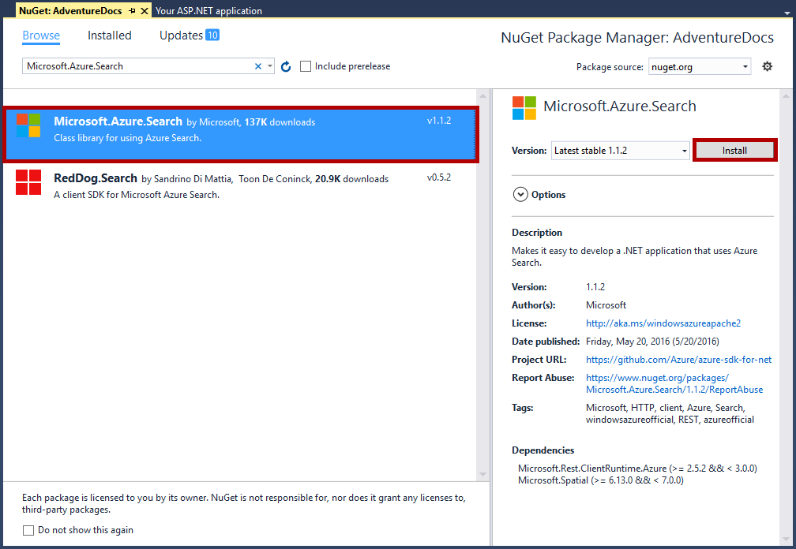

    _Installing Microsoft.Azure.Search_

1.	Repeat this process to add the NuGet package named **jQuery.UI.Combined** to the project. This package contains APIs and file elements required by MVC 5.0 for jQuery user interface elements. Once more, OK any changes and accept any licenses presented to you.
	
    

    _Installing jQuery.UI.Combined_

1.	In the Solution Explorer window, double-click **Web.config** to open it for editing.
	
    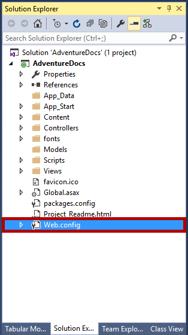

    _The web application Web.config file_

1.	Return to the Azure Portal for a moment and open the blade for the Azure DocumentDB application you created in Exercise 1. Then .
	
    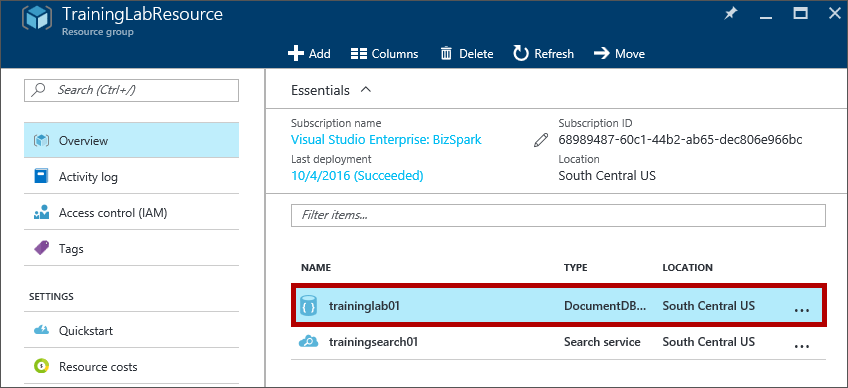

    _Selecting the DocumentDB application_

1.	Click **Keys** in the **SETTINGS** group, then select the **Read-only Keys** tab from the **Keys** panel.
	
    

    _Viewing the DocumentDB access keys_

1.	Click the **Copy** button to the right of **URI** to copy the application endpoint the clipboard.
	
    

    _Copying the DocumentDB application endpoint_

1.	Return to Visual Studio. In *Web.config*, add the following statement to the \<appSettings\> section, replacing ***documentdb_endpoint*** with the name of the application endpoint copied to the clipboard.
	
	```C#
	<add key="DocumentDBEndpointUrl" value="documentdb_endpoint" />
	```
    	
    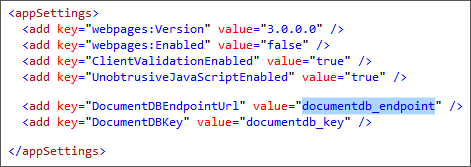

    _Inserting the DocumentDBEndpoint value_

1. Return to the Azure Portal and click the **Copy** button to the right of **PRIMARY READ-ONLY KEY** to copy the application access key the clipboard.
	
    

    _Copying the DocumentDB access key_

1.	Return to Visual Studio. In *Web.config*, add the following statement to the \<appSettings\> section, replacing ***documentdb_key*** with the name of the application access key copied to the clipboard.

	```C#
	<add key="DocumentDBKey" value="documentdb_key" />
	```	
	
    

    _Inserting the DocumentDBKey value_

1.	In the Solution Explorer window, find the file named _Layout.cshtml in the **Views/Shared** folder. Double-click the **file** to open it.

    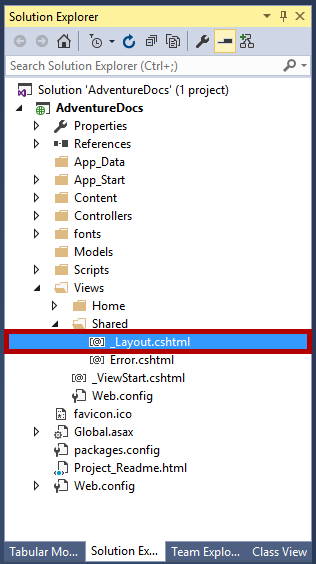

    _Opening _Layout.cshtml_

1.	Replace the contents of Layout.cshtml with the following code and markup: 

	```c#
	<!DOCTYPE html>
	<html>
	<head>
	    <meta charset="utf-8" />
	    <meta name="viewport" content="width=device-width, initial-scale=1.0">
	    <title>@ViewBag.Title</title>
	    @Styles.Render("~/Content/css")
	    @Scripts.Render("~/bundles/modernizr")
	    @Styles.Render("~/Content/css")
	    @Styles.Render("~/Content/themes/base/css")
	    @Scripts.Render("~/bundles/modernizr")
	    @Scripts.Render("~/bundles/jquery")
	    @Scripts.Render("~/bundles/bootstrap")
	    @Scripts.Render("~/bundles/jqueryui")
	</head>
	<body>
	    <div class="navbar navbar-inverse navbar-fixed-top">
	        <div class="container">
	            <div class="navbar-header">
	                <button type="button" class="navbar-toggle" data-toggle="collapse" data-target=".navbar-collapse">
	                    <span class="icon-bar"></span>
	                    <span class="icon-bar"></span>
	                    <span class="icon-bar"></span>
	                </button>
	                @Html.ActionLink("AdventureDB", "Index", "Home", new { area = "" }, new { @class = "navbar-brand" })
	            </div>
	            <div class="navbar-collapse collapse">
	                <ul class="nav navbar-nav">
	                    <li>@Html.ActionLink("Document Search", "Index", "Home")</li>
	                    <li>@Html.ActionLink("Customer Lookup", "Lookup", "Home")</li>
	                </ul>
	            </div>
	        </div>
	    </div>
	    <div class="container body-content">
	
	        @RenderBody()
	        <hr />
	        <footer>
	            <p class="text-muted">All rights reserved. Copyright &copy;@DateTime.Now.Year AdventureDB.</p>
	        </footer>
	    </div>
	
	    @Scripts.Render("~/bundles/bootstrap")
	    @RenderSection("scripts", required: false)
	</body>
	</html>
	
	```

1.	In Solution Explorer, right-click the project's **Models** folder and select **Add -> Class**:

    

    _Adding a class to the Models folder_

1.	Type "OrderInformation.cs" (without quotation marks) into the **Name** box, and then click **OK**.

    

    _Creating the OrderInformation class_

1.	Replace the empty *OrderInformation* class with the following class definitions, and note that you are making the classes public rather than private, as well as marking the OrderInformation class as "Serializable":

	```C#
	 	[Serializable]
	    public class OrderInformation
	    {
	        public string CustomerID { get; set; }
	        public string CompanyName { get; set; }
	        public Customer Customer { get; set; }
	    }
	
	    public class Customer
	    {
	        public string CustomerID { get; set; }
	        public string CompanyName { get; set; }
	        public string ContactName { get; set; }
	        public string ContactTitle { get; set; }
	        public string Address { get; set; }
	        public string City { get; set; }
	        public object Region { get; set; }
	        public string PostalCode { get; set; }
	        public int Latitude { get; set; }
	        public int Longitude { get; set; }
	        public string Country { get; set; }
	        public string Phone { get; set; }
	        public string Fax { get; set; }
	        public Orders Orders { get; set; }
	    }
	
	    public class Orders
	    {
	        public int OrderID { get; set; }
	        public string CustomerID { get; set; }
	        public int EmployeeID { get; set; }
	        public DateTime OrderDate { get; set; }
	        public DateTime RequiredDate { get; set; }
	        public DateTime ShippedDate { get; set; }
	        public int ShipVia { get; set; }
	        public float Freight { get; set; }
	        public string ShipName { get; set; }
	        public string ShipAddress { get; set; }
	        public string ShipCity { get; set; }
	        public object ShipRegion { get; set; }
	        public string ShipPostalCode { get; set; }
	        public string ShipCountry { get; set; }
	        public Details Details { get; set; }
	    }
	
	    public class Details
	    {
	        public int OrderID { get; set; }
	        public int ProductID { get; set; }
	        public int Quantity { get; set; }
	        public float Discount { get; set; }
	        public Product Product { get; set; }
	    }
	
	    public class Product
	    {
	        public int ProductID { get; set; }
	        public string ProductName { get; set; }
	        public int SupplierID { get; set; }
	        public int CategoryID { get; set; }
	        public string QuantityPerUnit { get; set; }
	        public int UnitPrice { get; set; }
	        public int UnitsInStock { get; set; }
	        public int UnitsOnOrder { get; set; }
	        public int ReorderLevel { get; set; }
	        public bool Discontinued { get; set; }
	    }
	```

1.	Right-click the project's **Models** folder again and select **Add -> Class**:

1.	Type "SearchResultInformation.cs" (without quotation marks) into the **Name** box, and then click **OK**.
	
    

    _Creating the SearchResultInformation class_

1.	Replace the empty SearchResultInformation class with the following class definition, and note that you are making the class public rather than private:

	```C#
	 public class SearchResultInformation
	    {
	        public string Title { get; set; }
	        public string Description { get; set; }
	        public string DocumentContent { get; set; }
	    }
	```

1.	Right-click the project's **Models** folder again and select **Add -> Class**:

1.	Type "OrderViewModel.cs" (without quotation marks) into the **Name** box, and then click **OK**.	
	
    

    _Creating the OrderViewModel class_

1.	Replace the empty *OrderViewModel* class with the following class definition, and note that you are making the class public rather than private:
	
	```C#
	 public class OrderViewModel
	    {
	        public string SearchQuery { get; set; }
	        public List<SearchResultInformation> SearchResults { get; set; }
	        public List<string> Collections { get; set; }
	        public string SelectedCollectionName { get; set; }
	        public string SearchResultTitle { get; set; }
	        public string SearchResultDescription { get; set; }
	    }
	```

1.	In the Solution Explorer window, right-click the **AdventureDocs** project and select **Add -> New Folder**:
	
    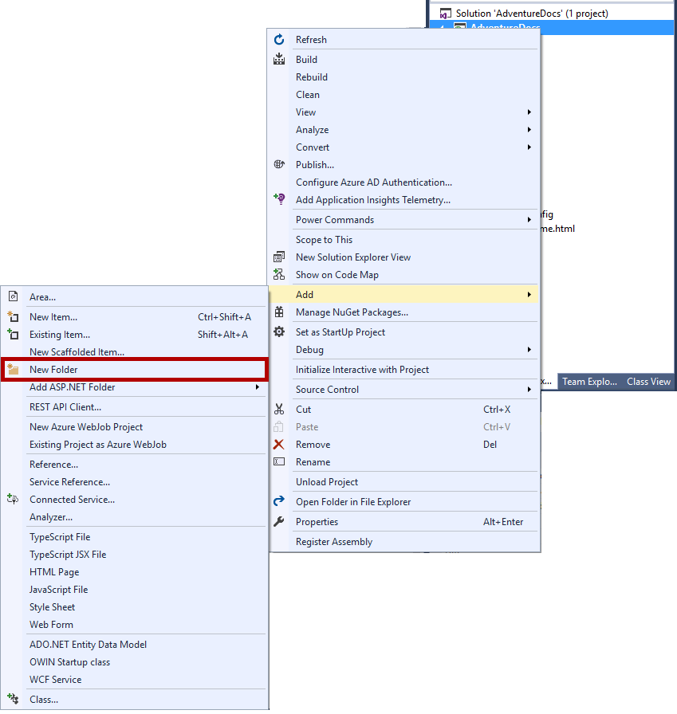

    _Adding a new folder_

1.	Type "Helpers" (without quotation marks) into the **Name** box, and then click **OK**.
	
    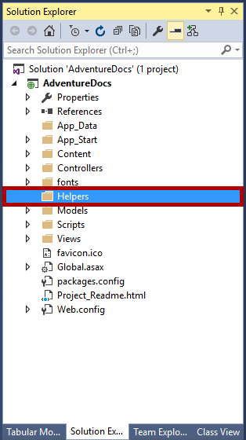

    _Renaming the Helpers folder_

1.	Right-click the project's **Helpers** folder created in the previous step and select **Add -> Class**:
	
    

    _Adding a class to the Helpers folder_

1.	Type "DocumentHelper.cs" (without quotation marks) into the **Name** box, and then click **OK**.
	
    

    _Adding the DocumentHelper class to the Helpers folder_

1.	Replace the **entire contents** of the DocumentHelper class with the following using statements, namespace declaration, and class definition, and note that you are making the class public rather than private:

	```C#
	using System;
	using System.Collections.Generic;
	using System.Linq; 
	using Microsoft.Azure.Documents;
	using Microsoft.Azure.Documents.Client;
	using Newtonsoft.Json;
	using System.Threading.Tasks;
	using AdventureDocs.Models;
	
	namespace AdventureDocs.Helpers
	{
	    public class DocumentHelper
	    {
	        public static DocumentClient GetDocumentClient()
	        {
	            string endpointUrl = Microsoft.Azure.CloudConfigurationManager.GetSetting("DocumentDBEndpointUrl");
	            string primaryKey = Microsoft.Azure.CloudConfigurationManager.GetSetting("DocumentDBKey");
	
	            DocumentClient client = new DocumentClient(new Uri(endpointUrl), primaryKey);
	
	            return client;
	        }
	
	        public static async Task<List<string>> GetAvailableCollectionNamesAsync(DocumentClient client)
	        {
	            List<string> collections = new List<string>();
	
	            try
	            {
	                var dbFeed = await client.ReadDatabaseFeedAsync();
	                var defaultDb = dbFeed.FirstOrDefault();
	
	                if (defaultDb != null)
	                {
	                    FeedResponse<DocumentCollection> collFeed = await client.ReadDocumentCollectionFeedAsync(defaultDb.SelfLink);
	
	                    collections = (from feed in collFeed select feed.Id).ToList();
	                }
	            }
	            catch (Exception ex)
	            {
	
	            }
	
	            return collections;
	
	        }
	
	        public static List<SearchResultInformation> GetOrdersByOrder(DocumentClient client, string countryName)
	        {
	            FeedOptions queryOptions = new FeedOptions { MaxItemCount = -1 };
	
	            IQueryable<OrderInformation> orderQuery = client.CreateDocumentQuery<OrderInformation>(
	                    UriFactory.CreateDocumentCollectionUri("CustomerOrders", "Orders"), queryOptions)
	                    .Where(f => f.Customer.Orders.ShipCountry.ToLower().StartsWith(countryName.ToLower()));
	
	            var orderItems = orderQuery.ToList();
	
	            var results = (from item in orderItems
	                           select new SearchResultInformation()
	                           {
	                               Title = item.Customer.CompanyName,
	                               Description = item.Customer.Orders.ShipCountry,
	                               DocumentContent = JsonConvert.SerializeObject(item),
	
	                           }).ToList();
	
	
	            return results.Select(r => r.Title).Distinct().Select(title => results.First(r => r.Title == title)).ToList();
	        }
	
	        public static List<SearchResultInformation> GetOrdersByCustomer(DocumentClient client, string companyName)
	        {
	            FeedOptions queryOptions = new FeedOptions { MaxItemCount = -1 };
	
	            IQueryable<OrderInformation> orderQuery = client.CreateDocumentQuery<OrderInformation>(
	                    UriFactory.CreateDocumentCollectionUri("CustomerOrders", "Orders"), queryOptions)
	                     .Where(f => f.Customer.CompanyName.ToLower().StartsWith(companyName.ToLower()));
	
	
	            var orderItems = orderQuery.ToList();
	
	            List<SearchResultInformation> results = (from item in orderItems
	                                                     select new SearchResultInformation()
	                                                     {
	                                                         Title = item.Customer.CompanyName,
	                                                         Description = item.Customer.Country,
	                                                         DocumentContent = JsonConvert.SerializeObject(item),
	
	                                                     }).ToList();
	
	            return results.Select(r => r.Title).Distinct().Select(title => results.First(r => r.Title == title)).ToList();
	        }
	
	        public static List<SearchResultInformation> GetOrdersByProduct(DocumentClient client, string productName)
	        {
	            FeedOptions queryOptions = new FeedOptions { MaxItemCount = -1 };
	
	            IQueryable<OrderInformation> orderQuery = client.CreateDocumentQuery<OrderInformation>(
	                    UriFactory.CreateDocumentCollectionUri("CustomerOrders", "Orders"), queryOptions)
	                    .Where(f => f.Customer.Orders.Details.Product.ProductName.ToLower().StartsWith(productName.ToLower()));
	
	            var orderItems = orderQuery.ToList();
	
	            var results = (from item in orderItems
	                           select new SearchResultInformation()
	                           {
	                               Title = item.Customer.Orders.Details.Product.ProductName,
	                               Description = item.Customer.Orders.Details.Product.QuantityPerUnit,
	                               DocumentContent = JsonConvert.SerializeObject(item),
	
	                           }).ToList();
	
	
	            return results.Select(r => r.Title).Distinct().Select(title => results.First(r => r.Title == title)).ToList();
	        }
	    }
	}
	```

1.	In the Solution Explorer, find *HomeController.cs* in the **Controllers** folder and double-click it to open it.
	
    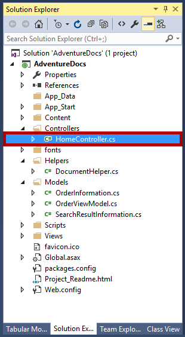

    _Opening the HomeController.cs_

1.	Add the following using statements to the top of the file:

	```C#
	using System.Threading.Tasks;
	using AdventureDocs.Models;
	```

1.	Replace the **Index** method in HomeController.cs with the following implementation:

	```C#
	 public async Task<ActionResult> Index()
	        {
	            var model = new OrderViewModel() { SearchResults = new List<SearchResultInformation>() };
	
	            var documentClient = Helpers.DocumentHelper.GetDocumentClient();
	
	            var availableCollections = await Helpers.DocumentHelper.GetAvailableCollectionNamesAsync(documentClient);
	
	            var searchResults = (List<SearchResultInformation>)TempData["SearchResults"];
	            var searchQuery = (string)Request["SearchQuery"];
	
	            if (searchResults != null)
	            {
	                model.SearchQuery = (string)TempData["SearchQuery"];
	                model.SearchResults = (List<SearchResultInformation>)TempData["SearchResults"];
	
	                model.SelectedCollectionName = (string)TempData["SelectedCollectionName"];
	                model.SearchResultTitle = $"{model.SelectedCollectionName}";
	                model.SearchResultDescription = $"The following results were found in {model.SelectedCollectionName} for '{model.SearchQuery.ToUpper()}':";
	            }
	            else if (!string.IsNullOrEmpty(searchQuery))
	            {
	                model.SearchQuery = searchQuery;
	
	                searchResults = Helpers.DocumentHelper.GetOrdersByCustomer(documentClient, searchQuery);
	
	                model.SearchResults = searchResults;
	
	                model.SelectedCollectionName = "Customers";
	                model.SearchResultTitle = $"{model.SelectedCollectionName}";
	                model.SearchResultDescription = $"The following results were found in {model.SelectedCollectionName} for '{model.SearchQuery.ToUpper()}':";
	            }
	            else
	            {
	                model.SearchQuery = "";
	                model.SelectedCollectionName = "Customers";
	                model.SearchResultTitle = "";
	                model.SearchResultDescription = "";
	            }
	
	            model.Collections = availableCollections;
	
	
	            return View(model);
	        }
	
	```
	
1.	Add the following methods to the **HomeController** class in HomeController.cs:
	
	```C#
	        public ActionResult Lookup()
	        {
	            ViewBag.Message = "Your application description page.";
	
	            return View();
	        }
	      
	        [HttpGet]
	        public ActionResult ViewSource(string[] content)
	        {
	            return new JsonResult
	            {
	                JsonRequestBehavior = JsonRequestBehavior.AllowGet,
	                Data = content[0]
	            };
	
	        }
	
	        [HttpPost]
	        public ActionResult Search(OrderViewModel model)
	        {
	            ViewBag.Message = "Your application description page.";
	
	            string searchQuery = model.SearchQuery + "";
	
	            var documentClient = Helpers.DocumentHelper.GetDocumentClient();
	
	            List<SearchResultInformation> searchResults = new List<SearchResultInformation>();
	
	            switch (model.SelectedCollectionName)
	            {
	                case "Customers":
	                    searchResults = Helpers.DocumentHelper.GetOrdersByCustomer(documentClient, searchQuery);
	                    break;
	                case "Products":
	                    searchResults = Helpers.DocumentHelper.GetOrdersByProduct(documentClient, searchQuery);
	                    break;
	                case "Orders":
	                    searchResults = Helpers.DocumentHelper.GetOrdersByOrder(documentClient, searchQuery);
	                    break;
	                default:
	                    break;
	            }
	
	            TempData["SearchQuery"] = searchQuery;
	            TempData["SearchResults"] = searchResults;
	            TempData["SelectedCollectionName"] = model.SelectedCollectionName;
	
	            return RedirectToAction("Index");
	        }
	```

1.	In the Solution Explorer, find Index.cshmtl in the **Views/Home** folder and double-click it to open it. This is the view that serves as the application's home page.

1.	Replace the contents of Index.cshtml with the following code and markup:

	```C#
	@{
	    ViewBag.Title = "AdventureDocs";
	}
	
	<div class="row">
	    @model AdventureDocs.Models.OrderViewModel
	    <div>
	        <h2>Document Search</h2>
	        <p>
	            To search documents in your Azure DocumentDB database, enter a value, select a DocumentDB collection, and click Search.
	        </p>
	
	        @using (Html.BeginForm("Search", "Home", FormMethod.Post))
	            {
	            <div>Search for:</div>
	            @Html.TextBoxFor(o => Model.SearchQuery)
	            <p></p>
	                <div>Select a collection:</div>
	
	                @Html.DropDownListFor(x => x.SelectedCollectionName, new SelectList(Model.Collections))
	
	                <input type="submit" value="Search">
	
	        }
	
	
	        <div>
	            <h4>@Html.DisplayFor(o => Model.SearchResultTitle)</h4>
	            <div>@Html.DisplayFor(o => Model.SearchResultDescription)</div>
	            <table style="margin:10px" border="0" cellpadding="3">
	
	                @foreach (var item in Model.SearchResults)
	            {
	                    <tr>
	                        <td>
	                            <strong>@Html.DisplayFor(modelItem => item.Title)</strong>
	                        </td>
	                        <td>
	                            <em>@Html.DisplayFor(modelItem => item.Description)</em>
	                        </td>
	
	                        <td>
	                            @Html.ActionLink(
	                            linkText: "[view document]",
	                            actionName: "ViewSource",
	                            controllerName: "Home",
	                            routeValues: new { content = item.DocumentContent },
	                            htmlAttributes: null)
	                        </td>
	                    </tr>
	                }
	            </table>
	        </div>
	
	    </div>
	</div>
	
	```

1.	Find About.cshmtl in the **Views/Home** folder. Right-click the **file** and select **Rename** and replace "About" with "Lookup" (without quotation marks) into the **Name** box, and then click **OK**.
	
    

    _Selecting the About.cshtml file_
	
    

    _Renaming the About.cshtml file_

1.	Double-click the Lookup.cshtml file to open it. This is the view that will serve as the document lookup page.

1.	Replace the contents of Lookup.cshtml with the following code and markup:

	```C#
	@Scripts.Render("~/bundles/jqueryui")
	
	<script type="text/javascript">
	    $(document).ready(function () {
	 
	    $('#customers').autocomplete({
	        source: '@Url.Action("Suggest")',
	        autoFocus: true,
	        select: function (event, ui) {
	
	            if (ui.item) {
	                $("#SearchQuery").val(ui.item.value);
	                $("form").submit();
	            }
	            }
	
	            }); 
	            })
	</script>
	
	<div class="row">
	
	    <div class="col-md-4">
	        <h2>Customer Lookup</h2>
	        <p>
	            To search documents in your Azure DocumentDB database, enter a value and select an autosuggested customer.
	        </p>
	        <div>Search for:</div>
	        <input id="customers" name="customers">
	        <form action="/" method="post">
	            <input hidden="hidden" id="SearchQuery" name="SearchQuery" type="text" />
	        </form>
	    </div>
	
	    <div style="height:400px" class="col-md-4"></div>
	
	</div>
	```

1.	In the Solution Explorer, find BundleConfig.cs in the **App_Start** folder and double-click it to open it. This is the view that serves as the application's home page.

1.	Add the following code at the end of the **RegisterBundles** method:

	```C#
	  	bundles.Add(new ScriptBundle("~/bundles/jqueryui").Include("~/Scripts/jquery-ui-{version}.js"));
	    bundles.Add(new StyleBundle("~/Content/themes/base/css").Include(
	            "~/Content/themes/base/jquery.ui.core.css",
	            "~/Content/themes/base/jquery.ui.autocomplete.css",
	            "~/Content/themes/base/jquery.ui.theme.css"));
	```

1.	Use Visual Studio's **Debug -> Start Without Debugging** command (or press **Ctrl+F5**) to launch the application in your browser. 

1.	**Type** the letter "a" (without quotes) in the **Search for** and click the **Search** button. After a few seconds, a listing of all customer documents starting with the letter A on the page:
	
    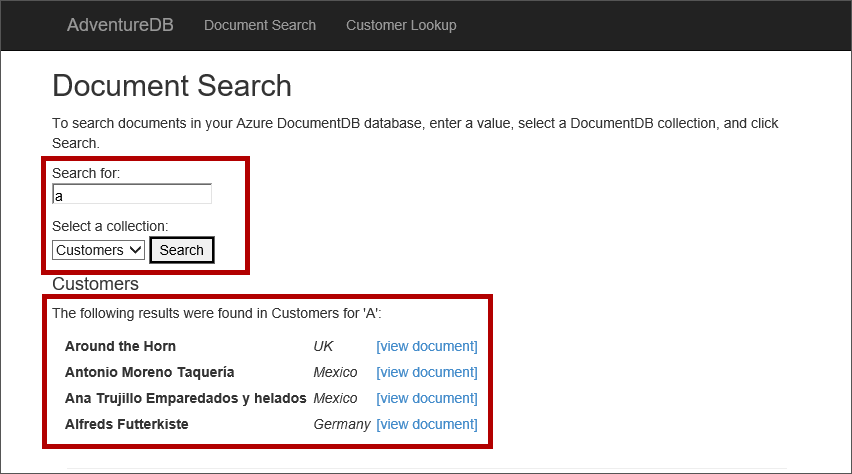

    _Viewing Customer documents_

1.	Change the **Select a collection** dropdown to **Products** and click the **Search** button. After a few seconds, a listing of all customer documents starting with the letter A appears on the page:
	
    

    _Viewing Product documents_

1.	Replace the letter "a" in the **Search for** with the letter "m", change the **Select a collection** dropdown to **Orders** and click the **Search** button. After a few seconds, a listing of all customer orders shipped to countries starting with the letter M appears on the page:
	
    

    _Viewing Order documents_

1.	The Orders listing displays the CompanyName and ShipRegion values returned from search results associated with documents on the Orders collection. To view an entire document, click **[view document]** in the far right column for an order. A new web page appears with the entire JSON-formatted document displayed.
	
    

    _Viewing Order document markup_	

Although your web app is able to easily access documents in your Customers, Products, and Orders collections, and you’ve written code to retrieve and view documents and schemas, your current search method searches for documents based on arbitrary characters entered by a user. It’s far more intuitive for a user to select from values "guaranteed" to exist in the document data. To create this experience, it’s time to add an "Autosuggest" control by leveraging Azure Search in [Exercise 6: Add document search to an Azure Web App](#Exercise6").

<a name="Exercise6"></a>
## Exercise 6: Add document search to an Azure Web App ##

Azure Search services deliver a "highly-performant" mechanism for providing super-fast retrieval of meaningful, indexed values in various data stores, based on identified and configured indexes. These values can be retrieved and displayed to users to provide a "lookup" of information "known to exist", as it draws from the actual values stored, such as documents in the Customers collection populated in Exercise 2.

To add document search to your web app:   

1.	Right-click the project's **Helpers** folder created in the previous step and select **Add -> Class**:
	
    

    _Adding a class to the Helpers folder_

1.	Type "SearchHelper.cs" (without quotation marks) into the **Name** box, and then click **OK**.
	
    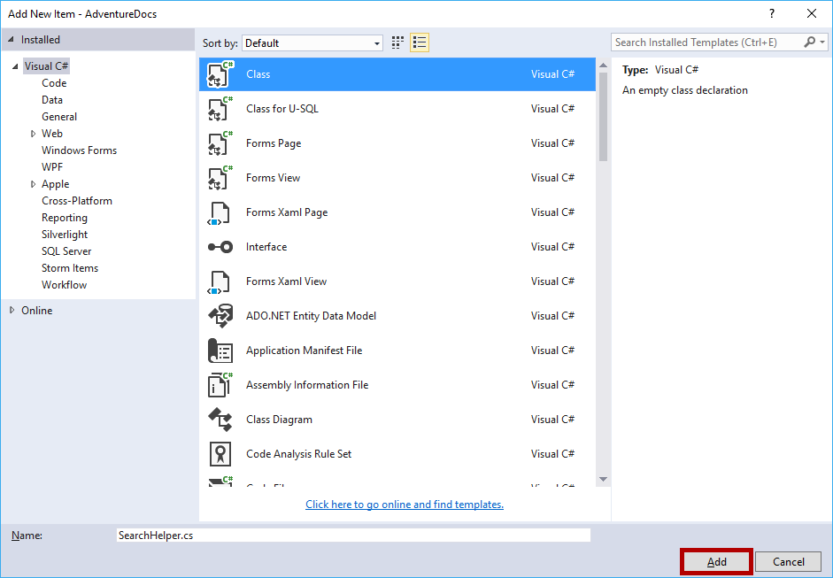

    _Adding the SearchHelper class to the Helpers folder_

1.	**Replace** the **entire contents** of the SearchHelper class with the following using statements, namespace declaration, and class definition, and note that you are making the class public rather than private:
	
	```C#
	using Microsoft.Azure.Search;
	using Microsoft.Azure.Search.Models;
	using System;
	using System.Collections.Generic;
	using System.Linq;
	using System.Threading.Tasks;
	using System.Web;
	using AdventureDocs.Models;
	
	namespace AdventureDocs.Helpers
	{
	    public static class SearchHelper
	    {
	        public static List<string> GetSuggestions(string query)
	        {
	            List<string> suggestions = new List<string>();
	
	            string searchServiceName = Microsoft.Azure.CloudConfigurationManager.GetSetting("SearchServiceName");
	            string searchServiceKey = Microsoft.Azure.CloudConfigurationManager.GetSetting("SearchServiceKey");
	
	            SearchServiceClient serviceClient = new SearchServiceClient(searchServiceName, new SearchCredentials(searchServiceKey));
	
	            ISearchIndexClient indexClient = serviceClient.Indexes.GetClient("customerindex");
	
	            DocumentSearchResult<Customer> response = indexClient.Documents.Search<Customer>($"{query.Trim()}*");
	
	            suggestions = (from result in response.Results
	                           select result.Document.CompanyName).ToList();
	
	            return suggestions;
	        }
	    }
	}
	```

1. In the Solution Explorer window, double-click *Web.config* to open it for editing and add the following statement to the \<appSettings\> section, replacing ***search_service_name*** with the name of the Azure Search service created in Exercise 4.
	
    

    _Replacing the SearchServiceName value_

1.	Return to the Azure Portal for a moment and open the blade for the Azure Search service you created in Exercise 4. Then click **Keys** in the "GENERAL" panel. 
	
    

    _Selecting the Search service Keys settings_

1.	Click **Manage query keys** to open the "Keys" panel, and then select and copy the **<empty> key value** to copy the query key to the clipboard. 


    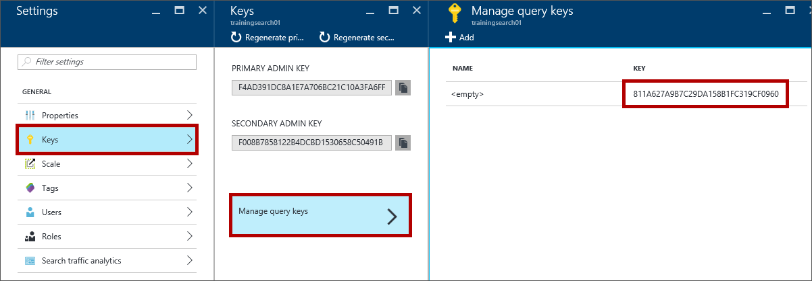

    _Copying the Search query key to the clipboard_


1.	Return to Visual Studio. In Web.config, add the following statement to the \<appSettings\> section, replacing **search_service_key** with the query key you copied to the clipboard in the previous step.
	
    

    _Replacing the SearchServiceKey value_

1.	In Solution Explorer, find **HomeController.cs** in the "Controllers" folder and double-click it to open it.

1.	Add the following methods to the **HomeController** class in HomeController.cs:
	
	```C#
	[HttpPost]
	        public ActionResult AutoSearch(string item)
	        {
	            ViewBag.Message = "Your application description page.";
	
	            string searchQuery = item + "";
	
	            TempData["SearchQuery"] = searchQuery;
	            TempData["SelectedCollectionName"] = "Customers";
	
	            return RedirectToAction("Index");
	        }
	
	        [HttpGet]
	        public ActionResult Suggest(string term)
	        {
	            List<string> suggestions = new List<string>();
	
	            suggestions = Helpers.SearchHelper.GetSuggestions(term);
	
	            return new JsonResult
	            {
	                JsonRequestBehavior = JsonRequestBehavior.AllowGet,
	                Data = suggestions
	            };
	
	        }
	```

1.	Use Visual Studio's **Debug -> Start Without Debugging** command (or press **Ctrl+F5**) to launch the application in your browser. 

1.	Click the **Customer Lookup** link in the top navigation to navigate to the **Customer Lookup** view.

1.	Type the characters "ar" (without quotes) in the **Search for** entry and after a short delay an "autosuggestion" list will appear, populated with actual customers from documents in the Customers collection.

    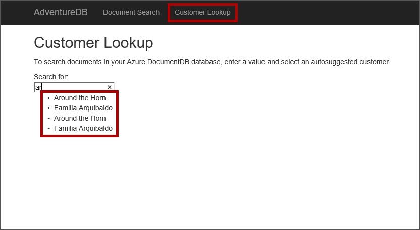

    _Using the Azure Search integrated autosuggest control_


1.	Select **Around the Horn** from the list of customers. After a few seconds, a single document for the customer *Around the Horn* appears on the Document Search view.
	
    

    _Viewing the Azure Search integrated autosuggest result_

1.	Click **[view document]** in the far right column to view the entire document indexed and retrieved by the Azure Search service.

	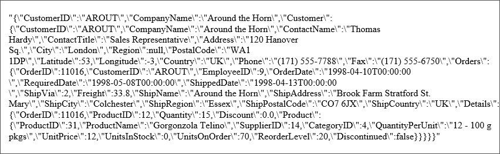

    _Viewing the Azure Search integrated autosuggest result_

In this exercise you added code to connect an Azure Search service to your existing document search experience, providing a super-fast retrieval of document information for display to a user in the form of a "lookup" control. Although you used the values from a Customer CompanyName field, adding additional lookups is as easy and accessing values in any fields included in the index created in Exercise 4. 

<a name="Summary"></a>
## Summary ##

In this hands-on lab you learned how to:

- Create an Azure DocumentDB account, database and collections
- Populate Azure Document DB collections with documents
- Create and configure an Azure Search service and index
- Access Azure DocumentDB collections from your apps
- Query Azure Search services connected to DocumentDB content

This is just a beginning, as there’s a whole lot more you can do to leverage the power of Azure DocumentDB. Start experimenting with other DocumentDB features, especially triggers, stored procedures, and user-defined functions, and identify other ways you can enhance your data and search strategies through integrating Azure DocumentDB into your application ecosystems.

----

Copyright 2016 Microsoft Corporation. All rights reserved. Except where otherwise noted, these materials are licensed under the terms of the MIT License. You may use them according to the license as is most appropriate for your project. The terms of this license can be found at https://opensource.org/licenses/MIT.