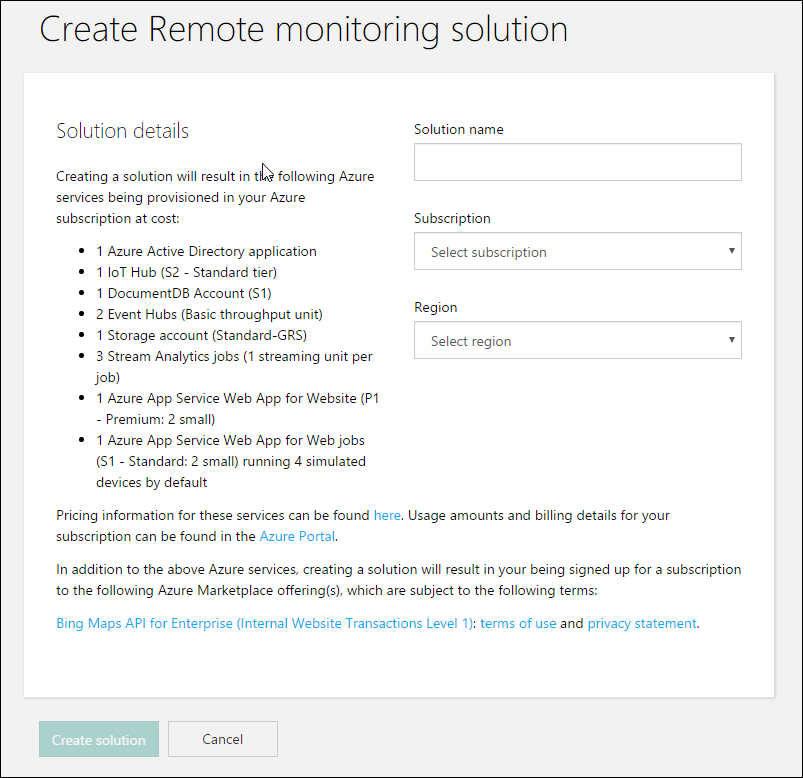
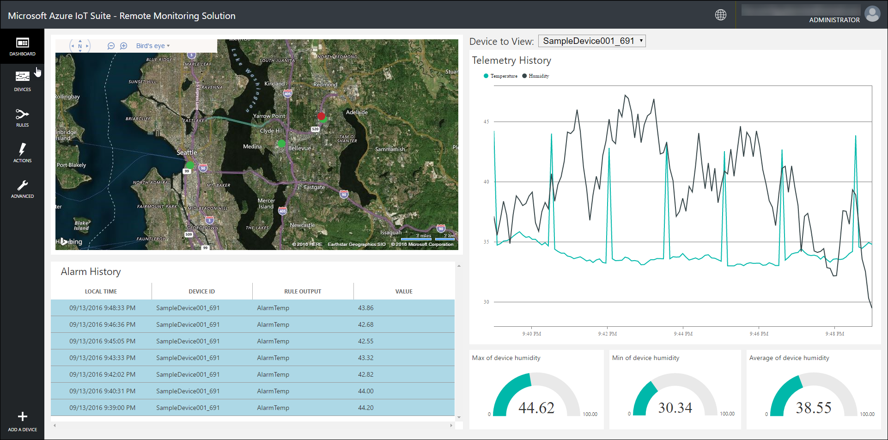
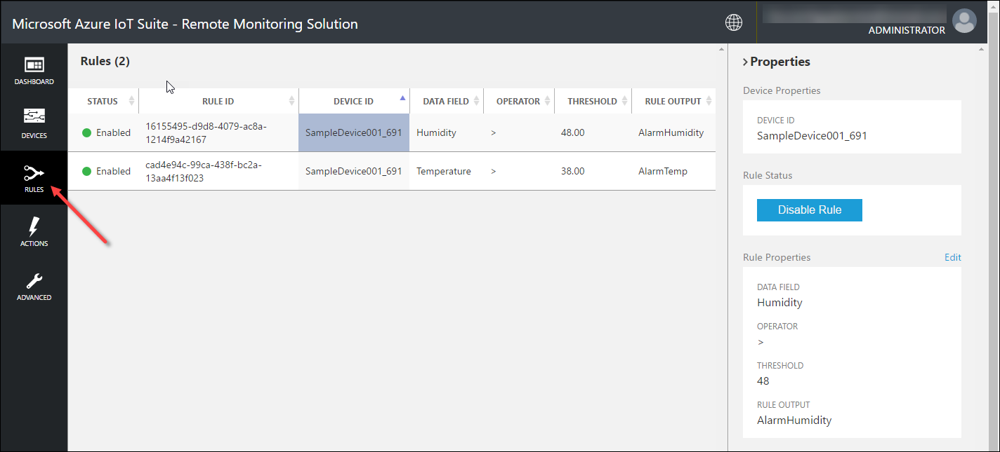
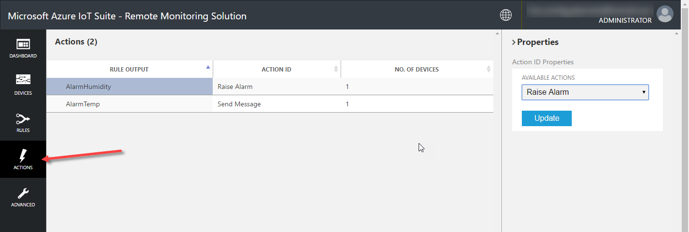
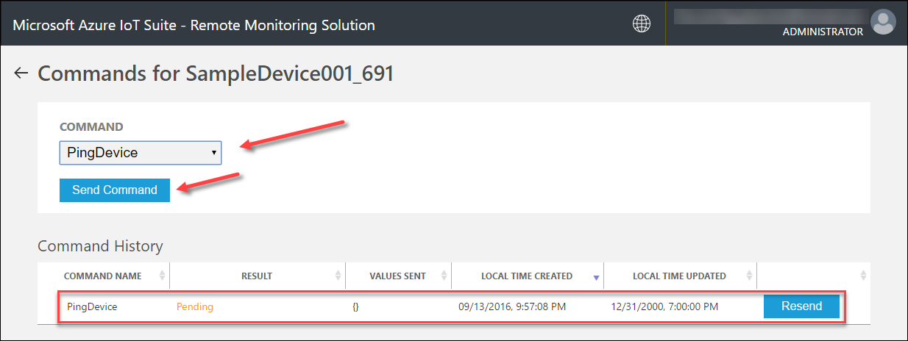
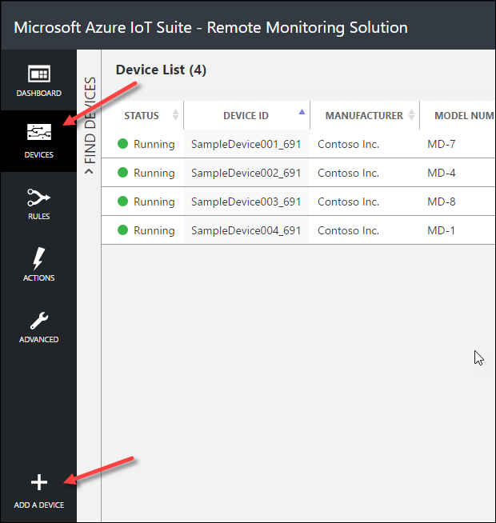
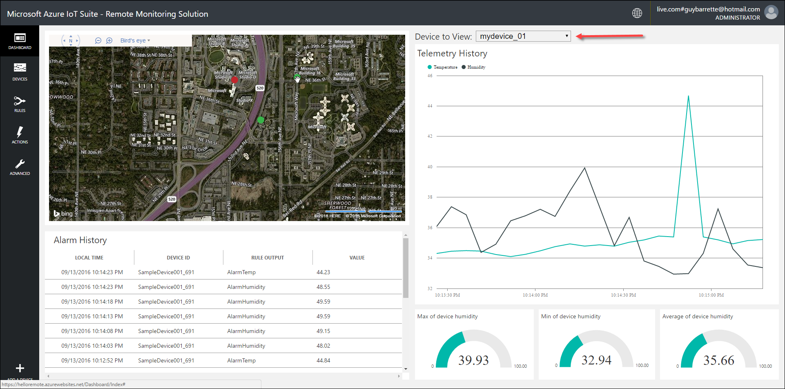
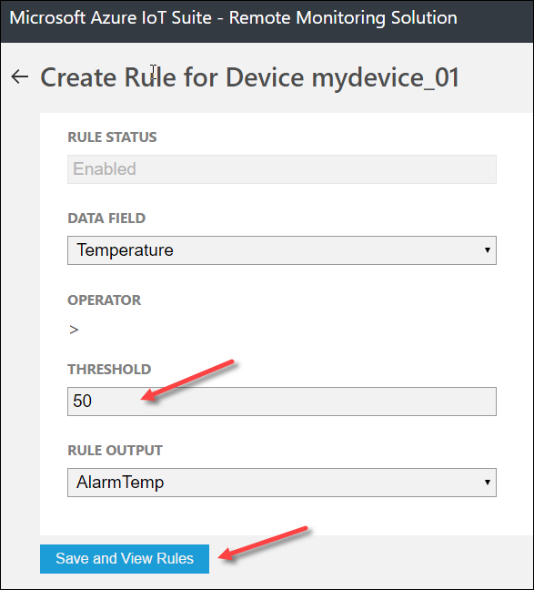
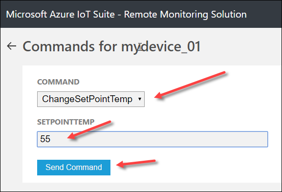

# DEMO 1.2: Remote Monitoring Template & Simulated Devices

This demo should take between 10 and 15 minutes.

## Objectives

The demo goal is to drill into the kind of features provided by a typical IoT monitoring system. To do this, you’ll use the Azure IoT Suite’s Remote Monitoring solution using simulated devices. You’ll show a Web application displaying devices status and telemetry. You’ll show how an administrator can add a new device, send commands to a device and monitor alerts.

For this demo, there’s no need to look under the hood, understand the code and explain how the solution is built. Again, the goal is to demonstrate the functionalities of a typical IoT dashboard.

## Requirements

An active Azure subscription. If you don’t have an account, you can create a free trial account in just a couple of minutes. For details, see <http://azure.microsoft.com/pricing/free-trial/>

## Setup

Make sure to create your Azure account before the event.

Provisioning an Azure IoT Suite solution takes a few minutes so create it before the presentation. If your Azure budget or credits is limited, it is also recommended you delete the solution right after the presentation as the solution uses many Azure services. See the teardown section at the end of this document.

### Provision the solution

1.  Log on to azureiotsuite.com using your Azure account credentials, and click the plus sign to create a new solution.

    

2.  Click Select on the Remote monitoring tile.

3.  Enter a Solution name, Region and Subscription for your remote monitoring preconfigured solution

    

4.  Click Create Solution to begin the provisioning process. This typically takes several minutes to run.

### Wait for the provisioning process to complete

1.  Click on the tile for your solution with Provisioning status.

2.  Notice the Provisioning states as Azure services are deployed in your Azure subscription.

    

3.  Once provisioning completes, the status changes to Ready.

4.  Click on the tile and you'll see the details of your solution in the right-hand pane.

    

5.  That’s it!

## Demo Steps: Explore the remote monitoring solution dashboard

The solution dashboard enables you to manage the deployed solution. For example, you can view telemetry, add devices, and configure rules.

When the provisioning is complete and the tile for your preconfigured solution indicates Ready, click Launch to open your remote monitoring solution portal in a new tab. You may be prompted to sign in, use your Azure account credentials.

Explain that you’ll be showing a Web application that monitors a series of simulated devices.

### Dashboard

By default, the solution portal shows the solution dashboard. You can select other views using the left-hand menu.

Explain that the dashboard displays the following information:

-   The map displays the location of each device connected to the solution. When you first run the solution, there are four simulated devices.

-   The Telemetry History panel plots humidity and temperature telemetry from a selected device in near real time and displays aggregate data such as maximum, minimum, and average humidity.

-   The Alarm History panel shows recent alarm events when a telemetry value has exceeded a threshold.

### Devices

Click on the Devices button in the left-hand menu.

Explain that the device list shows all the registered devices in the solution. You can view and edit device metadata, add or remove devices, and send commands to devices.

### Rules

Click on the Rules button in the left-hand menu.

Explain that the rules list shows rules that can trigger alarms. The first rule will trigger an alarm if the device detects that the humidity value is 48 and more. Selecting a rule will open the Properties pane on the right side of the screen.

### Actions

Click on the Action button in the left-hand menu.

Explain that each rule can trigger an action, either raise an alarm of send a message.

### Let’s ping a device

Click on the Devices button in the left-hand menu.

Let’s go back to the devices list and explain that you will send a command to a device. Depending on the device capabilities, a command could ask a device for some information or even reboot itself. For this demo, you’ll simply send a ping to a device.

1.  Select a device from the devices list.

2.  Click Commands in the device details pane for the selected device.

    

3.  Select PingDevice from the command list.

4.  Click Send Command.

5.  Explain that you can see the status of the command in the command history.

    

### Add a new simulated device

Click on the Devices button in the left-hand menu.

Explain that you’ll add a new simulated device to the system. A typical scenario would consist of the installation of a device by a field technician and the registration of this new device in the system before it could send any telemetry.

1.  Click + Add A Device in the bottom left corner to add a device.

    

2.  Click Add New on the Simulated Device tile.

    

3.  Select Let me define my own Device ID, enter a unique device ID name such as mydevice\_01 and click the Check ID button to validate that the name is unique.

    

4.  Click Create.

5.  The new device is now listed in the device list.

6.  Click on the Dashboard button in the left-side menu.

7.  Select the device from the device dropdown menu and show the device telemetry

    

### Create a rule for the new device

Click on the Devices button in the left-hand menu.

Explain that there are no rules for the new device you just added and you’ll be adding a rule that triggers an alarm when the temperature reported by the new device exceeds 50 degrees.

1.  Select your new device in the Devices List, and then click Add rule to add a rule for the device.

2.  Create a rule that uses Temperature as the data field and uses AlarmTemp as the output when the temperature exceeds 50 degrees.

    

3.  Click Save and View Rules to save your changes.

4.  Click Commands in the device details pane for the new device.

5.  Select ChangeSetPointTemp from the command list and set SetPointTemp to 55.

    

6.  Click the Send Command button

7.  Navigate back to the solution dashboard. After a short time, you will see a new entry in the Alarm History pane when the temperature reported by your new device exceeds the 50-degree threshold.

## Teardown

Provisioning an Azure IoT Suite solution is easy, deleting is even easier.

1.  Head back to azureiotsuite.com

2.  Click on the solution you want to delete

3.  In the info panel on the right of the screen, click on the Delete Solution button. This will take several minutes.

