# DEMO 1.3: Sentiment tracking

This demo should take about 10 minutes.

## Objectives

The demo goal is to demonstrate that besides temperature and humidity values, IoT devices can send data that can be analyzed by APIs like the Microsoft Cognitive Services APIs. You’ll have the audience point their smartphone browsers to a Web page, have them enter a sentence, send it to the cloud to be analyzed by a text analysis API and WOW them with live data being displayed in graphs.

For this demo, there’s no need to look too much under the hood, to understand the code or explain how the solution is built.

## Setup

Make sure you followed the setup for Demo 1.1 and well as the following…

### Stream Analytics

Perform these steps on the Azure portal for Stream Analytics:

1.  Stop the Stream Analytics job if it is running.

2.  Click on the Output tile, click on Add, select Power BI from the Sink dropdown menu and enter new alias, dataset and table names.

    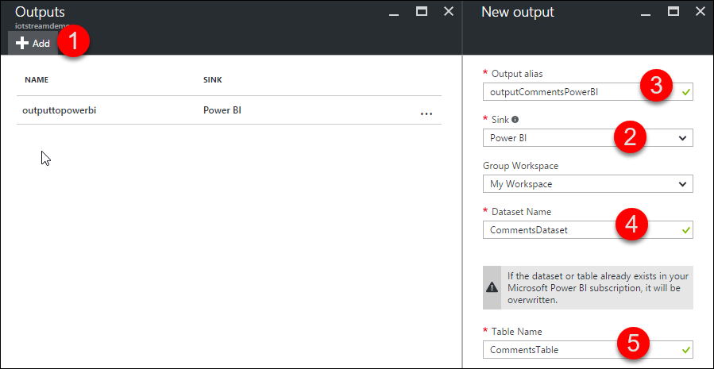

3.  Save and start the Stream Analytics job.

### Microsoft Cognitive APIs

This demo uses the Text Analytics API, part of the Microsoft Cognitive APIs. You need to create a free account and enable the API.

1.  Head to <https://www.microsoft.com/cognitive-services/en-us/apis>

2.  Create a free account

3.  Request a trial of the Text Analytics API

4.  Copy the API key to the clipboard.

    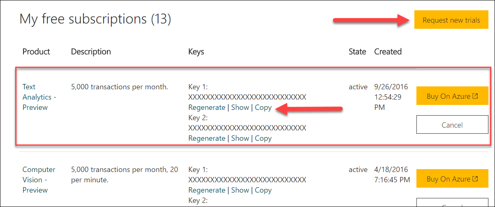

### Microsoft Cognitive APIs

You then need to add the API key to the Web application settings.

1.  In the Azure portal, locate the Web application

2.  Click on the Application settings link, locate the App settings section and add this new key textAnalyticsKey, paste your API key as the value then click on Save.

    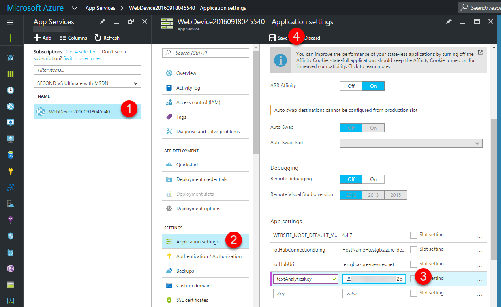

## DEMO Steps: Sentiment tracking

Before beginning your demo make sure you have your browser set up like this:

1.  Point your browser to the Azure portal: <http://portal.azure.com>

2.  Log in

3.  In a new tab, point to http://www.powerbi.com

4.  Login

5.  In a new tab, display the demo Web App

Explain to the attendees that they’ll use their smartphone, have them enter a sentence, send it to the cloud to be analyzed by a text analysis API and display the data in live charts.

Demo time!

1.  Stop the Stream Analytics job

2.  Replace the query with this new one replacing the text highlighted in yellow with the name of the new output you created for this demo (don’t use the one for demo 1.1)

3.  Start the Stream Analytics job. This should take a minute.

4.  Show the Demo 2 page on the Web site.

    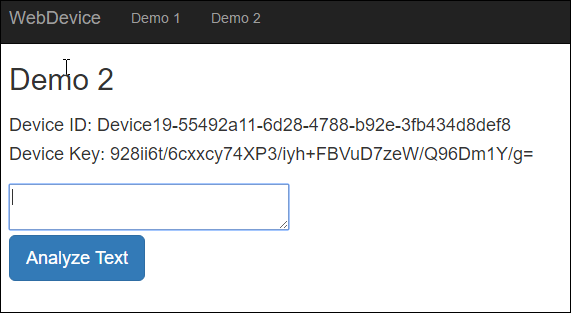

5.  Explain that you will enter a sentence and it will be analyzed by a text analysis API.

6.  Type a positive sentence and click on the Analyze Text button.

7.  Explain that a first API call detects the language. A language score of 1 means that the API is 100% sure of the language. 120 languages are supported.

8.  A call to a second API analyze the sentence and tries to figure out if it is positive or negative. 1 being the max positive value and 0 the max negative possibility. English, French, Spanish and Portuguese text are supported.

    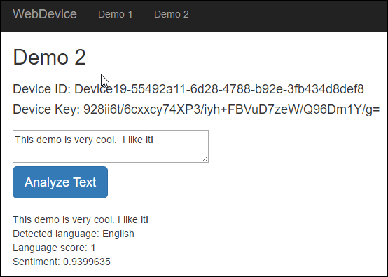

9.  Type a negative sentence and click on the Analyze Text button.

10. Head to [www.powerbi.com](http://www.powerbi.com) where you’ll create the new graph.

11. Click on the new dataset that was just created.

    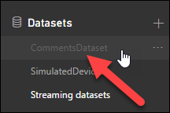

12. Select the line chart graph, drag the EventProcessedUtcTime filed as the Axis, drag the sentiment field as the value and select Average from its dropdown menu.

    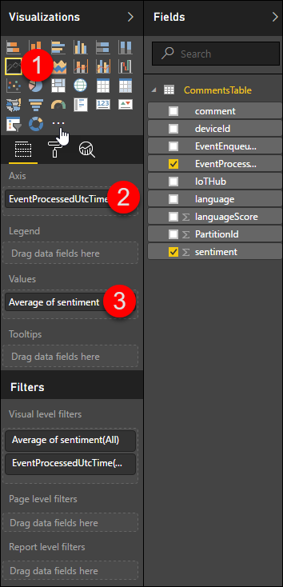

13. You should have a graph that looks like this.

    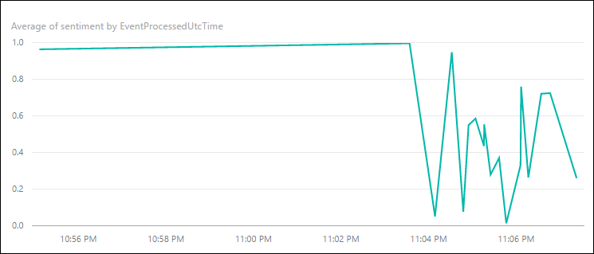

14. Click the graph Pin icon to save it and pin it to your dashboard.

15. Ask the attendees to express their feelings about your local \[hockey, football, baseball, etc\] winning the championship and see the results in real time!

16. Now on to add a second graph this time displaying a count of the languages found…

17. Click on the line chart graph, drag and drop the language field in the Axis and also as the value.

    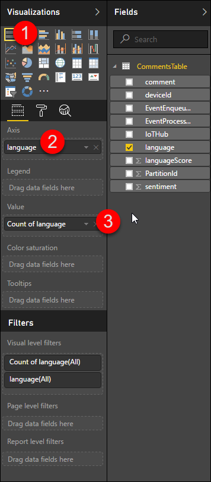

18. You should have something similar

    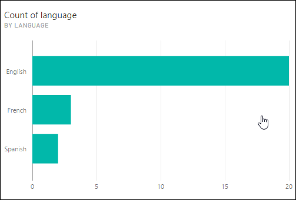

## Teardown

When you’re done, make sure to delete all the Azure resources that you used for this presentation. The easiest way is to simply delete the resource group that you associated your services with. Deleting the resource group will delete a child services.

1.  Click on Microsoft Azure and Resource groups in the service list. Select your resource group.

    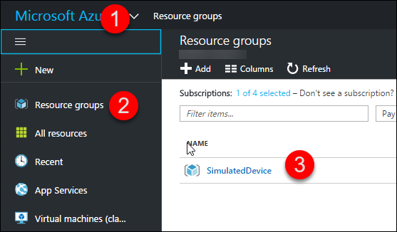

2.  Simply click on the resource group Delete link. This should take a moment.

    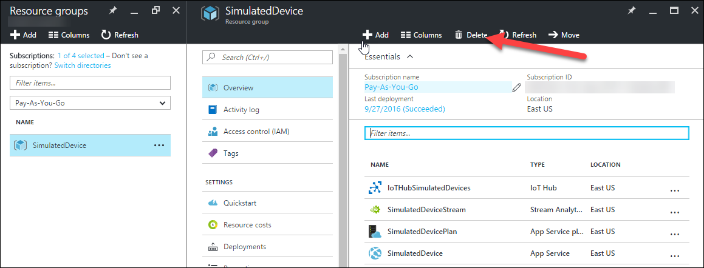

3.  That’s it! Well that’s unless you didn’t group your services in the same resource group. If so, you’ll have to locate them and delete them one by one.

##
