# DEMO 2.1: Explore the remote monitoring solution dashboard

## Objectives

Show the Remote Monitoring solution and some of the components that are used to build it.

## Requirements

An active Azure subscription. If you don’t have an account, you can create a free trial account in just a couple of minutes. For details, see <http://azure.microsoft.com/pricing/free-trial/>

## Setup

Make sure to create your Azure account before the event.

Provisioning an Azure IoT Suite solution takes a few minutes so create it before the presentation. If your Azure budget or credits is limited, it is also recommended you delete the solution right after the session as the solution uses many Azure services. See the teardown section at the end of this document.

### Provision the solution

1.  Log on to azureiotsuite.com using your Azure account credentials, and click the plus sign to create a new solution.

    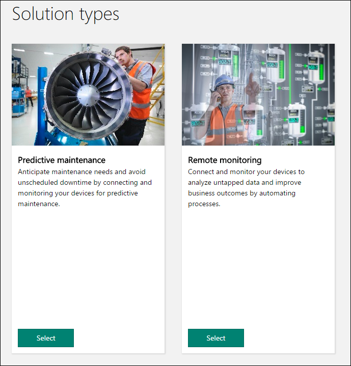

2.  Click Select on the Remote monitoring tile.

3.  Enter a Solution name, Region and Subscription for your remote monitoring preconfigured solution

    

4.  Click Create Solution to begin the provisioning process. This typically takes several minutes to run.

### Wait for the provisioning process to complete

1.  Click on the tile for your solution with Provisioning status.

2.  Notice the Provisioning states as Azure services are deployed in your Azure subscription.

    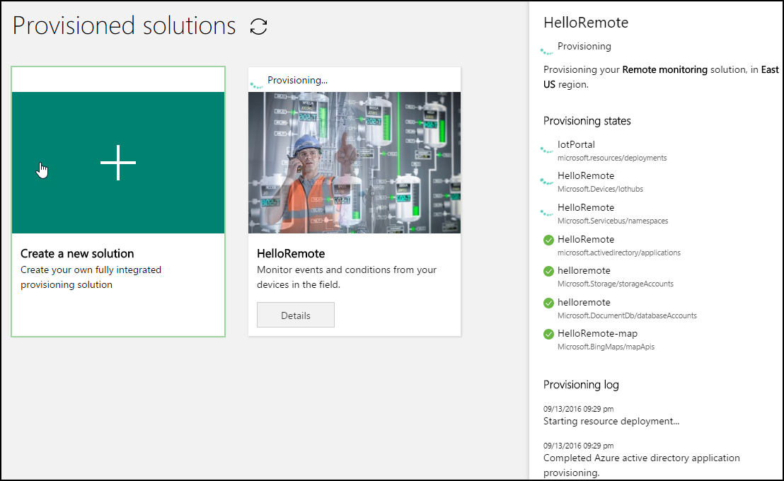

3.  Once provisioning completes, the status changes to Ready.

4.  Click on the tile and you'll see the details of your solution in the right-hand pane.

    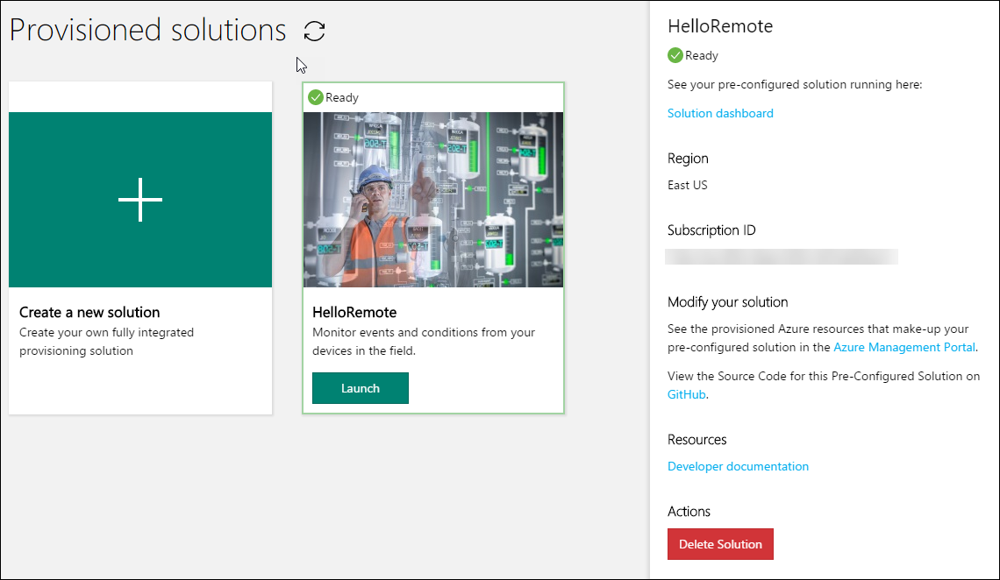

5.  That’s it!

## Demo Steps

The solution dashboard enables you to manage the deployed solution. For example, you can view telemetry, add devices, and configure rules.

When the provisioning is complete and the tile for your preconfigured solution indicates Ready, click Launch to open your remote monitoring solution portal in a new tab. You may be prompted to sign in, use your Azure account credentials.

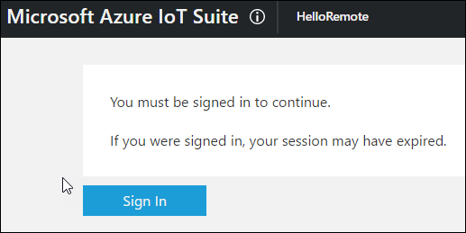

Explain that you’ll be showing a Web application that monitors a series of simulated devices. Explain that you’ll also show the Azure services used by the solution.

### Dashboard

By default, the solution portal shows the solution dashboard. You can select other views using the left-hand menu.

Explain that the dashboard displays the following information:

-   The map displays the location of each device connected to the solution. When you first run the solution, there are four simulated devices.

-   The Telemetry History panel plots humidity and temperature telemetry from a selected device in near real time and displays aggregate data such as maximum, minimum, and average humidity.

-   The Alarm History panel shows recent alarm events when a telemetry value has exceeded a threshold.

### Azure Portal

In a new browser tab, head to portal.azure.com. You’ll show the Azure services used by the Remote Monitoring solution.

1.  Locate the Solution’s resource group by clicking on the Resource groups link in the portal left menu and click on the resource group name in resource groups list.

    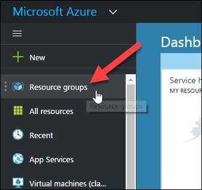

2.  Explain that the Remote Monitoring solution is a complex IoT solution that uses a series of Azure services.

    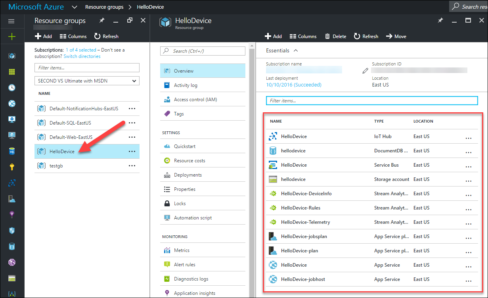

3.  From that list, click on the IoT Hub service.

    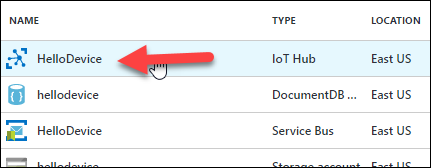

4.  Explain that simulated devices are currently sending messages to the IoT Hub. Show the telemetry.

    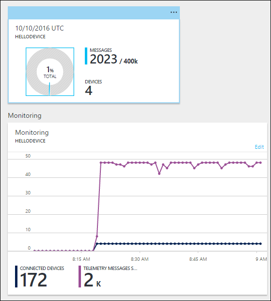

5.  Click on the Devices button. This will show the Device Explorer blade and the registered devices.

    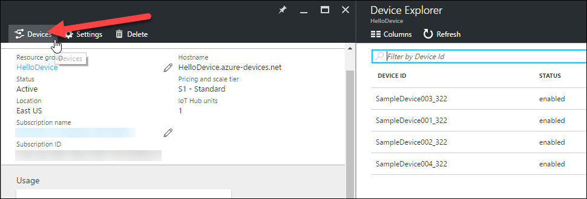

6.  Close this blade and return to the services list. Click on the \[solution name\]-Rules Stream Analytics jobs.

    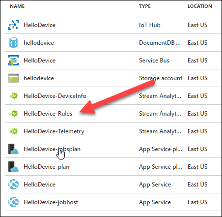

7.  Explain that the job analyse data coming from 2 sources (inputs) and send the results to two outputs. Click on the Query tile.

    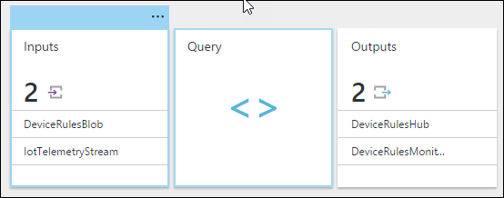

8.  Without going into too much detail, show and explain that you can write complex queries using a SQL like language.

    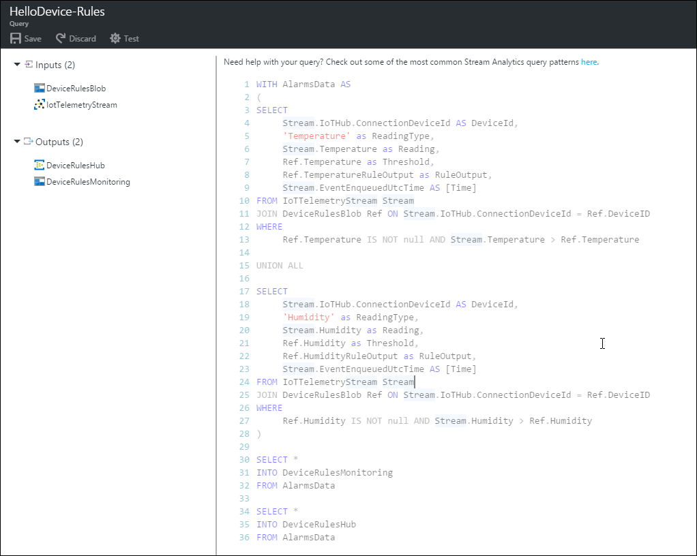

9.  Go back to the services list and select the \[solution name\]-jobhost App Service and click on the WebJobs link.

    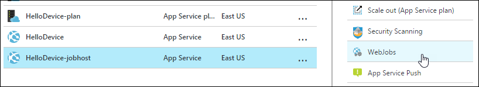

10. Explain that the simulated devices are WebJobs hosted in a App Service plan.

11. Select the other App Service plan and explain that this one hosts the Web application that you’re showing in the browser.

### Add a new simulated device

Explain that you’ll add a new simulated device to the system and show the result in the Azure portal.

1.  Click + Add A Device in the bottom left corner to add a device.

    

2.  Click Add New on the Simulated Device tile.

    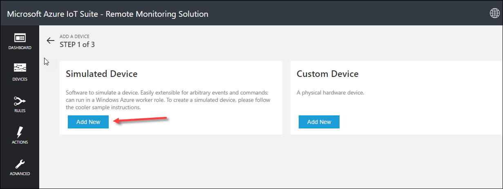

3.  Select Let me define my own Device ID, enter a unique device ID name such as mydevice\_01 and click the Check ID button to validate that the name is unique.

    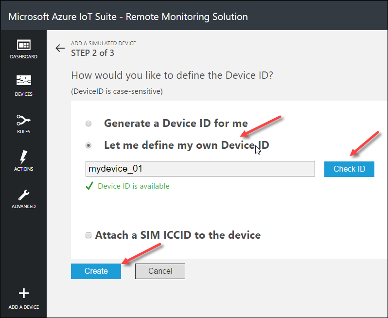

4.  Click Create.

5.  The new device is now listed in the device list.

6.  Return to the Azure portal.

7.  In the resource group of the Remote Monitoring solution, select the IoT Hub service.

8.  Click on the Devices button

    

9.  Show the newly created device in the Device Explorer blade.

10. This completes this demo.

## Teardown

You’ll need to come back to this azureiotsuite.com portal to delete your instance of the Remote Monitoring solution, ONLY when you’ve finished presenting all the demos in this session.
