# Session 3.2: Customizing the source code

Duration: 10 minutes

## Objectives

The purpose of this demo is to show how an available IoT suite solution can be customized and gain a deeper understanding of the Remote Monitoring solution.

## Requirements

An active Azure subscription. If you don’t have an account, you can create a free trial account in just a couple of minutes. For details, see <http://azure.microsoft.com/pricing/free-trial/>

The free Visual Studio 2015 Community Edition is required to show and deploy the Remote Monitoring Solution source code.

## Setup

### Use the snapshot version of the custom remote monitoring solution

A known version of the Remote Monitoring solution needs to be deployed prior to the presentation. Note that this can take around 10 minutes to complete

1.  Locate the Demo 3.2 folder under the Solutions folder for this session

2.  Start a “Developers Command Prompt for Visual Studio” as an Administrator

3.  CD to the Demo 3.2 folder

4.  Type: build.cmd cloud release deploymentname

    (where deploymentname is a globally unique name you choose – keep it to an alphanumeric name starting with alpa with no spaces/symbols perhaps ending in todays date as yyyymmdd)

## Demo Steps

In this demo, you’ll explain how it’s possible to customize the Remote Monitoring source code. Explain that the Website displays the max, min and average of the device humidity but it does not display the same for the device temperature.

Imagine you now receive a new requirement to display gauges for the device temperature. Note that the snapshot version of the Remote Monitoring solution that you deployed earlier ALREADY contains the code changes. You’ll go thru theses changes and explain at the same time how the code is structured.

Load the solution in Visual Studio 2015.

Explain that the code is structured in a number of projects and that you’ll go through most of them during the demo.

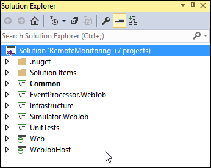

Explain that the Web application uses code from the Infrastructure and Common projects. Here’s the dependency graph:

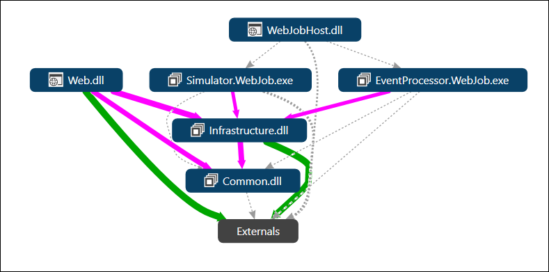

The Infrastructure project contains the business logic, the repository code and the models.

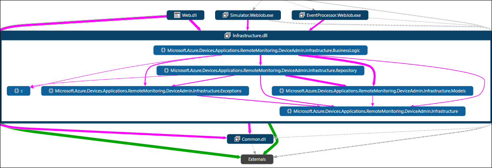

In a nutshell, the following diagram shows the data flow and the code changes:

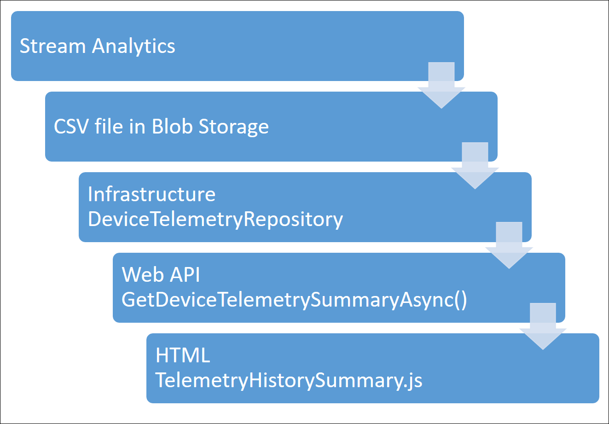

All the code changes have been identified with comments so they are easy to find.

In Visual Studio, press CTRL-F and search in the entire solution for “Demo Code”

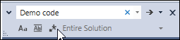

In the results pane, notice that the comments are numbered.

Just Double-Click each one in sequence.

### Change the title – Web project

Our first requirement is to change the title of the app displayed in the top left corner of the Web page. Explain that the solution uses resource files located in the App\_GlobalResources folder of the Web project.

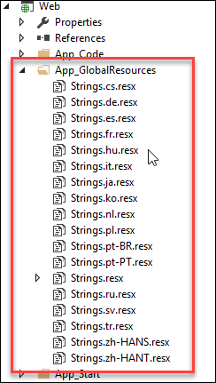

For demo simplicity, the string was hardcoded.

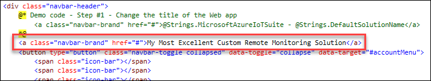

### Change the DTO – Infrastructure project

The Infrastructure project contains the main application logic and the telemetry data is read into a class named DeviceTelemetrySummaryModel. We need to add fields for the temperature data.

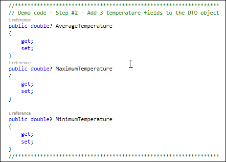

### Change the repository – Infrastructure project

The DeviceTelemetryRepository class contains the code that read and parse the CSV files stored in Blob storage by the Stream Analytics job. We need to modify the LoadBlobTelemetrySummaryModels() method so that it also parse the CSV file for the temperature data.

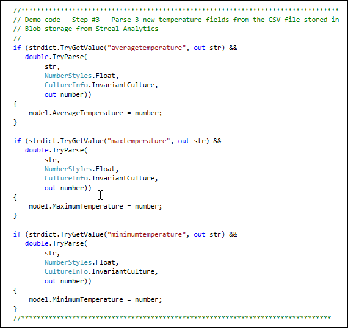

### Web API – Web project

The Web pages gets the telemetry from the Web site using Web API methods. This step does not have any code changes, simply explain that the GetDeviceTelemetrySummaryAsync() method is called from the Web pages using JavaScript.

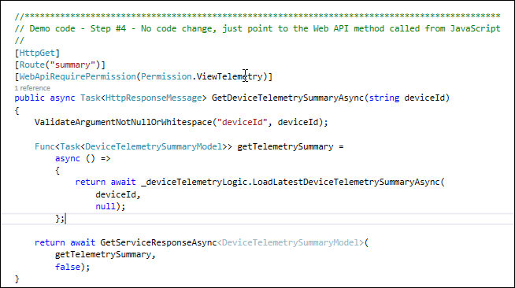

### Build the UI – Web project

We need to add 3 new gauges. The HTML code is located in the \_TelemetryHistorySummary.cshtml located in the Views/Dashboard folder of the Web project.

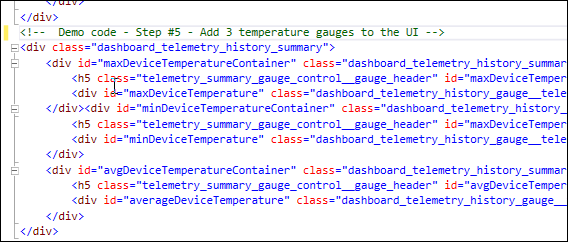

### Build the UI logic – Web project

The gauges are built using JavaScript in the TelemetryHistorySummary.js file located in the Scripts/Views/Dashboard folder of the Web project. Explain that changes were made throughout this JavaScript module to add 3 and update 3 new gauges.

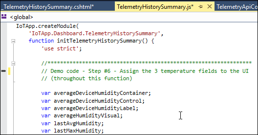

### Change the Stream Analytics job – Azure portal

The last code change that needs to be done is the Stream Analytics query located in the Azure Portal. This is the only change in the portal, and a change you will do DURING the demo, to make the demo work.

The \[deploymentname\]-Telemetry job query the telemetry sent from the simulated devices and store the results in Blob storage.

Locate and select the \[deploymentname\]-Telemetry Stream analytics job.

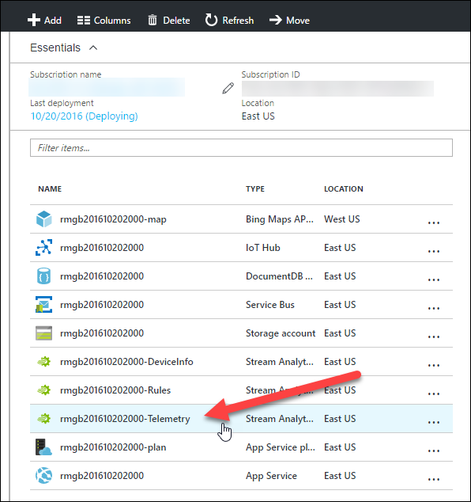

You need to edit the query but you can’t while the job is running. Click the Stop button to stop the Stream Analytics job. Note that it can take a minute or two but you can start editing the query while it’s stopping.

Click on the Query tile.

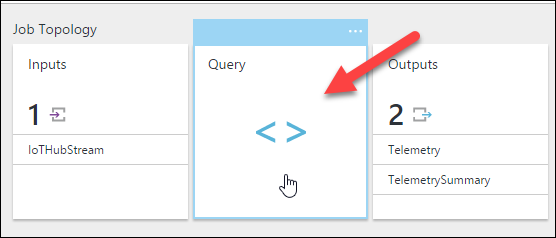

Edit the query and add 3 new output fields for the temperature data.

Click Save. Wait until the save has finished and click the Start button to restart the Stream Analytics job. Note that it can take a minute or two so it’s a good time to ask if people have questions.

After the job has started, you will see the temperature gauges light up with data.

## Teardown

Don’t delete the provisioned solution yet, you’ll need it in the next demo.
